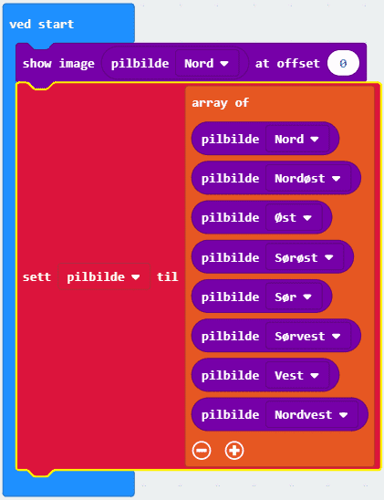
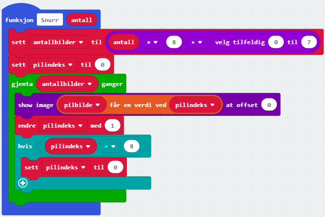
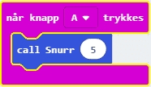
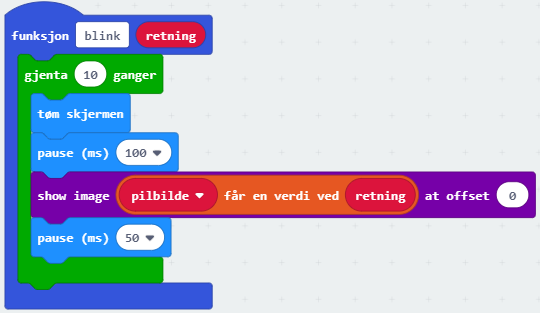

# Introduksjon {.intro}

Du har sikker lekt 'flasketuten peker på' mange ganger. 
I dette prosjektet vil vi bygge en lignende type spill, men i steden for å 
snurre på en flaske skal vi la en pil snurre rundt på displayet på 
micro:biten. 

# Steg 1: Vi starter spillet {.activity}

Når vi starter spillet, viser vi først en pil som peker rett opp, og deretter 
lager vi en liste med bilde av piler som peker i hver sin retning, 
totalt åtte piler.

## Sjekkliste {.check}

- [ ] Start et nytt PXT-prosjekt, for eksempel ved å gå til
  [makecode.microbit.org](https://makecode.microbit.org/?lang=no).

- [ ] Gå til `Avansert` og fra `Bilde`-kategorien velger du en 
`show image at offset`-kloss og legg den inne i `ved start` -blokken.

- [ ] Fra `Bilde`-kategorien velger du en `Pilbilde`-kloss og legg den inne i 
`show image at offset`-klossen. La offset være `0`.

- [ ] Lag først en variabel som heter `pilliste`

- [ ] Gå til `Avansert` og `Lister`-kategorien. Der velger du en 
`sett list til array of` -kloss. Pass på at du bruker variabelen `Pilbilde`
Du må gjøre klart til åtte elementer i lista.

- [ ] Gå til `Avansert` og `Bilder`-kategorien. Du legger inn en
`pilbilde` -kloss i hvert av de åtte elementer i lista. La de peke 
i hver sin retning, og la de følge klokka slik at pilen snurre fint rundt.

    

# Steg 2: Vi snurrer pilen {.activity}

Nå skal vi få pilen til å snurre og å stoppe i en tilfeldig retning.

- [ ] Lag en funksjon som heter `snurr` og la den ha `number` som 
parameter. Kall denne parameteren for `antall`. Da kan du bestemme
hvor mange kanger pilen skal snurre rundt når du bruker funksjonen
`snurr`.

- [ ] For å holde styr på hvor mange pilbilder som skal vises og hvilken pil 
som skal vises hver gang, lager vi en variabel som heter `antallbilder` og en 
som heter `pilbilde`

- [ ] Vi vet at ett snurr inneholder åtte bilder.Til slutt vil vi at pilen 
skal stoppe ved en tilfeldig retning. Vi setter derfor `antallbilder` 
til `antall*8 + tilfeldig tall fra 0 til 7`. Vi setter `pilindeks` 
til `0`.

- [ ] Vi legger inn en `gjenta`-kloss fra `Løkker`-kategorien og gjentar 
`antallbilder` ganger.

- [ ] Inne i `gjenta`-klossen kan bildet vises ved å legge inn `show image`
-kloss fra `Bilde`-kategorien. Nå må vi legge inn en 
`list får en verdi ved'-kloss fra `Lister`-kategorien. 
Velg liste-variabelen `pilbilde` og la variabelen `pilindeks` bestemme 
hvilket av de åtte pilbildene som vises.

- [ ] For at neste pil skal vises neste gang, må pilindeks økes med en. 
Men vi må passe på at den settes til `0` hvis den har blitt `8`.
Dette siden `pilbilde`-lista har indekser fra `0` til `7`.

   

- [ ] Nå kan vil kalle funksjonen `snurr` f.ek.s når knapp A trykkes.

   

## Test prosjektet {.flag}

- [ ] Til venstre på skjermen er det et bilde av en micro:bit. Her 
kan du teste at pilen snurrer og supper i en tilfeldig retning.

# Steg 3: Pilen blinker. {.activity}

For å markere at pilen har sluttet å snurre, kan vi legge til at pilen blinker.

- [ ] Lag en funksjon som heter `blink` og la den ha en number-parameter som 
heter `retning`.

- [ ] Legg til en `gjenta`-kloss fra `Løkker`-kategorien og gjenta f.eks. 
`10` ganger.

- [ ] Tøm skjermen, ta en pause i `100` ms, og bruk en `show image`-kloss 
fra `Bilder`-kategorien. Nå må vi legge inn en 
`list får en verdi ved'-kloss fra `Lister`-kategorien. 
Velg liste-variabelen `pilbilde` og la parameteren `retning` bestemme 
hvilket av de åtte pilbildene som vises. Ta en ny pause i `50` ms.

   
   
- [ ] Nå kan du kalle funksjonen `blink` helt i slutten av funksjonen `snurr`. 
Da må du spesifisere hvilken retning pilen skal peke i.

   

## Test prosjektet {.flag}

- [ ] Til venstre på skjermen er det et bilde av en micro:bit. Her kan du 
teste at pilen snurrer og blinker som den skal.

- [ ] Du kan laste ned programmet til til micro:biten.
