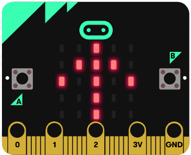

# Introduksjon {.intro}

Du har sikker lekt 'flasketuten peker på' mange ganger.
I dette prosjektet vil vi bygge et lignende type spill, men i steden for å
snurre på en flaske skal vi la en pil snurre rundt på displayet på
micro:biten.




# Steg 1: Vi starter spillet {.activity}

Når vi starter spillet, viser vi først en pil som peker rett opp, og deretter
lager vi en liste med bilde av piler som peker i hver sin retning. Totalt har
vi åtte ulike piler.

## Sjekkliste {.check}

- [ ] Start et nytt PXT-prosjekt, for eksempel ved å gå til
  [makecode.microbit.org](https://makecode.microbit.org/?lang=no){target=blank}

- [ ] Gå til __Avansert__ og fra `Bilde`{.microbitimages}-kategorien velger du en
`show image at offset`{.microbitimages}-kloss og legg den inne i `ved start`{.microbitbasic}-klossen.

- [ ] Fra `Bilde`{.microbitimages}-kategorien velger du en `pilbilde`{.microbitimages}-kloss
og legger den inne i `show image at offset`{.microbitimages}-klossen. La offset
være __0__.

- [ ] Lag en variabel som heter `pilliste`{.microbitvariables}.

- [ ] Gå til __Avansert__ og `Lister`{.microbitarrays}-kategorien. Der velger du en
`sett list til array of`{.microbitarrays}-kloss. Pass på at du bruker variabelen
`pilbilde`{.microbitvariables}. Du må gjøre klart til åtte elementer i lista som
vist i bildet under:

```microbit
images.arrowImage(ArrowNames.North).showImage(0)
let pilbilde = [0, 0, 0, 0, 0, 0, 0, 0]
```

- [ ] Gå til __Avansert__ og `Bilder`{.microbitimages}-kategorien. Legg inn en
`pilbilde`{.microbitimages}-kloss i hvert av de åtte elementene i lista. La de peke
i hver sin retning, og la de følge klokka slik at pilen snurrer pent rundt. Start
med Nord, deretter Nordøst, Øst, Sørøst og så videre.


# Steg 2: Velge en tilfeldig pil {.activity}

Her skal du velge mellom piler som peker i åtte forskjellige retninger.
Variabelen `pilliste`{.microbitvariables} inneholder de åtte pilene der hver pil
har et nummer. I tabellen under finner du en oversikt over pilene, både med
norske og engelske navn.

|      Pil     	|   ↑   	|      ↗     	|   →  	|      ↘     	|   ↓   	|      ↙     	|   ←  	|      ↖     	|
|:------------:	|:-----:	|:----------:	|:----:	|:----------:	|:-----:	|:----------:	|:----:	|:----------:	|
|    Nummer    	|   0   	|      1     	|   2  	|      3     	|   4   	|      5     	|   6  	|      7     	|
|  Norsk navn  	|  Nord 	|   Nordøst  	|  Øst 	|   Sørøst   	|  Sør  	|   Sørvest  	| Vest 	|  Nordvest  	|
| Engelsk navn 	| North 	| North East 	| East 	| South East 	| South 	| South West 	| West 	| North West 	|

Å velge en tilfeldig pil, blir derfor det samme som å velge et tilfeldig tall.
Altså: Velger vi tallet 4, viser vi en pil som peker mot Sør.

## Sjekkliste {.check}

 - [ ] Lag en ny variabel som skal lagre det tilfeldige tallet.

 - [ ] Sett denne variabelen til et tilfeldig tall mellom 0 og 7.

 - [ ] Legg inn en`show image`{.microbitimages}-kloss fra `Bilde`{.microbitimages}-kategorien.
 Så må vi legge inn en `list får en verdi ved`{.microbitarrays}-kloss fra `Lister`{.microbitarrays}-kategorien.
 Velg liste-variabelen `pilbilde`{.microbitvariables} og la variabelen `retning`{.microbitvariables}
 bestemme hvilket av de åtte pilbildene som skal vises.

 - [ ] Koden burde nå se slik ut:

```microbit
input.onButtonPressed(Button.A, function () {
    let pilliste: Image[] = []
    retning = Math.randomRange(0, 7)
    pilliste[retning].showImage(0)
})
```


# Steg 3: Vi snurrer pilen {.activity}

Nå skal vi få pilen til å snurre og så stoppe i en tilfeldig retning.

- [ ] Lag en funksjon som heter `snurr`{.microbitfunctions} og la den ha `number`{.microbitvariables}
som parameter. Kall denne parameteren for `antall`{.microbitvariables}. Da kan
du bestemme hvor mange ganger pilen skal snurre rundt når du bruker funksjonen
`snurr`{.microbitfunctions}.

- [ ] For å holde styr på hvor mange pilbilder som skal vises, og hvilken pil
som skal vises hver gang, oppretter vi noen variabler. Leg en variabel som heter
`antallbilder`{.microbitvariables} og en som heter `pilbilde`{.microbitvariables}.

- [ ] Vi vet at ett snurr inneholder åtte bilder. Til slutt vil vi at pilen
skal stoppe ved en tilfeldig retning. Vi setter derfor `antallbilder`{.microbitvariables}
til `antall*8 + tilfeldig tall fra 0 til 7`{.microbitmath}. Vi setter `pilindeks`{.microbitvariables}
til __0__.

- [ ] Vi legger inn en `gjenta`{.microbitloops}-kloss fra `Løkker`{.microbitloops}-kategorien
og gjentar løkken `antallbilder`{.microbitvariables} ganger.

- [ ] Inne i `gjenta`{.microbitloops}-klossen kan bildet vises ved å legge inn
`show image`{.microbitimages}-kloss fra `Bilde`{.microbitimages}-kategorien.
Nå må vi legge inn en `list får en verdi ved`{.microbitarrays}-kloss fra `Lister`{.microbitarrays}-kategorien.
Velg liste-variabelen `pilbilde`{.microbitvariables} og la variabelen `pilindeks`{.microbitvariables}
bestemme hvilket av de åtte pilbildene som skal vises.

- [ ] For at neste pil skal vises neste gang, må pilindeks økes med en.
Men vi må passe på at den settes til __0__ hvis den har blitt __8__.
Dette må vi gjøre fordi `pilbilde`{.microbitvariables}-lista kun har indekser
fra __0__ til __7__.

- [ ] Nå kan vil kalle funksjonen `snurr`{.microbitfunctions} for eksempel når
knapp A trykkes.

- [ ] Koden ser nå slik ut:

```microbit
input.onButtonPressed(Button.A, function () {
    snurr(5)
})
function snurr (antall: number) {
    antallbilder = antall * 8 + Math.randomRange(0, 7)
    pilindeks = 0
    for (let i = 0; i < antallbilder; i++) {
        let pilbilde: Image[] = []
        pilbilde[pilindeks].showImage(0)
        pilindeks += 1
        if (pilindeks == 8) {
            pilindeks = 0
        }
    }
}
```

## Test prosjektet {.flag}

- [ ] Til venstre på skjermen er det et bilde av en micro:bit. Her
kan du teste at pilen snurrer og stopper i en tilfeldig retning.


# Steg 4: Pilen blinker. {.activity}

For å markere at pilen har sluttet å snurre, kan vi legge til at pilen skal
blinke.

- [ ] Lag en funksjon som heter `blink`{.microbitfunctions} og la den ha en
number-parameter som heter `retning`{.microbitvariables}.

- [ ] Legg til en `gjenta`{.microbitloops}-kloss fra `Løkker`{.microbitloops}-kategorien
og gjenta for eksempel __10__ ganger.

- [ ] Tøm skjermen, ta en pause i __100__ ms, og bruk en `show image`{.microbitimages}-kloss
fra `Bilder`{.microbitimages}-kategorien. Nå må vi legge inn en `list får en verdi ved`{.microbitarrays}-kloss
fra `Lister`{.microbitarrays}-kategorien. Velg liste-variabelen `pilbilde`{.microbitvariables}
og la parameteren `retning`{.microbitvariables} bestemme hvilket av de åtte
pilbildene som vises. Ta en ny pause i __50__ ms.

- [ ] Nå kan du kalle funksjonen `blink`{.microbitfunctions} helt i slutten av
funksjonen `snurr`{.microbitfunctions}. Da må du spesifisere hvilken retning
pilen skal peke i.

```microbit
function blink (retning: number) {
    for (let i = 0; i < 10; i++) {
        let pilbilde: Image[] = []
        basic.clearScreen()
        basic.pause(100)
        pilbilde[retning].showImage(0)
        basic.pause(50)
    }
}
function snurr (antall: number) {
    antallbilder = antall * 8 + Math.randomRange(0, 7)
    pilindeks = 0
    for (let i = 0; i < antallbilder; i++) {
        let pilbilde: Image[] = []
        pilbilde[pilindeks].showImage(0)
        pilindeks += 1
        if (pilindeks == 8) {
            pilindeks = 0
        }
    }
    blink(pilindeks)
}
```

## Test prosjektet {.flag}

- [ ] Til venstre på skjermen er det et bilde av en micro:bit. Her kan du
teste at pilen snurrer og blinker som den skal.

- [ ] Du kan laste ned programmet til til micro:biten.

- [ ] Nå kan dere leke Flasketuten peker på.


## Noen utfordringer {.challenge}

*Noen forslag til endringer og utvidelser. Prøv gjerne dine egne ideer!*

Du har nå lært hvordan du kan lage en enkel animasjon med micro:bit. Nedenfor
er noen ideer til videreutvikling, men finn gjerne på noe helt eget!

- [ ] Kan du få pilen til å snurre i motsatt retning?

- [ ] Kan du bruke et annet bilde, f.eks. bytte ut bildet av en pil med kun en
led som viser retning?

- [ ] Kan du endre bildet som brukes og lage et annet spill, for eksempel en
terning?

- [ ] Hvis dere er tre-fire sammen kan dere legge inn samme sekvens av bilder og
se hvor ofte dere klarer å vise det samme bildet på micro:bitene. Da har dere
laget en enarmet banditt.
