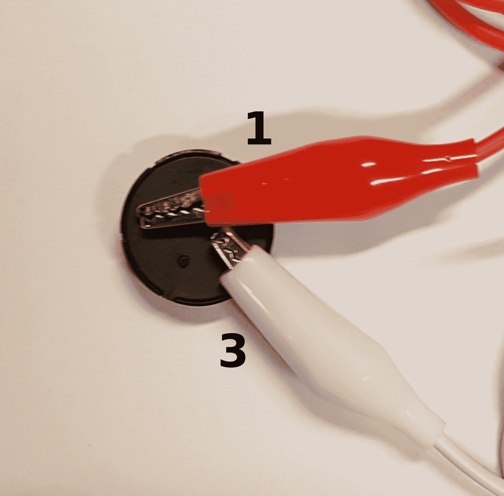
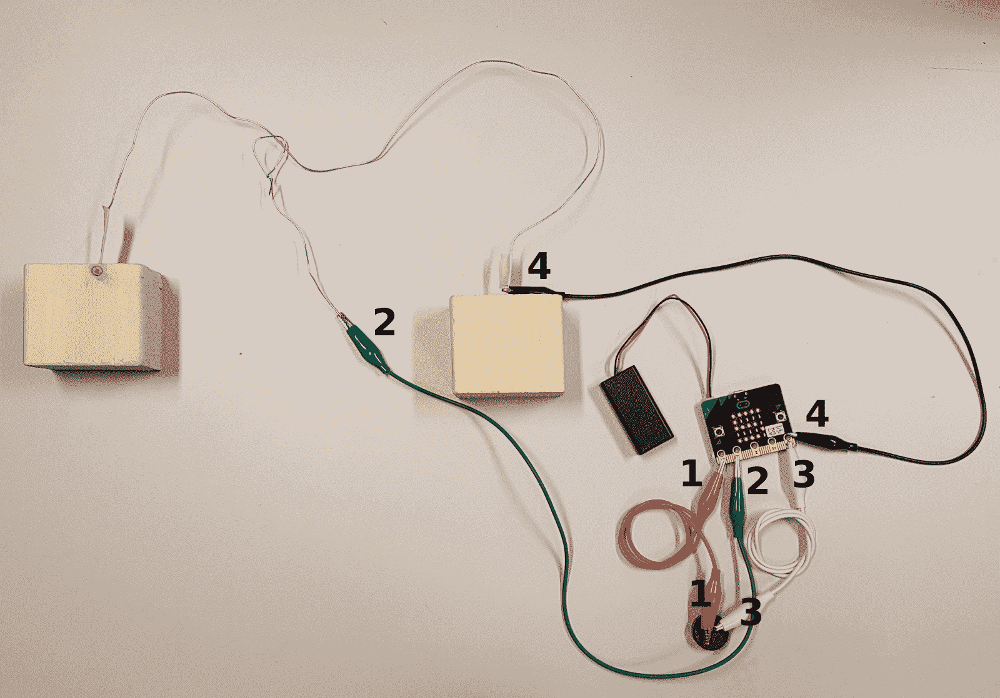

# Introduksjon {.intro}

Dette er eit enkelt koordinasjonsspel som går ut på å leie ein stav med ei løkke
langs ein bøygd ståltråd. Viss spelaren kjem borti ståltråden vil ein buzzar gi
lys, og spelaren får eit poeng. Spelaren med færrast poeng vinn!

Til dette prosjektet treng du nokre ekstra ting:

- Ståltråd

- Krokodilleklyper

- Treklossar med hol til å stikke ståltråden i.

- Buzzar

Basert på: https://codeclubprojects.org/en-GB/microbit/frustration/


# Steg 1: Lagre poeng {.activity}

## Sjekkliste {.check}

- [ ] Start eit nytt PXT-prosjekt, til dømes ved å gå til
  [makecode.microbit.org](https://makecode.microbit.org/?lang=no){target=blank}.

- [ ] Slett dei eksisterande blokkane.


- [ ] Me vil starte eit nytt spel når spelaren trykkar på knapp A. Til det kan
  me bruke `når knapp A blir trykka`{.microbitinput}-klossen som du finn i
  kategorien `Inndata`{.microbitinput}.

```microbit
  input.onButtonPressed(Button.A, function () {

})
```

- [ ] Me må opprette ein *variabel* til å ta vare på kor mange gonger spelaren
  berører ståltråden i løpet av spelet. Me opprettar variabelen `beroering`{.microbitvariables}
  for å gjere det. Hugs at det er lurt å unngå *æøå* fordi det fungerer ikkje alltid
  når me programmerer.

  

  

```microbit
let beroeringer = 0
input.onButtonPressed(Button.A, function () {
    beroeringer = 0
})
```

- [ ] Legg til at me viser antal `beroering`{.microbitvariables}ar etter at
`knapp A`{.microbitinput} er trykka.

```microbit
let beroeringer = 0
input.onButtonPressed(Button.A, function () {
    beroeringer = 0
    basic.showNumber(beroeringer)
})
```


# Steg 2: Oppdatere berøringane {.activity}

## Sjekkliste {.check}

- [ ] Du skal leggje til 1 til variabelen `beroering`{.microbitvariables} kvar
gong kontakt P0 blir trykka.

```microbit
input.onPinPressed(TouchPin.P0, function () {

})
```

- [ ] Vidare skal me vise eit kryss for 1 sekund kvar gong kontakt P1 blir
  trykka.

```microbit
input.onPinPressed(TouchPin.P1, function () {
    basic.showLeds(`
        # . . . #
        . # . # .
        . . # . .
        . # . # .
        # . . . #
        `)
})
```

```microbit
  input.onPinPressed(TouchPin.P1, function () {
    basic.showLeds(`
        # . . . #
        . # . # .
        . . # . .
        . # . # .
        # . . . #
        `)
    music.playTone(262, music.beat(BeatFraction.Whole))
})
```

```microbit
input.onPinPressed(TouchPin.P1, function () {
    basic.showLeds(`
        # . . . #
        . # . # .
        . . # . .
        . # . # .
        # . . . #
        `)
    music.playTone(262, music.beat(BeatFraction.Whole))
    basic.pause(500)
})
```

- [ ] Så må du endre verdien til `beroering`{.microbitvariables} med 1.

```microbit
input.onPinPressed(TouchPin.P1, function () {
    basic.showLeds(`
        # . . . #
        . # . # .
        . . # . .
        . # . # .
        # . . . #
        `)
    music.playTone(262, music.beat(BeatFraction.Whole))
    basic.pause(500)
    beroeringer += 1
})
```

- [ ] Så må me vise kor mange gonger me har vore borti ståltråden.

```microbit
input.onPinPressed(TouchPin.P1, function () {
    basic.showLeds(`
        # . . . #
        . # . # .
        . . # . .
        . # . # .
        # . . . #
        `)
    music.playTone(262, music.beat(BeatFraction.Whole))
    basic.pause(500)
    beroeringer += 1
    basic.showNumber(beroeringer)
})
```


# Steg 3: Bygg spelet {.activity}

## Sjekkliste {.check}

- [ ] Ta ein bit ståltråd og lag ei løkke i den eine enden.

- [ ] Tre løkka i ein annan bit ståltråd som du set i to treklossar med hol i.

- [ ] Fest ein kabel med krokodilleklyper i P0 på micro:biten til det eine
  beinet på buzzaren og ein annan kabel frå GND på micro:biten til det andre
  beinet på buzzaren. *Det har ikkje noko å seie kva bein på buzzaren som blir
  kopla til kva kabel på buzzaren*



- [ ] Fest ein kabel med krokodilleklyper til P1 på micro:biten og til
  ståltråden med løkka. Fest ein kabel til ståltråden som er festa til
  treklossane og til GND på micro:biten.




## Utfordring: Leggje til eigne melodiar {.challenge}

- [ ] Klarar du å endre spelet slik at ein startar med tre liv, og mistar eitt
  for kvar gong ein kjem borti ståltråden? __Tips:__ Du kan bruke klossen `game
  over`{.microbitgame} i kategorien `Spill`{.microbitgame} for å vise ein
  "Game over"-animasjon når spelaren mistar det siste livet.
