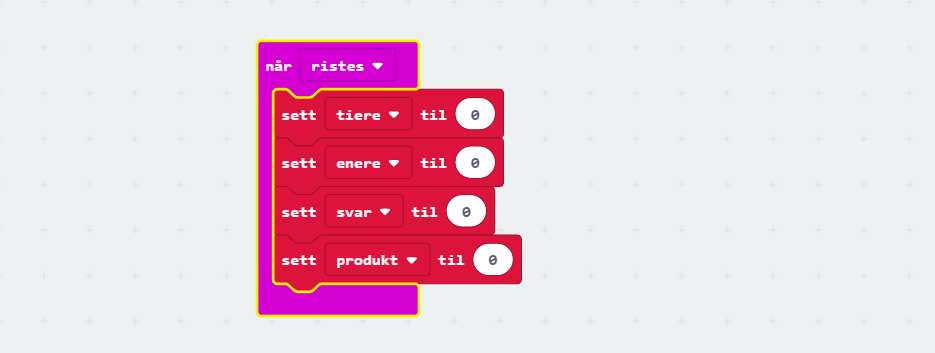
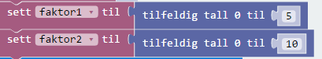
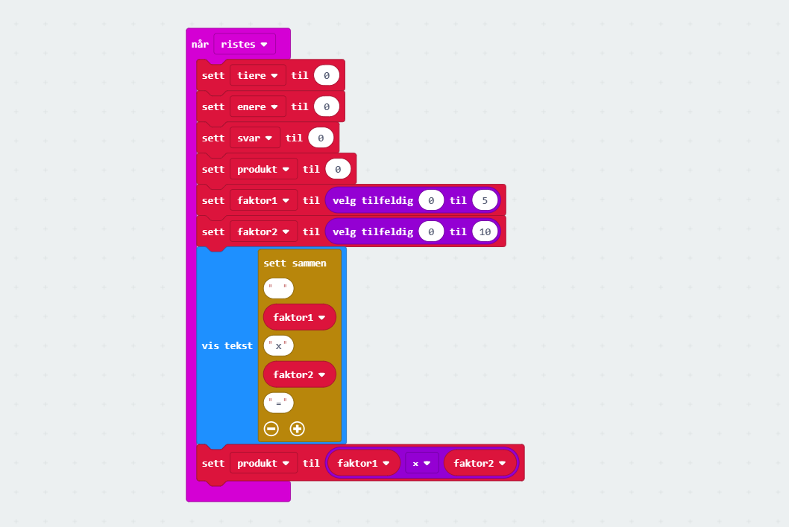
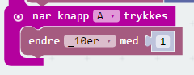
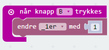
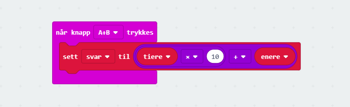
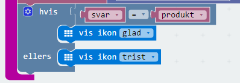

# Introduksjon {.intro}

Dette er et enkelt og modifiserbart gangespill for micro:bit. Det fungerer slik at når en rister micro:biten så vil en få presentert et gangestykke. En svarer ved å trykke på A-knappen for antall tiere i svaret og B-knappen for antall enere. Når man har svart så trykker man på A+B. Dersom man svarer korrekt så vil en få opp et smilefjes, hvis ikke kommer et surt fjes.

# Steg 1: Når microbit ristes {.activity}

## Sjekkliste {.check}

- [ ] Start et nytt PXT-prosjekt, for eksempel ved å gå til
  [makecode.microbit.org](https://makecode.microbit.org/?lang=no).

- [ ] Vi vil at noe skal skje når vi rister på micro:biten. Til dette kan vi
  bruke `når ristes`-klossen som finnes i kategorien `Inndata`.

- [ ] Når micro:bit ristes skal det vises et gangestykke på skjermen. Vi må opprette en del `variabler` til å ta vare på verdiene vi skal bruke underveis: `tiere` tar vare på antall tiere i svaret, `enere` tar vare på antall enere i svaret, `svar` er summen av variablene `tiere` og `enere`, mens `produkt` er svaret som micro:bit regner seg fram til.

	

- [ ] Deretter trenger vi to `faktorer`, som er selve gangestykket. En kan selv velge hvor langt opp i gangetabellene en ønsker å komme, ved å endre grensense for de tilfeldige tallene.

	

- [ ] Deretter må vi sette sammen faktorene til gangestykket som skal vises på skjermen. Vi bruker her `join` funksjonen som finnes under tekst, og som kan tilpasses til så mange elementer en ønsker. Man må klikke på `tannhjulet` for å utvide blokken.

	

- [ ] Vi regner til slutt ut `produktet` av de to `faktorene`, som vi skal kontrollere mot svaret som blir avgitt.

    

## Test prosjektet {.flag}

Det er to forskjellige måter vi kan teste micro:bit-programmer på:

- [ ] Til venstre på skjermen er det et bilde av en micro:bit. Dette er faktisk
  en simulator som kan kjøre programmet vi nettopp laget:

    Siden vår kode skal reagere når man rister på micro:biten kan du simulere
    dette ved å klikke på den hvite prikken til venstre for teksten `SHAKE` på
    micro:bit-simulatoren.

- [ ] Enda morsommere er det å teste programmet på micro:biten din! Koble
  micro:biten din til datamaskinen med en USB-kabel. Klikk deretter på knappen
  `Last ned` nede til venstre på skjermen.

    Det lastes nå ned en fil som heter `microbit-Uten-navn.hex` til datamaskinen
    din. Samtidig dukker det opp et vindu som sier at du må flytte denne filen
    til MICROBIT-disken på datamaskinen din.

# Steg 2: Registrere svar {.activity}

## Sjekkliste {.check}

- [ ] `Knapp A` skal registrere `tiere`, så ved hvert trykk skal den øke med 1.

	

- [ ] `Knapp B` skal registrere `enere`, så ved hvert trykk skal den øke med 1.

	

# Steg 3: Kontrollere svar {.activity}

*Nå skal vi sjekke at svaret vi har gitt er korrekt. Dersom man for eksempel får beskjed om å multiplisere tallene 4 og 7, så blir svaret 28. Da må vi trykke to ganger på `Knapp A` for å få 20, og åtte ganger på `Knapp B` for å få 8. Til sammen blir det 28.*

## Sjekkliste {.check}

- [ ] Når `A+B – knappene` trykkes samtidig, skal den kontrollere om en har regnet korrekt. Da legger vi sammen antall `tiere` og antall `enere` som vi har trykket, og lagrer summen av de tallene i varibelen `svar`.

  

- [ ] Vi kontrollerer deretter om `svar` og `produkt` er likt. Dersom det er rett, viser den smilefjes. Dersom det er galt, viser den trist fjes.

  

# Steg 4: Muligheter for endringer {.activity}

## Sjekkliste {.check}

- [ ] Klarer du lage et addisjon-spill?

- [ ] Klarer du lage et subtraksjon-spill?

- [ ] Klarer du lage et divisjon-spill?

- [ ] Klarer du lage et potens-spill?

- [ ] Klarer du lage et spill som bruker et annet tallsystem enn titallsystemet?
