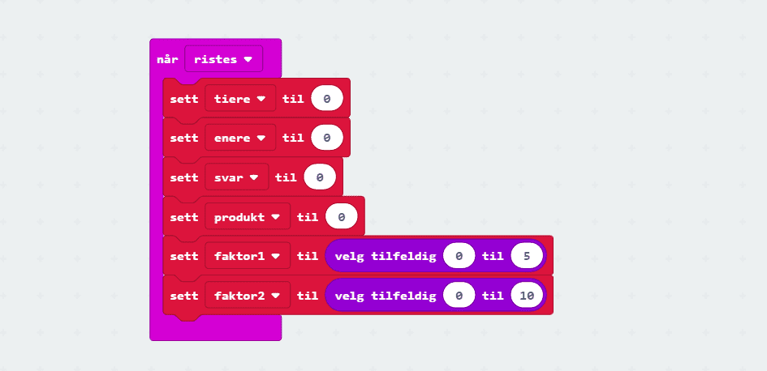
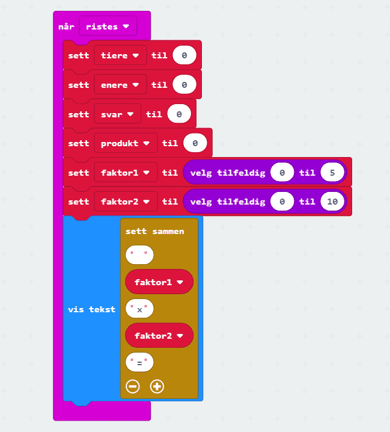
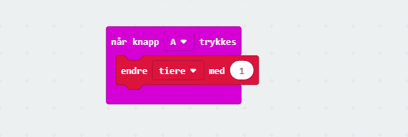
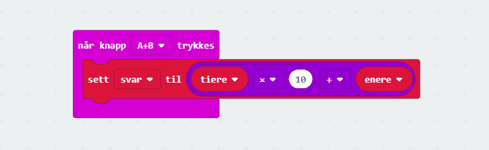

# Introduksjon {.intro}

Dette er eit enkelt og modifiserbart gongespel for micro:bit. Det fungerer slik
at når ein ristar micro:biten vil ein få presentert ein gongestykke. Spelaren
svarar ved å trykkje på A-knappen for tiarane i svaret, og B-knappen for
einarar. Når spelaren er klar til å svare trykkar han på A+B. Viss svaret er
riktig visast eit smilefjes, og viss ikkje kjem eit surt fjes.

# Steg 1: Når micro:bit blir rista {.activity}

## Sjekkliste {.check}

- [ ] Start eit nytt PXT-prosjekt, til dømes ved å gå til
  [makecode.microbit.org](https://makecode.microbit.org/?lang=no).

- [ ] Me vil at noko skal skje når me ristar på micro:biten. Då kan me bruke
  `når ristes`-klossen som du finn i kategorien `Inndata`.

- [ ] Når micro:bit blir rista skal det visast eit gongestykke på skjermen. Me
  må opprette ein del *variablar* til å ta vare på verdiane me skal bruke
  undervegs: `tiarar` tek vare på antal tiarar i svaret, `einarar` tek vare på
  einarane i svaret, `svar` er summen av variablane `tiarar` og `einarar`, og
  `produkt` er svaret som micro:bit reknar seg fram til.

  

- [ ] Så treng me to *faktorar* som er sjølve gongestykket. Du kan sjølv velje
  kor langt opp i gongetabellane du vil gå, ved å endre grensene for dei
  tilfeldige tala.

  

- [ ] No må me setje saman faktorane til gongestykket som skal visast på
  skjermen. Her brukar me `join`-funksjonen som finst under tekst. Den kan
  tilpassast til så mange element du vil. Klikk på `tannhjulet` for å utvide
  klossen.

  

- [ ] Vi regner til slutt ut `produktet` av de to `faktorene`, som vi skal
  kontrollere mot svaret som blir avgitt.

  

## Test prosjektet {.flag}

Det er to ulike måtar me kan teste micro:bit-program på:

- [ ] Til venstre på skjermen er det bilete av ein micro:bit. Dette er faktisk
  ein simulator som kan køyre programmet me akkurat laga:

  Sidan koden vår skal reagere når ein ristar på micro:biten, så kan du simulere
  det ved å klikke på den kvite prikken til venstre for teksten `SHAKE` på
  micro:bit-simulatoren.

- [ ] Det er endå meir morosamt å teste programmet på micro:biten din! Kople
  micro:biten din til datamaskina med ein USB-kabel. Så klikkar du på knappen
  `Last ned` nede til venstre på skjermen.

  No blir det lasta ned ei fil som heiter `microbit-Uten-navn.hex` til
  datamaskina di. Samstundes dukkar det opp eit vindauge som seier at du må
  flytte fila til MICROBIT-disken. Viss du treng hjelp til dette kan du spørje
  ein rettleiar.

# Steg 2: Registrere svar {.activity}

## Sjekkliste {.check}

- [ ] `Knapp A` skal registrere `tiarar`, så ved kvart trykk skal den auke med
  1.

  

- [ ] `Knapp B` skal registrere `einarar`, så ved kvart trykk skal den auke med
  1.

  

# Steg 3: Kontrollere svar {.activity}

*No skal me sjekke at svaret me har gitt er korrekt. Viss ein får beskjed om å
multiplisere tala 4 og 7, så blir svaret 28. Då må me trykkje to gonger på knapp
A for å få 20, og åtte gonger på knapp B for å få 8. Til saman blir det 28.*

## Sjekkliste {.check}

- [ ] Når `A`- og `B`-knappane blir trykt samstundes, så skal den kontrollere om
  spelaren har rekna korrekt. Då legg me saman antalet `tiarar` og antalet
  `einarar` som me har trykka, og lagrar summen av tala i variabelen `svar`.

  

- [ ] Me kontrollerer vidare om `svar` og `produkt` er likt. Viss dei er det,
  altså at svaret er rett, viser den smilefjes. Viss det er feil får ein opp eit
  surt fjes.

  

# Steg 4: Moglegheiter for endringar {.activity}

## Sjekkliste {.check}

- [ ] Klarar du å lage eit addisjonsspel?

- [ ] Klarar du å lage eit subtraksjonsspel?

- [ ] Klarar du å lage eit divisjonsspel?

- [ ] Klarar du å lage eit potensspel?

- [ ] Klarar du å lage eit spel som brukar eit anna talsystem enn
  titalssystemet?
