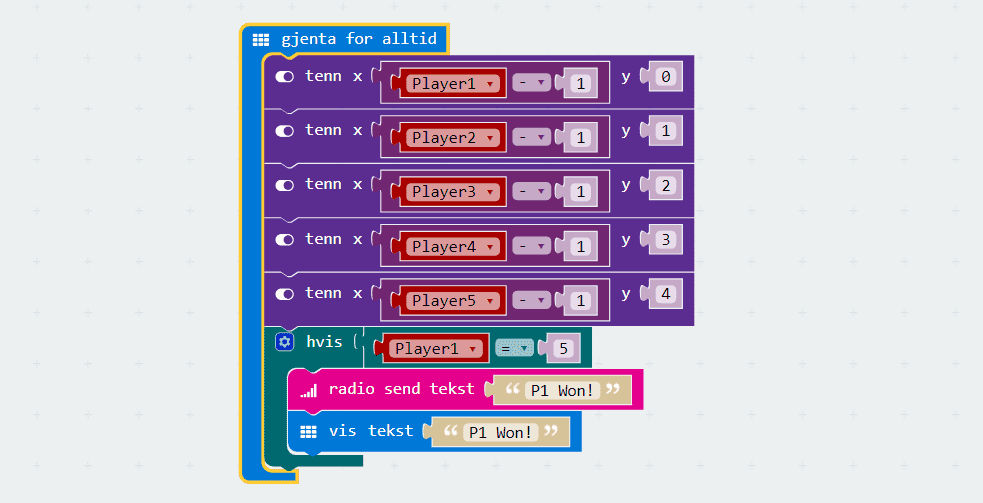
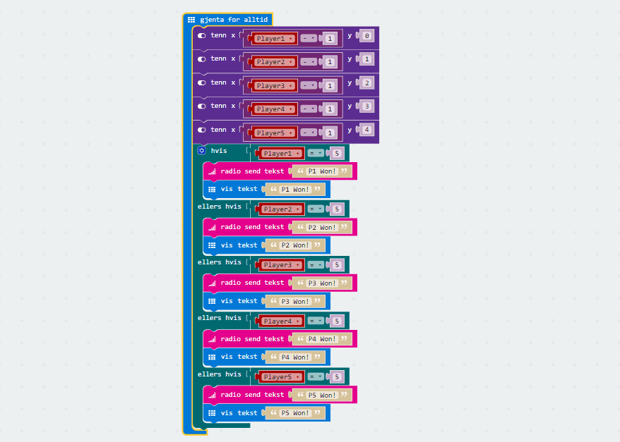
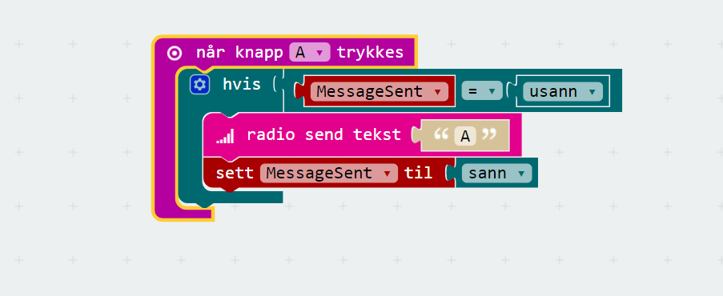
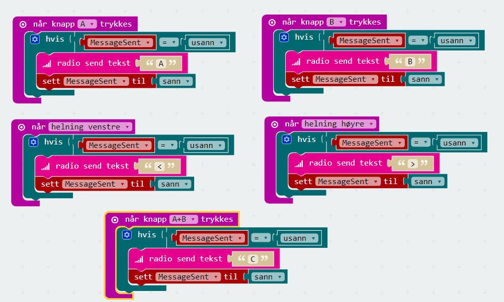
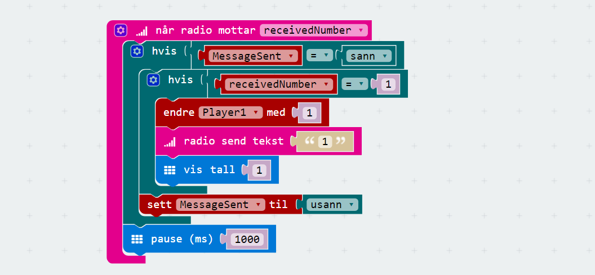
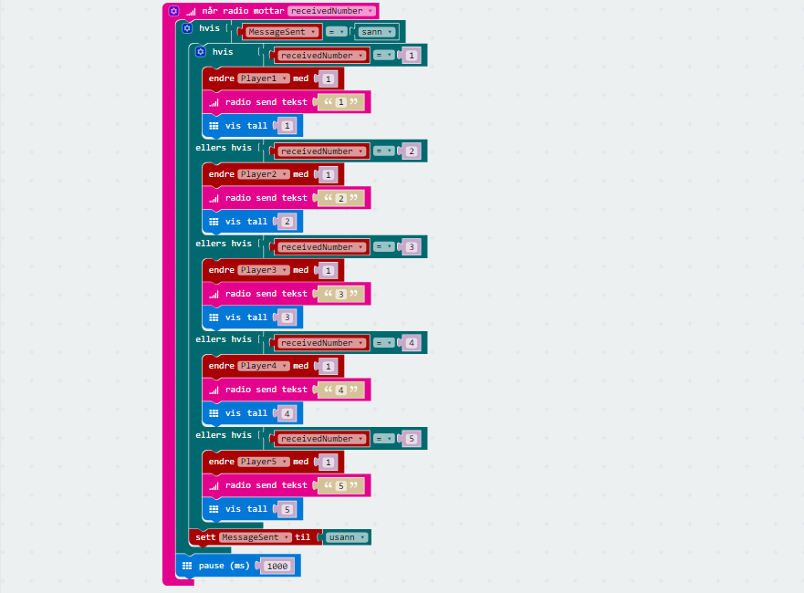
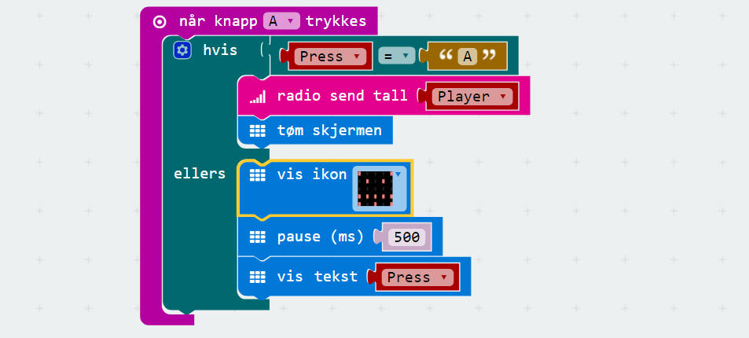
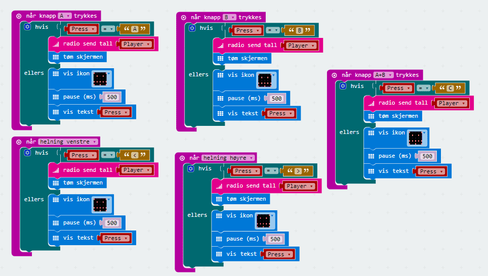

# Introduksjon {.intro}

Hermegåsa er eit spel der ein person er *spelleiar*. Spelet går ut på at
spelleiaren skal utføre instruksjonar på micro:biten sin som dei andre spelarane
skal gjenta (herme etter) på micro:biten sin. Det er eit spel for fleire
spelarar, og det er om å gjere å vere den raskaste spelaren til å herme etter
spelleiaren. Spelleiaren har oversikt over poenga til dei ulike spelarane på
skjermen sin, og spelet blir avslutta når ein spelar har vunne 5 gonger.

På biletet ser du at spelleiaren er i midten og har poengsummen til spelar 1 og
spelar 2 på skjermen sin. På sidene har spelarane fått beskjed om kva dei skal
gjere, i form av ei pil på skjermen. Fyrstemann som vippar micro:biten sin same
veg som pila vinn.

# Steg 1: Sjekk at du har riktig utstyr {.activity}

*Det er viktig at du har alt utstyret og tilbehøret for å kunne gjere denne
oppgåva.*

## Sjekkliste {.check}

  - [ ] 1 micro:bit med ein micro-usb-kabel som spelleiar.

  - [ ] 2-5 micro:bitar med strømforsyning (micro-usb-kablar eller batteri).

  - [ ] Ei datamaskin med Internett.

### Spelereglar {.protip}

*Her er eit oversyn over reglane i spelet:*

| Skjerm viser | Spelar utfører   |
| ------------ | ---------------- |
| A            | Trykk på A       |
| B            | Trykk på B       |
| C            | Trykk på A + B   |
| <            | Vipp til venstre |
| \>           | Vipp til høgre   |

# Steg 2: Programmere spelleiaren {.activity}

*Når spelet skal starte må me syte for at alle micro:bitane kan kommunisere med
kvarandre. For å få til det må me bestemme eit gruppe-nummer som alle
deltakarane brukar for å sende informasjon over bluetooth. I tillegg må me lagre
at me har sendt ut ei melding til deltakarane, slik at me ikkje sender ut fleire
meldingar før me har fått svar på den førre.*

## Sjekkliste {.check}

- [ ] Start eit nytt PXT-prosjekt, til dømes ved å gå til
  [makecode.microbit.org](https://makecode.microbit.org/?lang=no).

- [ ] Finn klossen `ved start` under `Basis` og dra den inn i kodefeltet.

- [ ] Gå til `Radio` og finn klossen `radio sett gruppe`. I utgangspunktet står
  talet `1` i denne klossen, men du bestemmer sjølv kva tal du vil bruke.

- [ ] Til slutt går me til `Variabler` og veljer klossen `sett variabel til`.
  Denne kan du bytte namn på ved å klikke på _variabel_ og så på _Rename
  variable_. Den bør heite `MessageSent`.

- [ ] Til `MessageSent` koplar me klossen `usann`, som du finn under `Logikk`.

- [ ] Når spelet startar skal alle spelarane ha `0` poeng. Lag ein variabel for
  kvar spelar med namn `Player1`, `Player2` osb. som du set til `0` poeng.

- [ ] Viss du har gjort alt rett vil koden din sjå slik ut:

  

### OBS! {.protip}

Hugs at gruppenummeret du har valt må brukast alle stader i spelet der du skal
bestemme gruppenumer. I denne oppgåva har me valt talet `37`.

I oppgåva antek me at me har fem spelarar. Viss de kjem til å vere færre
spelarar enn det, så treng du ikkje leggje til så mange.

# Steg 2: Vise poeng på skjermen {.activity}

*For å halde oversyn over kor mange poeng dei ulike spelarane har, så viser me
det på skjermen til spelleiaren. Viss nokon av spelarane får 5 poeng, så gir me
beskjed om at den spelaren vann.*

## Sjekkliste {.check}

- [ ] Fyrst legg me til `gjenta for alltid`-klossen frå `Basis`.

- [ ] Me vil vise poengsummen til kvar spelar i radene på skjermen til
  spelleiaren. Me viser `Player1` i rad `1`, `Player2` i rad `2` osb. Legg til
  klossen `tenn x y` frå `Skjerm`. La `y` vere lik `0`.

- [ ] Me må setje `x` til å vere lik poengsummmen til spelarane. Fordi
  koordinatane til skjermen startar på `(0,0)`, _ikkje_ `(1,1)`, så må me
  trekkje frå eitt poeng heile tida, slik at lysa seier kor mange poeng spelaren
  har. Det kan me gjere slik:

  

- [ ] Gjer det same for `Player2`, `Player3`, `Player4` og `Player5`.

- [ ] Legg til ein `hvis`-kloss og sjekk om `Player1` er lik `5` poeng. Då har
  spelaren vunne.

- [ ] Viss `Player1` har `5` poeng skal me sende ut beskjed om det til alle.
  Fyrst legg me til `radio send tekst`, og så legg me til `vis tekst`. Sett
  begge tekstane til _P1 Won!_. Då ser koden slik ut:

- [ ] Utvid `hvis`-klossen til `hvis - ellers hvis - ellers hvis - ellers hvis -
  ellers hvis`, slik at du kan sjekke poenga til alle spelarane, og gjer det
  same for `Player2`, `Player3`, `Player4` og `Player5`.

- [ ] Viss du har gjort alt rett så vil koden din sjå slik ut:

  

# Steg 3: Sende ut meldingar til deltakarane {.activity}

*Så må me sende ut meldingar til deltakarane om kva dei skal herme etter. Me
lagar ein kloss for kvar av dei ulike meldingane, ut frå reglane som er beskrive
lengre opp.*

## Sjekkliste {.check}

- [ ] Fyrst må me finne klossen som heiter `når knapp A trykkes`. Den ligg under
  `Inndata`.

- [ ] Så hentar me `hvis`-klossen frå `Logikk` og set den saman med
  `erlik-klossen` (`=`) frå same kategori. Her skal du sjekke om `MessageSent`
  er lik `usann`. Klarar du å setje det saman?

- [ ] Inni `hvis`-klossen set me `radio send tekst` med teksten `A`.

- [ ] Til slutt legg me til klossen `sett MessageSent til` frå `Variabler` og
  set verdien til `sann`.

- [ ] Viss du har gjort alt rett så vil koden din sjå slik ut:

  

- [ ] Gjer det same for `B`, `C`, `<` og `>`. Sjekk tabellen over for å sjå kva
  som skal gjerast.

- [ ] Viss du har gjort alt rett så vil koden din sjå slik ut:

  

# Steg 4: Sjekke svaret til deltakarane {.activity}

*Etter kvar runde må spelleiaren sjekke kva deltakar som var raskast til å
herme.*

## Sjekkliste {.check}

- [ ] Finn `når radio mottar receivedNumber` frå `Radio`.

- [ ] Sjekk om `MessageSent` er lik `sann`.

- [ ] Viss `MessageSent` er lik `sann` skal du sjekke om `receivedNumber` er lik
  `1`, for då vann `Player1` denne runden. Me får altså ein `hvis`-kloss inni
  ein annan `hvis`-kloss.

- [ ] Viss `receivedNumber` er lik `1` så set me klossen `endre Player1 med 1`
  frå `Variabler` inni den innerste `hvis`-klossen.

- [ ] Under `endre Player1 med 1` legg du til `radio send tekst` med talet `1`.
  Då sender me beskjed til alle om kven som vann. Legg òg til `vis tall` med
  talet `1`. Då viser me det på spelleiaren sin micro:bit.

- [ ] Så legg me til ei pause på `1` sekund mellom dei to `hvis`-klossane før me
  går vidare til neste runde. Dette gjer du ved å leggje til klossen `pause
  (ms)` og set den til `1000`. Tusen millisekund er det same som eitt sekund.

- [ ] Til slutt endrar me `MessageSent` til `usann` att.

- [ ] Viss du har gjort alt rett så vil koden din sjå slik ut:

  

- [ ] Utvid `hvis`-klossen til `hvis - ellers hvis - ellers hvis - ellers hvis -
  ellers hvis`, slik at du kan sjekke om det var nokon av dei andre spelarane
  som vann denne runden, og gjer det same for `Player2`, `Player3`, `Player4` og
  `Player5`.

- [ ] Viss du har gjort alt rett så vil koden din sjå slik ut:

  

# Steg 5: Overføre programmet til spelleiaren {.activity}

- [ ] Gi namnet `spelleiar` til programmet ditt. Dette gjer du ved å endre
  teksten heilt nede på midten på skjermen din.

- [ ] Koble den eine micro:biten din til datamaskina med ein USB-kabel. Denne
  micro:biten blir spelleiaren i spelet.

- [ ] Klikk på knappen `Last ned` nede til venstre på skjermen. No blir det
  lasta ned ei fil som heiter `spelleiar.hex` til datamaskina di.

- [ ] Flytt denne fila over til MICROBIT-disken på maskina di.

# Steg 6: Programmere spelarane {.activity}

*Fyrst må me syte for at spelarane koplar seg til spelleiaren og gir dei eit
spelarnummer, slik at me kan sjekke kven som vinn.*

## Sjekkliste {.check}

- [ ] Start eit nytt PXT-prosjekt.

- [ ] Finn klossen `ved start` under `Basis` og dra den inn i kodefeltet.

- [ ] Gå til `Radio` og finn klossen `radio sett gruppe`. Hugs at du må bruke
  det same talet her som du valte i `spelleiar`.

- [ ] Gå til `Variabler` og vel klossen `sett variabel til`. Denne kan du bytte
  namn på ved å klikke på _variabel_ og så på _Rename variable_. Den bør heite
  `Player`. Set verdien til `1`.

- [ ] Til slutt viser me talet vårt til skjermen, ved å hente klossen `vis tall`
  og kople den til variabelen `Player`.

- [ ] Viss du har gjort alt rett så vil koden din sjå slik ut:

  

# Steg 7: Når spelar mottek ei melding {.activity}

*Neste steg er å ta imot meldinga om kva me skal herme etter, og lagre den. Då
kan me sjekke at me har gjort rett seinare.*

## Sjekkliste {.check}

- [ ] Finn `når radio mottar receivedString` frå `Radio`.

- [ ] Vis teksten `receivedString` på skjermen.

- [ ] Opprett ein ny variabel med namnet `Press` og set den til
  `receivedString`. Då har me lagra det me treng til å sjekke om me har klart å
  herme etter spelleiaren.

- [ ] Viss du har gjort alt rett så vil koden din sjå slik ut:

  

# Steg 8: Når spelar sender ei melding {.activity}

*Siste steg er å herme etter spelleiaren og sende ein beskjed i retur.*

## Sjekkliste {.check}

- [ ] Me startar med å herme etter spelleiar viss meldinga var `A`. Fyrst må me
  finne klossen som heiter `når knapp A trykkes`. Den ligg under `Inndata`.

- [ ] Så hentar me `hvis`-klossen frå `Logikk` og set den saman med
  `erlik-klossen` (`=`) frå same kategori. Her skal du sjekke om `Press` er lik
  `A`.

- [ ] Viss `Press` er lik `A`, så skal me sende spelarnummeret vårt tilbake til
  spelleiaren. Legg til klossen `radio send tall` inni `hvis`-klossen og kople
  den til `Player`. Legg òg til klossen `tøm skjermen` frå `Basis`.

- [ ] Utvid `hvis`-klossen til `hvis - ellers`.

- [ ] Viss `Press` ikkje er lik `A`, så skal micro:biten vise eit surt fjes. Du
  finn klossen `vis ikon` under `Basis`. Vel eit passande ikon.

- [ ] Legg til `pause` i `500` ms. Til slutt kan du finne klossen `vis tekst` og
  leggje variabelen `Press` inni den, for å vise kva du eigentleg burde gjort.

- [ ] Viss du har gjort alt rett så vil koden din sjå slik ut:

  

- [ ] Gjer tilsvarande for `B`, `C`, `<` og `>`.

- [ ] Viss du har gjort alt rett så vil koden din sjå slik ut:

  

# Steg 9: Overføre programmet til spelarane {.activity}

*Overfør programmet til kvar av spelarane sine micro:bitar. Hugs å endre
programmet med spelarnummer mellom kvar gong, og last det ned på nytt.*

## Sjekkliste {.check}

- [ ] Gi namnet `spelar` til programmet ditt. Det gjer du ved å endre teksten
  heilt nede på midten av skjermen din.

- [ ] Kople den eine micro:biten din til datamaskina med ein USB-kabel. Denne
  micro:biten blir spelleiaren i spelet.

- [ ] Klikk på knappen `Last ned` nede til venstre på skjermen. No blir det
  lasta ned ei fil som heiter `spelar.hex` til datamaskina di.

- [ ] Flytt denne fila over til MICROBIT-disken på maskina di.

- [ ] Endre spelarnummeret i programmet, og gjer samme prosess for kvar av
  spelarane som skal vere med.

### OBS! {.protip}

Hugs å endre nummeret kvar spelar får mellom kvar nye micro:bit du koplar til og
lastar ned programmet til. Du må laste ned programmet på nytt for kvar av
spelarane med dei endringane du har gjort.

## Utfordringar {.challenge}

- [ ] Legg til fleire element som spelarane skal reagere på. Til dømes viss
  micro:biten blir rista.

- [ ] Endre koden til spelleiaren slik at micro:biten automatisk vel heilt
  tilfeldig kva spelarane skal herme etter.

- [ ] Endre koden slik at spelarane kan jukse. Kan du gjere slik at dei alltid
  svarar rett? Kan du få til at ein spelar alltid svarar raskast?

- [ ] Endre koden til spelleiaren slik at han sjekkar at spelarane faktisk har
  svara rett, for å passe på at dei ikkje har juksa. Merk at då må du endre på
  spelarane sin kode òg.

## Sikkerheit med server og klient {.protip}

No har me laga ein applikasjon med server (spelleiaren) og klientar (spelarane).
Spelarane kommuniserer gjennom kvar sin klient, men koordinerer (tel kven som
vinn) på ein server.

### Sikkerheit i spelet vårt

Kvar klient kan i prinsippet bestemme kva kode som skal køyre på si eiga eining.
Det gjer det mogleg å jukse! for å unngå at det er mogleg å jukse må me tenke
oss om for å finne ut korleis me skal kode serveren og klienten vår.

**Å la klienten sende tilbake "eg hadde rett" er ikkje sikkert.** Då kan eg lage
min eigen klient som alltid gir meg alle poenga, uansett kva eg har svart.

**Å la klienten sende tilbake "eg svarte B" er betre.** Då må eg faktisk vite
svaret for å kunne få poeng. _Kva trur du skjer viss du gjettar alle svara heile
tida? Klarar du å tenke på ein måte som gjer det umogleg?_

### Sikkerheit på Facebook

Facebook er ein annan applikasjon som er delt inn i klient og server.

**Klienten viser bileta dine og venene dine.** Du ser klienten når du går til
`facebook.com` i ein nettlesar. Når du brukar Facebook-appen på ein
mobiltelefon, brukar du ein annan klient.

**Serveren heldt styr på all informasjonen.** Serveren kan seie om du prøver å
logge inn med riktig brukarnamn og passord. Serveren veit kven som er venene
dine, og den veit kven som kan administrere kva sider og grupper.

Kva hadde skjedd viss gruppeadministrasjon vart handtert i klienten? Korleis
kunne du då ha laga din eigen klient? Kva kunne du gjort med den?
