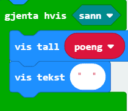

# Introduksjon {.intro} 

"Himmelfall" er et spill som går ut på å unngå det som faller ned på micro:bit skjermen. Spilleren skal bevege seg til høyre og venstre med knappene A og B. Selv om vi i denne oppgaven skal lage et spill, skal vi unngå `Spill`-kategorien helt og heller bruke andre kategorier for å lage spillet vårt. 

Skjermen på micro:biten består av 5x5 ledlys. Disse kan vi skru av og på med litt kode. I denne oppgaven bruker vi klosser fra `Skjerm`-kategorien til å sette og endre hvor lysene skal være. Posisjonen til lysene blir gitt med en x- og en y-posisjon som i et rutenett. Verdien til x angir plassen til lyset bortover (horisontalt) og verdien til y angir plassen nedover (vertikalt), dette er vist på bilder under. Hjørnet øverst til venstre har verdiene `(0,0)`, mens hjørnet nederst til høyre har verdiene `(4,4)`.

# Steg 1: Grunnmur {.activity}

*Det første vi må gjøre er å lage litt av grunnlaget for spillet.*

## Sjekkliste {.check}

- [ ] Lag variablene `spiller`, `poeng`, `liv` og `hull` med 
`Lag en variabel...` i `Variabler`-kategorien. 

- [ ] I `ved start`-klossen (som allerede er i kodefeltet ditt, ellers finner du den i `Basis`), sett `spiller` til 2. Bruk klossen under som du finner i `Variabler`:

- [ ] Bruk `tenn`-klossen fra `Skjerm`-kategorien til å tenne x: 2 og y: 4. Dette er startposisjonen til spilleren. 

- [ ] Sett `poeng` til 0 og `liv` til 3. 

- [ ] Hvis du har gjort alt rett burde koden din se slik ut: 

# Steg 2: Det faller {.activity}

*I dette steget skal vi kode ledlysene som faller nedover og lage hullåpningen som spilleren skal komme seg gjennom.*

## Sjekkliste {.check}

- [ ] I kategorien `Løkker` finn en `gjenta hvis sann`-kloss og sett den til sist i `ved start`. 

I steden for `sann` vil vi at løkken skal kjøre så lenge `liv` er større enn 0.

- [ ] Bytt ut `sann` med klossen , som du finner i `Logikk`. Klikk på pilen på midten av klossen og endre veien tegnet står. Variabelen `liv` skal inn i stedenfor den første 0-en.

**All koden vi skriver videre i steg 2 og steg 3 skal inn i `gjenta hvis liv > 0`-klossen.**

- [ ] Hullet spilleren skal gjennom skal settes til et tilfeldig sted for hver runde. Bruk en kloss fra `Variabler` og en fra `Matematikk` for å få dette til. Koden skal settes i klossen fra forrige punkt. 

Det vi skal gjøre nå er å gå gjennom hele rutenettet for leddlysene og se hvor vi må tenne og etterpå slukke lys for å få det til å se ut som lysene faller nedover. 

- [ ] Lag to variabler `x-indeks` og `y-indeks`. Disse variablene vil holde styr på hvor vi er i rutenettet. 

- [ ] Finn en `gjenta for indeks 0 til 4`-kloss i kategorien `Løkker`, denne skal settes under klossen fra forrige punkt. Endre variablen til `y-indeks`. 

- [ ] Sett en `gjenta for indeks 0 til 4`-kloss inn i den forrige og bytt ut variabelen med `x-indeks`.

Programmet skal gå gjennom hele raden bortover (alle x indeksene) og tenne alle ledlysene på raden utenom der hullet skal være.

- [ ] Hvis `x-indeks` er ulik `hull` skal lyset tennes ved x: `x-indeks` og y: `y-indeks`. Kod dette ved bruk av klossene `hvis` (fra kategorien `Logikk`), `tenn` (fra kategorien `Skjerm`) og  (som du finner i `Logikk` ved å endre på `=` klossen). Disse klossene skal sammen settes i `gjenta for x-indeks 0 til 4`-klossen. 

- [ ] Sett så en `pause`-kloss til 300 etter `gjenta for x-indeks 0 til 4`-blokken. 

- [ ] Kopier `gjenta for x-indeks 0 til 4`-blokken (høyreklikk og trykk på `Lag kopi`). Sett blokken under `pause`-klossen og endre `tenn`-klossen til en `slukk`-kloss.

# Steg 3: Poeng og antall liv {.activity}

*Nå skal vi lage kode som holder orden på antall poeng og liv!* 

## Sjekkliste {.check}

- [ ] Sett inn en `hvis-eller`-kloss under `gjenta for y-indeks fra 0 til 4`-blokka. `Hvis-ellers`-klossen finner du i `Logikk`. 

- [ ] Hvis `spiller` er lik `hull` så skal `poeng` endres med 1. Se om du kan klare å kode dette til ved å bytte ut `sann` med klosser fra `Variabler` og `Logikk`, og sette inn en kloss i område til `hvis` som skal være fra `Variabler`. 

## {.tip}
`hvis-ellers`-klossen fungerer slik at hvis spilleren kommer seg gjennom hullet, så vil programmet kjøre koden som hører til `hvis`-delen av klossen. Hvis dette ikke er sant (spilleren klarte ikke å komme gjennom hullet), vil programmet kjøre koden som hører til `ellers`-delen av klossen. 
##

Hvis spilleren ikke klarer å komme seg gjennom hullet, skal et liv går tapt.

- [ ] I `ellers`-området til `hvis-ellers`-klossen, endre liv med -1. 

Hvis vi har tapt et liv, og alle liv er brukt opp, skal spillet være over. Hvis vi fortsatt har liv igjen, skal vi tenne spilleren på nytt. 

- [ ] Sett in en `hvis-ellers`-kloss under `endre liv med 1`. 

- [ ] Bytt ut `sann` med klossen under:

	

- [ ] Når alle liv er tapt (liv = 0) er spillet over. Det første vi skal gjøre, er å vise dette klart å tydelig med et bilde. Gå til kategorien `Basis` og bruk klossen `vis ikon`. Du kan selv velge hvilket bilde du vil bruke, men et forslag er hodeskallen.

	

- [ ] Legg på en `pause`-kloss som du finner i `Basis`, og endre tallet til 500. 

## {.tip}
Vi legger på en `pause`-kloss under `vis ikon` fordi vi vil at bildet skal vises en stund før resten av koden kjøres. 
##

- [ ] Til slutt vil vi at poengsummen vår skal vises. Dette gjør vi ved å bruke en `hvis sann`-kloss siden koden i klossen vil kjøre helt til vi vil starte spillet på nytt. Sett inn koden nedenfor under `pause`-klossen. 

## {.tip}
Klossene `vis tall` og `vis tekst` kan begge finnes i `Basis`-kategorien. 
##

## {.tip}
Hvis man vil starte spillet på nytt kan man trykke på den sorte `RESET`-knappen på baksiden av micro:biten.
##

Det eneste vi vil gjøre hvis vi fortsatt har liv igjen, er å tenne `spiller`. 

- [ ] I `ellers`-området til `hvis-ellers`-klossen, sett inn en `tenn`-kloss som skal tenne x: `spiller` og y: 4. 

- [ ] Hvis du har gjort alt rett burde koden din se slik ut: 

# Steg 4: Beveg spilleren {.activity}

*Vi vil at spilleren skal bevege seg mot venstre når knapp A trykkes, og mot høyre når knapp B trykkes.*

## Sjekkliste

- [ ] Finn en `når knapp A trykkes`-kloss i `Inndata`-kategorien. 

- [ ] Bruk `slukk`- og `tenn`-klossene som du finner i `Skjerm`-kategorien til å først slukke og så tenne lyset til spilleren. X-verdien er det vi har kalt `spiller`, mens y-verdien er 4 siden spilleren bare skal bevege seg på nederste rad. 

- [ ] Mellom `slukk`- og `tenn`-klossene trenger vi en `hvis`-kloss. Her skal koden inni kjøre om `spiller` er over 0. `spiller` skal da endres med -1. 

## {.tip}
Grunnen til at vi bruker en `hvis` kloss og ikke endrer `spiller` uansett er fordi vi ikke vil at spilleren skal bevege seg mer mot venstre enn det rutenettet med leddlys tillater. Hvis spilleren allerede står på x: 0, skal den ikke få lov til å bevege seg mot venstre.
##

- [ ] Kopier hele `når knapp A trykkes`-blokka ved å høyreklikke på den og trykk `Lag kopi`.

- [ ] Endre den kopierte blokka slik at den er for når knapp B trykkes (trykk på pilen ved siden av `A`. 

Det er to ting som må endres fra `når knapp A trykkes`-blokka til `når knapp B trykkes`. Det ene er veien spilleren skal gå når knappen blir trykket, og det andre er det som hindrer spilleren i å gå ut av brettet. 

- [ ] Endre fra `spiller > 0` til `spiller < 4`. Da vil ikke spilleren få lov til å gå utenfor spillebrettet mot høyre.

- [ ] Endre tallet i `endre spiller med ...` slik at spilleren går mot høyre når knapp B trykkes (du trenger bare å ta bort en minus (`-`)). 

## Test prosjektet {.flag}

*Koden din er nå ferdig!*

- [ ] Sjekk simulatoren og se til at alt fungerer som det skal. 

- [ ] Last ned spillet til micro:biten og spill i vei!

## Utfordringer {.challenge}

- [ ] Sett på lyd ved starten av spillet og når spillet er over

- [ ] Klarer du å endre koden slik at spillet blir litt vanskeligere eller enklere å spille?