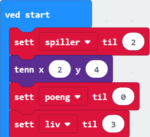
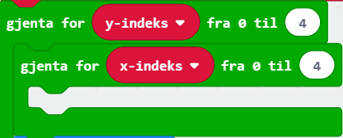
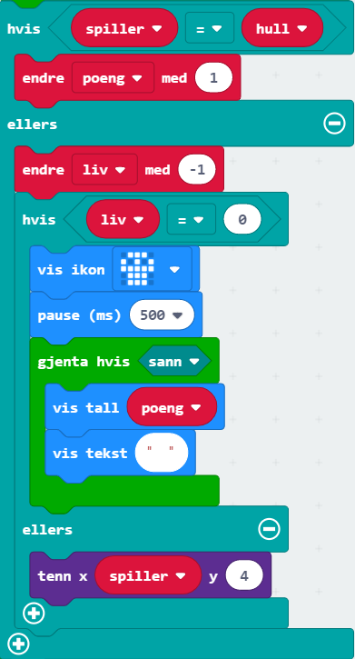

# Introduksjon {.intro}

"Himmelfall" er eit spel som går ut på å unngå det som fell ned på
micro:bit-skjermen. Spelaren skal bevege seg til høgre og venstre med knappane A
og B. Sjølv om me skal lage eit spel skal me unngå `Spel`-kategorien heilt, og
heller bruke andre klossar for å lage spelet vårt.

Skjermen vår har 5x5 ledlys. Desse kan me skru av og på med litt kode. I denne
oppgåva brukar me klossar frå Spel-kategorien til å setje og endre kor lysa skal
vere. Posisjonen til lysa blir gitt ved ein `x`- og ein `y`-posisjon, som i eit
rutenett. Verdien til `x` gir plassen til lyset bortover (vassrett) og verdien
til `y` gir plassen nedover (loddrett), som du ser på biletet under. Hjørnet
øvst til venstre er `(0, 0)` og hjørnet nedst til høgre er `(4, 4)`.

# Steg 1: Grunnmur {.activity}

*Det fyrste me må gjere er å lage litt av grunnlaget for spelet.*

## Sjekkliste {.check}

- [ ] Lag variablane `spelar`, `poeng`, `liv` og `hol` med  `Lag ein
  variabel...` i `Variablar`-kategorien.

- [ ] I `ved start`-klossen (som allereie er i kodefeltet ditt, elles finn du
  den i `Basis`), set `spelar` til `2`. Bruk klossen under som du finn i
  `Variablar`:

- [ ] Bruk `tenn`-klossen frå `Skjerm`-kategorien til å tenne `x = 2` og `y =
  4`. Dette er startposisjonen til spelaren.

- [ ] Set `poeng` til `0` og `liv` til `3`.

- [ ] Viss du har gjort alt rett burde koden din sjå slik ut:

# Steg 2: Det fell {.activity}

*I dette steget skal me kode ledlysa som fell nedover og lage holet som spelaren
 skal kome seg gjennom.*

## Sjekkliste {.check}

- [ ] I kategorien `Løkker` finn du ein `gjenta viss sann`-kloss. Set den sist i
  `ved start`.

I staden for `sann` vil me at løkka skal køyre så lenge `liv` er større enn `0`.

- [ ] Bytt ut `sann` med klossen , som du finn i `Logikk`. Klikk på pila på
  midten av klossen og endre vegen teiknet står. Variabelen `liv` skal inn i
  staden for den fyrste `0`-en.

**All koden me skriv vidare i steg 2 og steg 3 skal inn i `gjenta viss liv >
 0`-klossen.**

- [ ] Holet spelaren skal gjennom skal plasserast ein tilfeldig stad kvar runde.
  Bruk ein kloss frå `Variablar` og ein frå `Matematikk` for å få det til. Koden
  skal setjast i klossen frå førre punkt.

Det neste me skal gjere er å gå gjennom heile rutenettet for ledlysa og sjå kor
me må tenne og så slokke lys for å få det til å sjå ut som at lysa fell nedover.

- [ ] Lag to variablar `x-indeks` og `y-indeks`. Desse variablane vil halde styr
  på kor me er i rutenettet.

- [ ] Finn ein `gjenta for indeks 0 til 4`-kloss i kategorien `Løkker`, denne
  skal setjast under klossen frå førre punkt. Endre variabelen til `y-indeks`.

- [ ] Set ein `gjenta for indeks 0 til 4`-kloss inn i den førre og bytt ut
  variabelen med `x-indeks`.

Programmet skal gå gjennom heile rekkja bortover (alle `x`-indeksane) og tenne
alle ledlysa på rekkja utanom der holet skal vere.

- [ ] Viss `x-indeks` er ulik `hol` skal lyset tennast ved `x = x-indeks` og `y
  = y-indeks`. Kod dette ved å bruke klossane `viss` (frå kategorien `Logikk`),
  `tenn` (frå kategorien `Skjerm`) og  (som du finn i `Logikk` ved å endre på `=`-klossen). Desse
  klossane skal setjast saman i `gjenta for x-indeks 0 til 4`-klossen.

- [ ] Set ein `pause`-kloss til `300` etter `gjenta for x-indeks 0 til
  4`-blokka.

- [ ] Kopier `gjenta for x-indeks 0 til 4`-blokka (høgreklikk og trykk på `Lag
  kopi`). Set blokka under `pause`-klossen og endre `tenn`-klossen til ein
  `slukk`-kloss.

# Steg 3: Poeng og antal liv {.activity}

*No skal me lage kode som heldt orden på antal poeng og liv!*

## Sjekkliste {.check}

- [ ] Set inn ein `viss-elles`-kloss under `gjenta for y-indeks 0 til 4`-blokka.
  `Viss-elles`-klossen finn du i `Logikk`.

- [ ] Viss `spelar` er lik `hol` så skal `poeng` endrast med `1`. Sjå om du får
  til å kode dette ved å bytte ut `sann` med klossar frå `Variablar` og
  `Logikk`, og setje inn ein kloss i området til `viss` som skal vere frå
  `Variablar`.

## {.tip}

`viss-elles`-klossen fungerer slik at viss spelaren kjem seg gjennom holet, så
vil programmet køyre koden som høyrer til `viss`-delen av klossen. Viss dette
ikkje er sant (spelaren klarte ikkje å kome gjennom holet), vil programmet køyre
koden som høyrer til `elles`-delen av klossen.

##

Viss spelaren ikkje klarer å kome seg gjennom holet, skal ein miste eitt liv.

- [ ] I `elles`-området til `viss-elles`-klossen, endre liv med `-1`.

Viss me har mista eit liv, og alle liva er brukt opp, skal spelet vere over.
Viss me framleis har att liv skal me tenne spelaren på nytt.

- [ ] Set inn ein `viss-elles`-kloss under `endre liv med 1`.

- [ ] Bytt ut `sann` med klossen under:

	

- [ ] Når alle liv er tapt (`liv = 0`) er spelet over. Det fyrste me skal gjere
  er å vise det klart og tydeleg med eit bilete. Gå til kategorien `Basis` og
  bruk klossen `vis ikon`. Du kan velje kva bilete du vil bruke sjølv, men eit
  forslag er hovudskallen.

	

- [ ] Legg på ein `pause`-kloss som du finn i `Basis`, og endre talet til `500`.

## {.tip}

Vi legger på ein `pause`-kloss under `vis ikon` fordi me vil at biletet skal
visast ei stund før resten av koden køyrer.

##

- [ ] Til slutt vil me at poengsummen vår skal visast. Dette gjer me ved å bruke
  ein `viss sann`-kloss sidan koden i klossen vil køyre heilt til me vil starte
  spelet på nytt. Set inn koden nedanfor under `pause`-klossen.

## {.tip}

Klossane `vis tal` og `vis tekst` ligg begge i `Basis`-kategorien.

## {.tip}

Viss ein vil starte spelet på nytt kan ein trykke på den svarte `RESET`-knappen
på baksidan av micro:bit-en.

##

Det einaste me vil gjere viss me framleis har att liv er å tenne `spelar`.

- [ ] I `elles`-området til `viss-elles`-klossen, set inn ein `tenn`-kloss som
  skal tenne `x = spelar` og `y = 4`.

- [ ] Viss du har gjort alt rett burde koden din sjå slik ut:

# Steg 4: Beveg spelaren {.activity}

*Me vil at spelaren skal bevege seg mot venstre når knapp A vert trykt, og mot
 høgre når knapp B vert trykt.*

## Sjekkliste

- [ ] Finn ein `når knapp A vert trykt`-kloss i `Inndata`-kategorien.

- [ ] Bruk `slukk`- og `tenn`-klossane som du finn i `Skjerm`-kategorien til å
  fyrst slukke og så tenne lyset til spelaren. X-verdien er det me kallar
  `spelar`, medan `y`-verdien er `4` sidan spelaren berre skal bevege seg på
  nedste rad.

- [ ] Mellom `slukk`- og `tenn`-klossane treng me ein `viss`-kloss. Her skal
  koden inni køyre viss `spelar` er over `0`. Då skal `spelar` endrast med `-1`.

## {.tip}

Grunnen til at me brukar ein `viss`-kloss og ikkje endrar `spelar` uansett er
fordi me ikkje vil at spelaren skal bevege seg lengre til venstre enn det
rutenettet med ledlys tillet. Viss spelaren allereie står på `x = 0` skal det
ikkje gå an å gå lengre til venstre.

##

- [ ] Kopier heile `når knapp A vert trykt`-blokka ved å høgreklikke på den og
  trykk `Lag kopi`.

- [ ] Endre den kopierte blokka slik at den er for når knapp B vert trykt (trykk
  på pila ved sidan av `A`.

Det er to ting som må endrast frå `når knapp A vert trykt`-blokka til `når knapp
B vert trykt`. Det eine er vegen spelaren skal gå når knappen blir trykt, og det
andre er det som hindrar spelaren i å gå ut av brettet.

- [ ] Endre frå `spelar > 0` til `spelar < 4`. Då vil ikkje spelaren få lov til
  å gå utanfor spelebrettet mot høgre.

- [ ] Endre talet i `endre spelar med ...` slik at spelaren går mot høgre når
- knapp B vert trykt (du trenger berre å ta bort ein minus (`-`)).

## Test prosjektet {.flag}

*No er koden din ferdig!*

- [ ] Sjekk simulatoren og sjå til at alt fungerer som det skal.

- [ ] Last ned spelet til micro:biten og spel i veg!

## Utfordringer {.challenge}

- [ ] Set på lyd ved starten av spelet og når spelet er over.

- [ ] Klarar du å endre koden slik at spelet blir litt vanskelegare eller
  enklare å spele?
