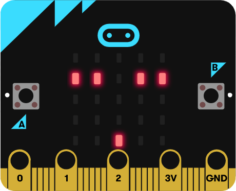
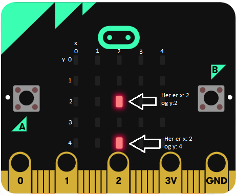

# Introduksjon {.intro}

"Himmelfall" er eit spel som går ut på å unngå det som fell ned på
micro:bit-skjermen. Spelaren skal bevege seg til høgre og venstre med knappane A
og B. Sjølv om me skal lage eit spel skal me unngå `Spel`{.microbitgame}-kategorien
heilt, og heller bruke andre klossar for å lage spelet vårt.



Skjermen vår har 5x5 ledlys. Desse kan me skru av og på med litt kode. I denne
oppgåva brukar me klossar frå Spel-kategorien til å setje og endre kor lysa skal
vere. Posisjonen til lysa blir gitt ved ein __x__- og ein __y__-posisjon, som i eit
rutenett. Verdien til __x__ gir plassen til lyset bortover (vassrett) og verdien
til __y__ gir plassen nedover (loddrett), som du ser på biletet under. Hjørnet
øvst til venstre er __(0, 0)__ og hjørnet nedst til høgre er __(4, 4)__.




# Steg 1: Grunnmur {.activity}

*Det fyrste me må gjere er å lage litt av grunnlaget for spelet.*

## Sjekkliste {.check}

- [ ] Lag variablane `spelar`{.microbitvariables}, `poeng`{.microbitvariables},
  `liv`{.microbitvariables} og `hol`{.microbitvariables} med  `Lag ein
  variabel...`{.microbitvariables} i `Variablar`{.microbitvariables}-kategorien.

- [ ] I `ved start`{.microbitbasic}-klossen (som allereie er i kodefeltet ditt,
  elles finn du den i `Basis`{.microbitbasic}), set `spelar`{.microbitvariables}
  til __2__. Bruk klossen `sett variabel til`{.microbitvariables} som du finn i
  `Variablar`{.microbitvariables}:

- [ ] Bruk `tenn`{.microbitled}-klossen frå `Skjerm`{.microbitled}-kategorien
  til å tenne `x = 2`{.microbitled} og `y = 4`{.microbitled}. Dette er
  startposisjonen til spelaren.

- [ ] Set `poeng`{.microbitvariables} til __0__ og `liv`{.microbitvariables} til
  __3__.

- [ ] Viss du har gjort alt rett burde koden din sjå slik ut:

```microbit
let spiller = 2
led.plot(2, 4)
let poeng = 0
let liv = 3
```


# Steg 2: Det fell {.activity}

*I dette steget skal me kode ledlysa som fell nedover og lage holet som spelaren
 skal kome seg gjennom.*

## Sjekkliste {.check}

- [ ] I kategorien `Løkker`{.microbitloops} finn du ein `gjenta viss sann`{.microbitloops}-kloss.
  Set den sist i `ved start`{.microbitbasic}.

I staden for `sann`{.microbitlogic} vil me at løkka skal køyre så lenge `liv`{.microbitvariables}
er større enn __0__.

- [ ] Bytt ut `sann`{.microbitlogic} med klossen `0 > 0`{.microbitlogic}, som
  du finn i `Logikk`{.microbitlogic}. Klikk på pila på midten av klossen og endre
  vegen teiknet står. Variabelen `liv`{.microbitvariables} skal inn i staden for
  den fyrste __0__-en.

```microbit
while (liv > 0) {

}
```

**All koden me skriv vidare i steg 2 og steg 3 skal inn i** `gjenta viss liv >
 0`{.microbitloops}**-klossen.**

- [ ] Holet spelaren skal gjennom skal plasserast ein tilfeldig stad kvar runde.
  Bruk ein kloss frå `Variablar`{.microbitvariables} og ein frå `Matematikk`{.microbitmath}
  for å få det til. Koden skal setjast i klossen frå førre punkt.

Det neste me skal gjere er å gå gjennom heile rutenettet for ledlysa og sjå kor
me må tenne og så slokke lys for å få det til å sjå ut som at lysa fell nedover.

- [ ] Lag to variablar `x-indeks`{.microbitvariables} og `y-indeks`{.microbitvariables}.
  Desse variablane vil halde styr på kor me er i rutenettet.

- [ ] Finn ein `gjenta for indeks 0 til 4`{.microbitloops}-kloss i kategorien
  `Løkker`{.microbitloops}, denne skal setjast under klossen frå førre punkt.
  Endre variabelen til `y-indeks`{.microbitvariables}.

- [ ] Set ein `gjenta for indeks 0 til 4`{.microbitloops}-kloss inn i den førre
  og bytt ut variabelen med `x-indeks`{.microbitvariables}.

```microbit
while (liv > 0) {
    for (let yindeks = 0; yindeks <= 4; yindeks++) {
        for (let xindeks = 0; xindeks <= 4; xindeks++) {

        }
    }
}
```

Programmet skal gå gjennom heile rekkja bortover (alle __x__-indeksane) og tenne
alle ledlysa på rekkja utanom der holet skal vere.

- [ ] Viss `x-indeks`{.microbitvariables} er ulik `hol`{.microbitvariables} skal
  lyset tennast ved `x = x-indeks`{.microbitled} og `y = y-indeks`{.microbitled}.
  Kod dette ved å bruke klossane `viss`{.microbitlogic} (frå kategorien `Logikk`{.microbitlogic}),
  `tenn`{.microbitled} (frå kategorien `Skjerm`{.microbitled}) og `0 ulik 0`{.microbitlogic}
  (som du finn i `Logikk`{.microbitlogic} ved å endre på `=`{.microbitlogic}-klossen).
  Desse klossane skal setjast saman i `gjenta for x-indeks 0 til 4`{.microbitloops}-klossen.

- [ ] Set ein `pause`{.microbitbasic}-kloss til __300__ etter `gjenta for x-indeks 0 til
  4`{.microbitloops}-blokka.

- [ ] Kopier `gjenta for x-indeks 0 til 4`{.microbitloops}-blokka (høgreklikk og
  trykk på __Lag kopi__). Set blokka under `pause`{.microbitbasic}-klossen og
  endre `tenn`{.microbitled}-klossen til ein `slukk`{.microbitled}-kloss.


# Steg 3: Poeng og antal liv {.activity}

*No skal me lage kode som heldt orden på antal poeng og liv!*

## Sjekkliste {.check}

- [ ] Set inn ein `viss-elles`{.microbitlogic}-kloss under `gjenta for y-indeks
  0 til 4`{.microbitloops}-blokka. `Viss-elles`{.microbitlogic}-klossen finn du
  i `Logikk`{.microbitlogic}.

- [ ] Viss `spelar`{.microbitvariables} er lik `hol`{.microbitvariables} så skal
  `poeng`{.microbitbasic} endrast med __1__. Sjå om du får til å kode dette ved
  å bytte ut `sann`{.microbitlogic} med klossar frå `Variablar`{.microbitvariables}
  og `Logikk`{.microbitlogic}, og setje inn ein kloss i området til `viss`{.microbitlogic}
  som skal vere frå `Variablar`{.microbitvariables}.

## {.tip}

`viss-elles`{.microbitlogic}-klossen fungerer slik at viss spelaren kjem seg
gjennom holet, så vil programmet køyre koden som høyrer til `viss`{.microbitlogic}-delen
av klossen. Viss dette ikkje er sant (spelaren klarte ikkje å kome gjennom holet),
vil programmet køyre koden som høyrer til `elles`{.microbitlogic}-delen av klossen.

##

Viss spelaren ikkje klarer å kome seg gjennom holet, skal ein miste eitt liv.

- [ ] I `elles`{.microbitlogic}-området til `viss-elles`{.microbitlogic}-klossen,
  endre liv med __-1__.

Viss me har mista eit liv, og alle liva er brukt opp, skal spelet vere over.
Viss me framleis har att liv skal me tenne spelaren på nytt.

- [ ] Set inn ein `viss-elles`{.microbitlogic}-kloss under `endre liv med 1`{.microbitvariables}.

- [ ] Bytt ut `sann`{.microbitlogic} med klossen `liv = 0`{.microbitlogic}.

- [ ] Når alle liv er tapt (`liv = 0`{.microbitlogic}) er spelet over. Det fyrste
  me skal gjere er å vise det klart og tydeleg med eit bilete. Gå til kategorien
  `Basis`{.microbitbasic} og bruk klossen `vis ikon`{.microbitbasic}. Du kan
  velje kva bilete du vil bruke sjølv, men eit forslag er hovudskallen.

- [ ] Legg på ein `pause`{.microbitbasic}-kloss som du finn i `Basis`{.microbitbasic},
  og endre talet til __500__.

## {.tip}

Vi legger på ein `pause`{.microbitbasic}-kloss under `vis ikon`{.microbitbasic}
fordi me vil at biletet skal visast ei stund før resten av koden køyrer.

##

- [ ] Til slutt vil me at poengsummen vår skal visast. Dette gjer me ved å bruke
  ein `viss sann`{.microbitlogic}-kloss sidan koden i klossen vil køyre heilt til
  me vil starte spelet på nytt. Set inn koden nedanfor under `pause`{.microbitbasic}-klossen.

```microbit
while (true) {
    basic.showNumber(poeng)
    basic.showString("")
}
```

## {.tip}

Klossane `vis tal`{.microbitbasic} og `vis tekst`{.microbitbasic} ligg begge i
`Basis`{.microbitbasic}-kategorien.

## {.tip}

Viss ein vil starte spelet på nytt kan ein trykke på den svarte __RESET__-knappen
på baksidan av micro:bit-en.

##

Det einaste me vil gjere viss me framleis har att liv er å tenne `spelar`{.microbitvariables}.

- [ ] I `elles`{.microbitlogic}-området til `viss-elles`{.microbitlogic}-klossen,
  set inn ein `tenn`{.microbitled}-kloss som skal tenne `x = spelar`{.microbitled} og `y = 4`{.microbitled}.

- [ ] Viss du har gjort alt rett burde koden din sjå slik ut:

```microbit
if (spiller == hull) {
    poeng += 1
} else {
    liv += -1
    if (liv == 0) {
        basic.showIcon(IconNames.Skull)
        basic.pause(500)
        while (true) {
            basic.showNumber(poeng)
            basic.showString("")
        }
    } else {
        led.plot(spiller, 4)
    }
}
```

# Steg 4: Beveg spelaren {.activity}

*Me vil at spelaren skal bevege seg mot venstre når knapp A vert trykt, og mot
 høgre når knapp B vert trykt.*

## Sjekkliste

- [ ] Finn ein `når knapp A vert trykt`{.microbitinput}-kloss i `Inndata`{.microbitinput}-kategorien.

- [ ] Bruk `slukk`{.microbitled}- og `tenn`{.microbitled}-klossane som du finn
  i `Skjerm`{.microbitled}-kategorien til å fyrst slukke og så tenne lyset til
  spelaren. X-verdien er det me kallar `spelar`{.microbitvariables}, medan y-verdien
  er __4__ sidan spelaren berre skal bevege seg på nedste rad.

- [ ] Mellom `slukk`{.microbitled}- og `tenn`{.microbitled}-klossane treng me
  ein `viss`{.microbitlogic}-kloss. Her skal koden inni køyre viss `spelar`{.microbitvariables}
  er over __0__. Då skal `spelar`{.microbitvariables} endrast med __-1__.

## {.tip}

Grunnen til at me brukar ein `viss`{.microbitlogic}-kloss og ikkje endrar `spelar`{.microbitvariables}
uansett er fordi me ikkje vil at spelaren skal bevege seg lengre til venstre enn det
rutenettet med ledlys tillet. Viss spelaren allereie står på __x = 0__ skal det
ikkje gå an å gå lengre til venstre.

##

- [ ] Kopier heile `når knapp A vert trykt`{.microbitinput}-blokka ved å høgreklikke
  på den og trykk __Lag kopi__.

- [ ] Endre den kopierte blokka slik at den er for når knapp B vert trykt (trykk
  på pila ved sidan av __A__.

Det er to ting som må endrast frå `når knapp A vert trykt`{.microbitinput}-blokka
til `når knapp B vert trykt`{.microbitinput}. Det eine er vegen spelaren skal gå
når knappen blir trykt, og det andre er det som hindrar spelaren i å gå ut av brettet.

- [ ] Endre frå `spelar > 0`{.microbitlogic} til `spelar < 4`{.microbitlogic}.
  Då vil ikkje spelaren få lov til å gå utanfor spelebrettet mot høgre.

- [ ] Endre talet i `endre spelar med ...`{.microbitvariables} slik at spelaren
  går mot høgre når knapp B vert trykt (du treng berre å ta bort ein minus (__-__)).

## Test prosjektet {.flag}

*No er koden din ferdig!*

- [ ] Sjekk simulatoren og sjå til at alt fungerer som det skal.

- [ ] Last ned spelet til micro:biten og spel i veg!

## Utfordringer {.challenge}

- [ ] Set på lyd ved starten av spelet og når spelet er over.

- [ ] Klarar du å endre koden slik at spelet blir litt vanskelegare eller
  enklare å spele?
