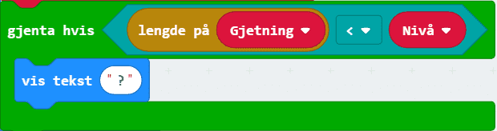
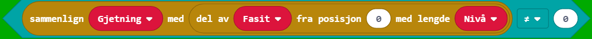
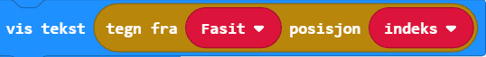
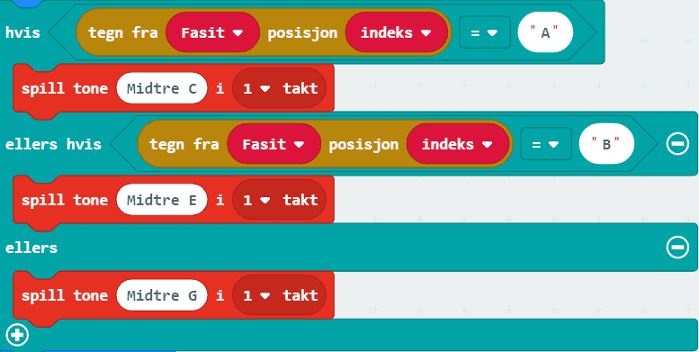
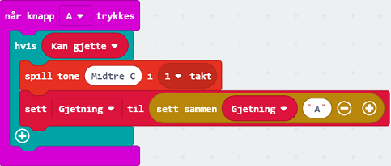
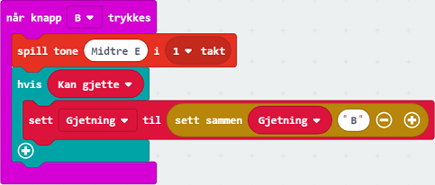
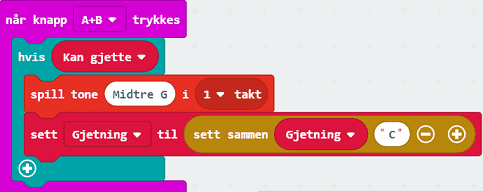

# Introduksjon {.intro} 

"Hjernteppe!" er en huskelek hvor du skal huske stadig lengre rekker med bokstaver!

I denne oppgaven skal vi bruke noe som kalles for en funksjon. En funksjon er et sett med flere kodelinjer (klosser) som til sammen utfører en oppgave. Å lage funksjoner er lurt dersom man skal gjøre oppgaven flere ganger underveis i programmet. Det kan også være lurt for å dele opp programmet i mindre deler.  

# Steg 1: Velg fasit {.activity}

*Det første vi skal kode er en funksjon som skal inneholde de forskjellige bokstavkombinasjonene man kan få som en oppgave. Funksjonen skal også ha med en variabel `Fasit` som skal velge hvilken oppgave som er den gjeldende.*

## Sjekkliste {.check}

- [ ] Lag en ny funksjon som du kaller `Velg fasit`. Du lager en ny funksjon med `Lag en funksjon...`-knappen i kategorien `Funksjoner` i `Avansert`. 

- [ ] Sett en variabel kalt `Oppgaver` til en liste med tre eller flere tekstsstrenger med ulike variasjoner på rekkefølge på bokstavene A, B og C. Du kan få bruk for denne klossen: . Koden settes inn i `Velg fasit`. 

## {.tip}
Forslag til tre ulike teksstrenger er: ABCCBABA, ACCBACBC og CBACCBAB
##

- [ ] En variabel `Fasit` skal settes til `Oppgaver` som får en verdi mellom 0 og antall oppgaver - 1. `Sett Fasit til`-klossen finner du i `Variabler`,  finner du i `Lister` og `plukk et tilfeldig tall mellom...` finner du i `Matematikk`. 

## OBS! {.tip}
Hvis du endrer antall oppgaver i listen, må du også endre makstallet for det tilfeldige tallet du plukker. Makstallet skal være antall oppgaver - 1. 
##

# Steg 2: Vis fasit {.activity}

*I dette steget skal vi lage en til funksjon. Denne skal holde styr på nivået vi er på og vise bokstavene til skjermen på micro:biten.*

## Sjekkliste 

- [ ] Lag en ny funskjon kalt `Vis fasit` og sett den inn i kodefeltet ditt.  

- [ ] Lag en ny variabel `Gjetning`. Denne skal inneholde gjetningen av bokstaver til spilleren.

- [ ] Sett den nye variabelen til en tom teksstreng i `Vis fasit`-funksjonen. -klossen finner du i kategorien `Tekst`. 

- [ ] Lag en ny variabel `Kan gjette`. Denne variabelen skal holde styr på om personen som spiller kan gjette, eller om den må vente. *Senere skal vi kode at spilleren bare kan gjette hvis et spørsmålstegn vises på skjermen til micro:biten.*

- [ ] Sett `Kan gjette` til `usann`. -klossen finner du i `Logikk`. 

Nivået vi er på tilsvarer antall bokstaver vi må huske. Det vi nå skal kode er bokstavene som skal vises på skjermen til nivået vi er på.

- [ ] Lag to nye variabler `indeks` og `Nivå`. 

- [ ] Finn en passende løkke i `Løkker` som skal gjenta for variabelen `indeks` fra 0 til `Nivå` - 1. Løkken skal settes inn nederst i `Vis fasit`.

- [ ] Sett først inn en `tøm skjerm`-kloss og så en `pause`-kloss på 200 ms i løkken. Begge klossene kan du finne i `Basis`. 

- [ ] Videre i løkken vil vi at en bokstav fra variabelen `Fasit` skal vises, på den posisjoen (`indeks`) vi er på i løkken. En `vis tekst`-kloss finner du i `Basis`, klossen under fra `Tekst` kan også komme godt med. 

	   

- [ ] Sett inn en `pause`-kloss med et tall mellom 500 og 1000. 

Vi går nå ut av løkken og fortsetter videre under.

- [ ] Siden vi er ferdig med å vise bokstavene spilleren skal gjette, setter vi `Kan gjette` til `sann`. 

- [ ] Til slutt i denne funksjonen vil vi vise et spørsmålstegn så lenge gjetningen ikke er like lang som det nivået vi er på. Sett inn koden som er vist nedenfor under forrige kloss. Klossen `lengde på` finner du i `Tekst`-kategorien. 

	

# Steg 3: Sett sammen programmet {.activity}

## Sjekkliste {.check}

- [ ] I `ved start` skal det legges inn en kloss som heter `call Velg fasit` fra `Funksjoner`. *Denne klossen henter funksjonen `Velg fasit` og kjører koden der den plasseres.*

- [ ] Lag en ny variabel som du kaller `Nivå`. Denne skal settes til 0.

- [ ] Legg til en `gjenta hvis sann`-kloss. I steden for `sann` vil vi at løkken skal kjøre så lenge `Nivå` er mindre enn lengden på `Fasit`. `Mindre enn`-klossen ser slik ut:

- [ ] Endre `Nivå` med 1 inni løkken fra forrige punkt. 

- [ ] Hent ut funksjonen `Vis fasit`. 

- [ ] Sett inn en `gjenta hvis sann`-kloss. Bytt ut `sann` med koden under. *Vi skal fortsatt være inni forrige løkke.*

	

- [ ] Sett inn en `vis ikon`-kloss (fra `Basis`) i løkken fra forrige punkt. Bilde som skal vises skal være et kryss. 

- [ ] Under bildet skal `Vis fasit` hentes på nytt.  

- [ ] Vi går nå ut av den ene løkken. Sett inn en `vis ikon`-kloss under. Bildet skal se slik ut: 

- [ ] Gå ut av den første løkken og sett inn en `vis ikon`-kloss helt nederst i `ved start`-blokken. Dette bildet skal vise at spillet er ferdig og at spilleren har klart alle nivåene i oppgaven. Du kan selv velge hvilket bilde du vil bruke.

# Steg 4: Knapper {.activity}

*Nå skal vi lage knappene som spilleren skal bruke når den gjetter på bokstavene!*

## Sjekkliste {.check}

- [ ] Plasser en `når knapp A trykkes`-kloss fra `Inndata` i kodefeltet ditt.

Spilleren skal bare kunne gjette hvis variabelen `Kan gjette` er satt til sann. Koden vi bruker for å gjette skal derfor settes inn i en `hvis`-kloss. 

- [ ] Sett inn en `hvis`-kloss fra `Logikk`. Bytt ut `sann` med `Kan gjette`. 

- [ ] I `hvis`-klossen, sett inn: 

- [ ] Lag kode for `når knapp B trykkes` og `når knapp A+B trykkes`. `Når knapp A+B trykkes` skal det være en gjetning på bokstaven C.

## Test prosjektet {.flag}
*Nå er koden din ferdig!*

- [ ] Last ned koden til micro:biten og se hvor mye du klarer å huske!

# Videre arbeid: Musikk istedenfor bokstaver! {.activity}

*Hvis du vil kan du bytte til å gjette på toner i steden for bokstaver. Du vil trenge litt ekstra utstyr:* 

*- Høyttaler (buzzer) eller hodetelefoner*

*- 2 krokodilleklemmer* 

- [ ] Bytt ut  i `Vis fasit`-funksjonen med det under:

	

- [ ] Utvid koden for knappene til de ser slik ut: 

	  

- [ ] Koble til en høyttaler (buzzer) eller hodetelefoner med krokodilleklemmer (hvis du er usikker på hvordan dette gjøres kan du se på en av de andre oppgavene som skal spille av lyd, der er alt forklart). 

- [ ] Last ned koden til micro:biten og spill i vei. 
