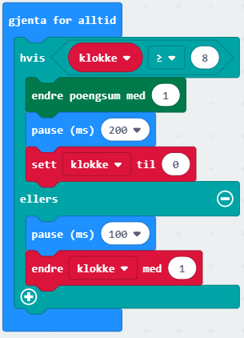
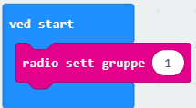
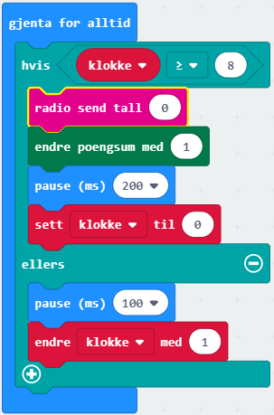
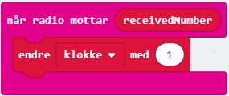

# Introduksjon {.intro} 

Ildlfuer blinker i mørket om
natta. Noen ild-fluer er spesielle ved at de kan blinke nesten i takt. 
Hvordan er dette mulig. Forskere har funnet ut at hver ildlfue har sin egen interne
 klokke og blinker med jevne mellomrom. I tilleg ser hver ildflue når naboen blinker, 
 og da endrer de litt på på sin egen klokke. Til slutt kan da hele svermer av ildlfluer 
 blinke i takt. Du kan lese mer om ildlfuer og synkronisert blinking på 
 [denne nettsiden](http://ncase.me/fireflies/){target=_blank}

I denne oppgaven skal vi kode micro:bitene slik at de fungere som en sverm med blinkende 
ildfluer. 

# Steg 1: Vi lager en ensom ildflue {.activity}

Det første er å lage en ensom ildflue som ikke kommuniserer med de andre. 
Det gjør vi ved å lage en intern klokke som teller langsomt oppver. 
Hver gang den når verdien 8 
bruker den endre poengsum-blokk fra spill-menyen for å vise en liten animasjon. 

## Sjekkliste {.check}

- [ ] Lag en variabel som heter `klokke`

- [ ] Bruk `gjenta for alltid`-blokken og legg inn en `hvis ellers`-kloss 
fra `Logikk`-kategorien. 

- [ ] Test for om variabelen `klokke` er større eller lik `8` øverst i 
`hvis ellers`-klossen. 

- [ ] I den øverset åpningen i `hvis ellers`-klossen, legg inn en 
`endre poengsum med 1`-kloss fra `Spill`-kategorien, legg inn en 
`pause`-kloss og ta en pause på `200 ms` Sett så variabelen 
`klokke` til `0`. 

- [ ] I den nederste åpningen i `hvis ellers`-klossen legg inn en 
`pause`-kloss og ta en pause på `100 ms`. Legg så til en 
`endre klokke med 1`-kloss fra `Variabler`-kategorien.

	

## Test prosjektet {.flag}

*Nå kan dere teste om micro:biten blinker med jevne mellomrom*

- [ ] Last ned prosjektet til micro:biten.

- [ ] Har dere flere micro:biter i gruppa/klassen? Blinker de i takt?

# Steg 2: Ildfluene kommuniserer {.activity}

Vi kan nå micro:bitene tuil å kommunisere ved å be de sende ut et radiosignal hver gang 
de blinker. Vi vil også la alle micro:bitene motta radiosignal ra naboene og 
endre klokka når signalet mottas.

## Sjekkliste {.check}

- [ ] Alle micro:bitene må bruke samme radiokanal. Dette gjør vi ved å
legge inn en `radio send serienummer`-kloss fra Radio-kategorien inne i ved start-klossen.

	

- [ ] Nå må vi endre på koden fra Steg 1 ved å legge inn en radio send tall-kloss i den
øverste åpningen i `hvis ellers`-klossen. Nå sender micro:biten ut et radiosignal hver gang
den blinker.

	

- [ ] Nå må vi få micro:biten til å motta radio-signal fra andre. Legg inn en
når mottar recievedNumber-kloss fra Radio-kategorien. Inne i denne endres klokke med 1.

	

## Test prosjektet {.flag}

*Nå kan dere teste om micro:biten blinker med jevne mellomrom*

- [ ] Last ned prosjektet til micro:biten.

- [ ] Har dere flere micro:biter. Blinker de mer i takt?

# Steg 4: Noen utfordringer {.activity}

*Noen forslag til endringer og utvidelser, men prøv selv dine ideer!*

## Flere ideer {.check}

Nedenfor er noen 
ideer til videreutvikling, men finn gjerne på noe helt eget!

- [ ] Kan du la ildfluen din ha sitt helt eget bilde eller animasjon?

- [ ] Hva skjer hvis fluene har ulik klokke?
