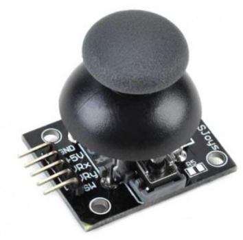
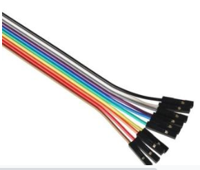
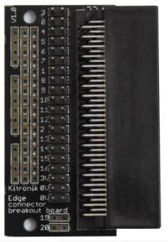
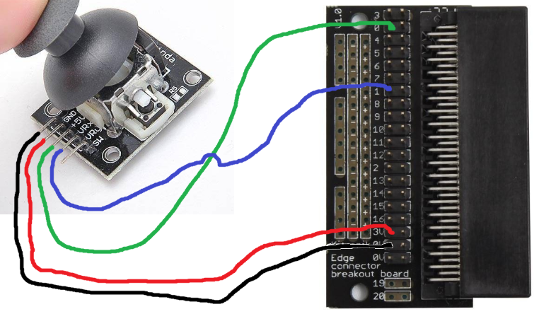

# Introduksjon {.intro}

I denne oppgaven skal vi koble en joystick (styrepinne) til Micro:bit-en og
så styre en figur («sprite») på Micro:bit-ens skjerm ved hjelp av joysticken.
Figuren er en lysende LED på skjermen til Micro:bit.




# Steg 1: Vi kobler til joysticken {.activity}

For å koble til joystick-en trenger vi noe ekstra utstyr:
* 1 grønn ledning med kontakt (hull) i begge ender.
* 1 rød ledning med kontakt (hull) i begge ender.
* 1 blå ledning med kontakt (hull) i begge ender.
* 1 svart ledning med kontakt (hull) i begge ender.
* 1 [koblingsbrett](https://kodegenet.no/shop/product/microbit_edge_connector){target=_blank} slik at vi kan bruke alle tilkoblingsmuligheter micro:biten har.
* 1 [analog joystick](https://kodegenet.no/shop/product/joystick_analog){target=_blank}

    

    


## Sjekkliste {.check}

- [ ] Svart ledning festes på `GND` på joystick og på en av `0V` på tilkoblingsenheten.

- [ ] Rød ledning festes på `+5V` på joysticken og på `3V` på tilkoblingsenheten.

- [ ] Grønn ledning festes på `VRx` på joysticken og på `0` på tilkoblingsenheten.

- [ ] Blå ledning festes på `VRy` på joysticken og på `1` på tilkoblingsenheten.

- [ ] Sjekk en gang til at du har koblet riktig som vist på bildet nedenfor:.

    


# Steg 2: Vi koder micro:biten {.activity}

For å kode micro:biten må vi forstå hvordan koblingen vi laget i forrige steg
fungerer. Strøm vil gå fra `3V` på micro:biten til `+5V` på Joysticken. Strøm
vil så gå tilbake fra `GND` på joystick til `0V` (`GND`) på Micro:bit-en.
Joysticken vil også sende litt strøm over `VRx` og `VRy` og mengden strøm vil
avhenge av hvor mye vi beveger pinnen på joysticken langs X-aksen (side til
side) og Y-aksen (opp og ned). Micro:biten kan da lese verdiene (mellom `0` og
`1023`) på pin `1` og `0` for å finne ut i hvilken posisjon joysticken står. På
pin `0` betyr verdi `0` at joysticken er bøyd helt til venstre og `1023` betyr
helt til høyre. På pin `1` betyr verdi `0` at joysticken er bøyd helt ned og
`1023` betyr at joystick er bøyd helt opp. Verdien `512` betyr at joysticken
står rett opp.


## Sjekkliste {.check}

- [ ] Start et nytt PXT-prosjekt, for eksempel ved å gå til
  [makecode.microbit.org](https://makecode.microbit.org/?lang=no){target=_blank}

- [ ] Lag en ny variabel som heter `spiller`{.microbitvariables}.

- [ ] Ved start sett `spiller`{.microbitvariables} til å være en `sprite`{.microbitgame} ved å bruke en
`sprite`{.microbitgame}-kloss fra `Spill`{.microbitgame}-kategorien. Plasser `spiller`{.microbitvariables} midt på
micro:bit-en, dvs i posisjon 2,2.

```microbit
let spiller = game.createSprite(2, 2)
```

- [ ] Lag en variabel som heter `lesX`{.microbitvariables} og en som heter `lesY`{.microbitvariables}.

- [ ] Inne i `gjenta for alltid`{.microbitbasic}-klossen må vi sette `lesX`{.microbitvariables} og `lesY`{.microbitvariables} til
analoge verdier som leses fra henholdsvis inngangene P0 og P1.
Husk at verdien som leses styres av posisjonen til joysticken. Dette gjør
vi ved å bruke en `les analog verdi fra`{.microbitpins}-kloss fra `Tilkobling`{.microbitpins}-kategorien
under `Avansert`.

- [ ] Nå må vi sjekke for hvilken verdi som er lest inn og flytte `spiller`{.microbitvariables}
etter hvordan joysticken beveges. Vi sjekker først om
`lesX`{.microbitvariables} er mindre enn `300`. Da må `spiller`{.microbitvariables} flyttes ett skritt til venstre.
Vi trenger da en `sprite endre x med`{.microbitgame}-kloss fra `Spill`{.microbitgame}-kategorien. Når
joysticken sender en verdi lavere enn `300` på `P0`, vil den peke mot venstre.
Da må `spiller`{.microbitvariables} sin x-verdi endres med `-1` for at den skal bevege seg mot
venstre.

- [ ] Vi sjekker så om `lesX`{.microbitvariables} er større enn `700`. Da må `spiller`{.microbitvariables} flyttes
ett skritt til høyre ved å øke `spillers`{.microbitvariables} x-verdi med `1`.

- [ ] Vi sjekker så om `lesY`{.microbitvariables} er mindre enn `300`. Da peker joysticken
nedover og spiller må `spiller`{.microbitvariables} flyttes ett skritt nedover ved å endre
y-verdi med `1`

- [ ] Vi sjekker så om `lesY`{.microbitvariables} er mer enn `700`. Da må Spiller flyttes
ett skritt oppover ved å endre y-verdi med `-1`.

- [ ] Legg til en `pause`{.microbitbasic}-kloss og ta pause i for eksempel `10` ms slik at `spiller`{.microbitvariables} ikke
beveger seg for fort.

 - [ ] Koden burde nå se slik ut:

```microbit
let spiller = game.createSprite(2, 2)
basic.forever(function () {
    lesX = pins.analogReadPin(AnalogPin.P0)
    lesY = pins.analogReadPin(AnalogPin.P1)
    if (lesX < 300) {
        spiller.change(LedSpriteProperty.X, -1)
    }
    if (lesX > 700) {
        spiller.change(LedSpriteProperty.X, 1)
    }
    if (lesY < 300) {
        spiller.change(LedSpriteProperty.X, 1)
    }
    if (lesY > 700) {
        spiller.change(LedSpriteProperty.X, -1)
    }
})
```

## Test prosjektet {.flag}

- [ ] Til venstre på skjermen er det et bilde av en micro:bit. Her kan du
teste at pilen snurrer og blinker som den skal.

- [ ] Du kan laste ned programmet til til micro:biten.

- [ ] Prøv å styre den lysende prikken med joysticken. Klarer du å få den tilbake til midten?


## Noen utfordringer {.challenge}

*Noen forslag til endringer og utvidelser, men prøv selv dine ideer!*

Du har nå lært hvordan du kan lage en enkel animasjon med micro:bit. Nedenfor
er noen ideer til videreutvikling, men finn gjerne på noe helt eget!

- [ ] Kan du få Spilleren til å kun bevege seg loddrett eller vannrett?

- [ ] Kan du bruke joystick-en i et annet micro:bit prosjekt, for eksempel
[Det regner mat](https://oppgaver.kidsakoder.no/microbit/pxt_det_regner_mat/det_regner_mat){target=_blank}
