# Introduksjon {.intro}

Lag et morsomt blinkende juletre som pynter opp til jul. Endre lys-show ved å trykke på knappene!

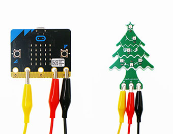

På bildet ser du hvordan du skal koble micro:bit'en til juletreet med krokodilleklemmene på kablene. Pass på at klemmene alltid står rett på micro:bit'en så den ikke kortslutter de andre strømførende feltene.

# Først: Sjekk at du har riktig utstyr {.activity}
  *Det er viktig at du har alt utstyr og tilbehør før du starter på denne
  oppgaven.*

## Sjekkliste {.check}
  - [ ] En micro:bit med en USB-kabel

  - [ ] Tre kabler med krokodilleklemmer

  - [ ] Et juletre med seks RGB led-lys

  - [ ] En datamaskin med Internett

  Hvis du ikke har to skjermer kan det være lurt å skrive denne oppgaven ut på papir. Velg *Last ned PDF* under tittelen øverst og skriv ut fra dialogen som vises.

# Steg 1: Installere tillegget Neopixel {.activity}

## Sjekkliste {.check}

- [ ] Start et nytt PXT-prosjekt ved å åpne en nettleser og gå til
  [makecode.microbit.org](https://makecode.microbit.org/?lang=no). Velg nytt prosjekt og skriv inn dette navnet - Juletre i dialogen. Trykk *Lag* og du kommer inn i utviklingsmiljøet for micro:bit. 
  
  Her vises en simulator til venstre, en verktøymeny i midten og et stort kodefelt til høyre. Her er det allerede lagt til to blokker; - `ved start` og `for alltid`.

- [ ] Først må vi installere utvidelsen *Neopixel* for å styre led-lysene på treet. Gå til *Avansert* nederst i verktøymenyen og velg *Utvidelser*. Velg så kortet neopixel på siden som kommer opp. Nå installeres denne og du kommer tilbake til utviklingsmiljøet. Legg merke til at du har fått et nytt valg i verktøymenyen - *Neopixel*.

- [ ] Finn blokken `set strip to` under *Neopixel* og dra denne inn i kodefeltet.

- [ ] Dra deretter denne videre inn i blokken `ved start`, velg *pin1* og endre antallet leds til *6*. Legg merke til at simulatoren til venstre nå får led-lys tilkoblet under med ledninger koblet til *1*, *3V* og *GND*.

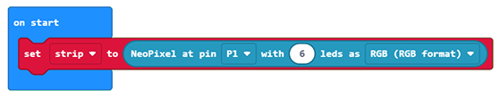

# Steg 2: Slå på lysene i juletreet {.activity}

## Sjekkliste {.check}

- [ ] Fra *Neopixel* dra inn blokken `strip show raindow from`. Plassér denne under `set strip to`-blokken i `ved start`. 

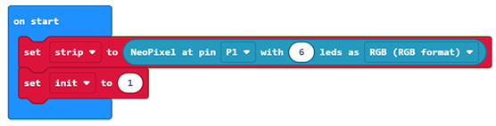

Nå endres led-lysene i simulatoren og du ser forskjellige farger.

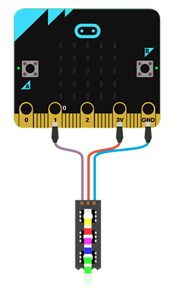

# Steg 3: Prøve lysene på micro:bit-kontrolleren {.activity}

- [ ] Koble opp juletreet til micro:bit med kablene og krokodilleklemmene som på bildet over. En kabel fra *1* på Microbit til *S* på juletreet, en fra *3V* til *V* og den siste fra *GND* til *G*.

- [ ] Koble micro:bit'en din til datamaskinen med USB-kabelen.

- [ ] Klikk deretter på knappen `Last ned` nede til venstre på skjermen. Det lastes nå ned en fil som heter `juletre.hex` til datamaskinen din.

- [ ] Kopiér denne filen over til MICROBIT-disken (d:) på PC'en din. Det blinker i det gule led-lyset på baksiden micro:bit'en mens nedlasting pågår. Straks denne slutter å blinke er filen overført og juletreet skal lyse.

# Steg 4: Få lysene til å skifte farge {.activity}

## Sjekkliste {.check}

- [ ] Finn blokken som heter `strip rotate by`. Den ligger under *Neopixel*. Dra denne inn i `gjenta for alltid`-blokken. 
- [ ] Finn deretter blokken `strip show` og dra denne inn under den forrige. I simulatoren vil du nå se at led-lysene bytter farge veldig raskt. For å senke hastigheten legger vi inn en pause.
- [ ] Fra *Basis* i verktøymenyen, finn blokken `pause`. Trekk denne inn under `strip show` og skriv inn 400 millisekunder. Nå blinker led-lysene i et roligere tempo.  

# Steg 5: Gjør det mulig å bytte modus

## Sjekkliste {.check}

- [ ] Fra *Logikk* dra inn en `hvis..ellers`-blokk. Plassér denne øverst i `gjenta for alltid`-blokken.
- [ ] Fra *Logikk* dra inn en sammenligningblokk `0 = 0` og slipp den over *sann*-feltet i hvisblokken.  
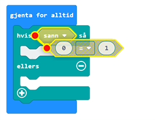

- [ ] I *Variabler* - lag en ny variabel og gi den navnet `modus`.
- [ ] Dra en instans av `modus` og slipp den over den første 0'en i sammenligningsboksen.
- [ ] Endre den andre 0'en til 1.  
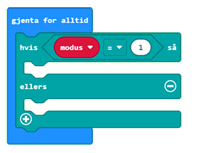

- [ ] I *Variabler* - lag enda en ny variabel og gi den navnet `init`.
- [ ] I `ved start`-blokken dra inn en `sett..til` fra *Variabler*. Velg variabelen `init` og sett denne til *1*.  
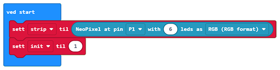

- [ ] Dra alle blokkene som stod i `gjenta for alltid`-blokken fra før inn i `ellers`-delen av `hvis..ellers`-blokken. Trekker du i den øverste blokken følger de som henger under med. 
- [ ] Over disse legger du inn en ny `hvis`-blokk fra *Logikk*.
- [ ] Dra inn en sammenligningsblokk og sammenlign om variabelen `init` er *1*.
- [ ] Flytt `strip show raindow from ..`-blokken fra `ved start` og slipp denne inn i `hvis`-blokken.
- [ ] Fra *Variabler* dra inn en `sett..til`-blokk. Velg variabelen *init* og sett verdi til 0. Dette for markere at initialisering av regnbuen er utført.

Her ble det mange operasjoner. Sjekk at du har like  blokker og verdier som vist under. 
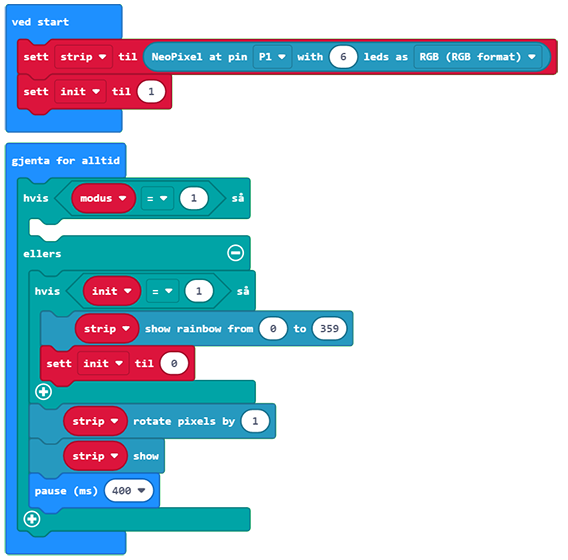

- [ ] Fra *Inndata* dra inn en `når knapp..trykkes`-blokk. Velg knapp *A*.
- [ ] Fra *Variabler* dra inn en `endre..med`-blokk. Velg variabelen *modus* og sett verdi til 1.
- [ ] Fra *Variabler* dra inn en `sett..til`-blokk. Velg variabelen *init* og sett verdi til 1.

For å forstå hva som skjer er det lurt å vise hva variabelen modus inneholder:
- [ ] Fra *Basis* dra en `vis tall`-blokk inn nederst i `når knapp..trykkes`-blokken. 
- [ ] Fra *Variabler* hent en instans av *modus*-variabelen og slipp den inn som tall.

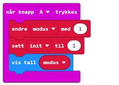

- [ ] Lag en kopi av den siste kodeblokken ved å høyreklikke på den og velge *lag kopi*.
- [ ] Endre til knapp B i `når knapp..trykkes`-blokken.
- [ ] Endre fra 1 til -1 i `endre..med`-blokken.

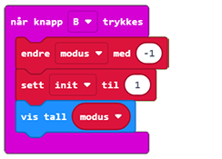

Nå har vi et program som kan skifte mellom forskjellige modi ved å trykke på knappen A og B. Hvilket modus som er aktivt vises på skjermen. Vi har bare et modi klart nå, men har lagt til rette for å legge til så mange vi vil. 

_Dette er et godt tidspunkt å ta en liten pause..._

# Kort om farger

## RGB og CMYK
På dataskjermer brukes fargemodellen RGB. Her er primærfargene rød, grønn og blå. Alle farger kan vises ved å kombinere forskjellige styrker på disse fargene. Ser dere nærmere på hvert enkelt led-lys i juletreet ser dere at hvert enkelt lys består av tre ørsmå led-lys i nettopp disse tre fargene. Slik er også hver piksel på dataskjermen. 
Settes alle fargene til 0 får vi svart, mens alle til 255 (maks) blir hvitt. R=255 G=255 og B=0 blir gul, mens R=0, G=255 og B=255 blir turkis. Når fargene er lysende får vi additiv fargeblanding. Dette er forskjellig fra fargeblanding i malerskrinet. Der er det subtraktiv fargeblanding som gjelder. Dette er vanlig ved utskrift på papir der alle farger blandes av sekundærfargene turkis (cyan), rosarød (magenta), gul (yellow) (CMY). I tillegg brukes svart (black) CMYK. 

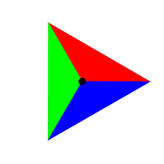  
Primærfarger  
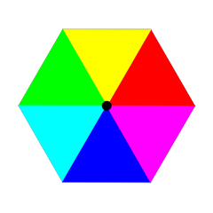  
Primærfarger og sekundærfarger

## Fargesirkelen - HSL 
Kulør (hue), metning (saturation) og valør (lightness) brukes for å beskrive farger i HSL-modellen. Kulør beskriver hvor i fargesirkelen fargen hentes. Denne begynner på rødt og går gjennom hele regnbuen til fiolett. Metning er styrken på fargen. Er metningen lik 0 får vi fargen som en gråtone. 100 er sterke farger. Valør er styrken på lyset i fargen. 0 er helt mørkt og 100 er helt lyst. 50 gir oss klarest farger.

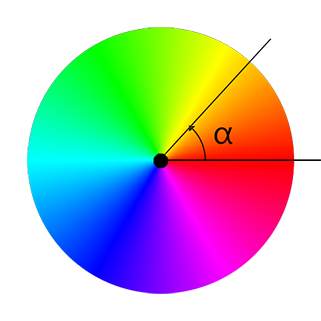

Vinkelen **&alpha;** bestemmer kulør i HSL-modellen. Den starter med rød (0&deg;) og løper gjennom hele regnbuen til ringen sluttes tilbake på rød (359&deg;).

Vi har indirekte brukt dette i *Steg 4*. Regnbuefunksjonen bruker dette, men skjuler det for oss. Nå skal vi bruke matematikk og få flere spennende muligheter med fargene.

# Steg 5: modus 1 - flytende farger
Her skal vi bevege oss rundt og rundt fargesirkelen og vise alle fargene med flytende overgang.
## Sjekkliste {.check}
- [ ] Fra *Variabler* opprett en ny variabel som du kaller `alfa`.
- [ ] Fra *Løkker* finn en `gjenta for..fra 0 til`-blokk og dra denne inn i `hvis modus = 1`-blokken. Velg variabelen `alfa` og skriv inn 359 i til-feltet. Da vil alfa loope gjennom alle gradene rundt fargesirkelen.
- [ ] Dra inn enda en `gjenta for..fra 0 til`-blokk. Slipp den inni den forrige og la indeks gå til 6. Dette er for å endre hvert enkelt led-lys i juletreet.
- [ ] Fra *Neopixel|Mer* trekk inn en `strip set pixel color at ..`-blokk og slipp den inni den innerste `gjenta for..fra 0 til`-blokken.
- [ ] Fra *Neopixel* dra inn en `hue..saturation..luminosity ..`-blokk og slipp den i verdifeltet til `set pixel color at`.(Dette feltet hadde defaultverdi *rød*.)
- [ ] I `at`-feltet trekker du inn variabelen *indeks*.
- [ ] `hue` skal inneholde variabelen *alfa*, `saturation` settes lik 100 og `luminosity` 50.  
- [ ] Nederst i den ytterste `gjenta for..`-løkken legg inn en *Neopixel* `strip show`-blokk;
- [ ] Under denne legger du en *Basis* `pause`-blokk og setter denne til 10ms.

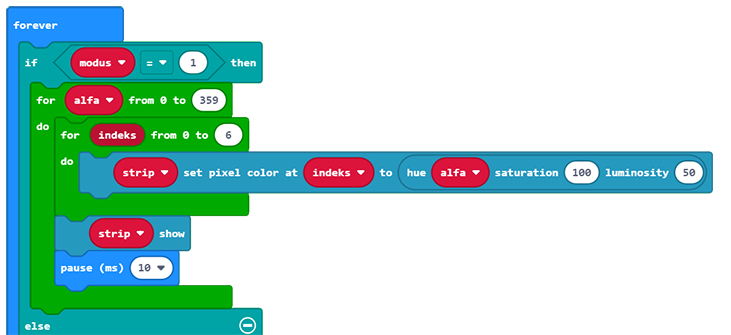

Nå kan du prøve programmet på micro:bit'en igjen. Velg *Last ned* nederst på siden og kopier den nedlastede fila over på til MICROBIT-disken (d:). Nå skal modus 0 starte og du bytter til modus 1 ved å trykke på A-knappen. Bytt tilbake ved å trykke B. Modus 1 må gjøre ferdig løkken sin, så det kan noen ganger ta litt tid før det byttes.

# Steg 6: modus 2 - komplimentære farger
De to fargene som har størst kontrast med hverandre kalles komplimentærfarger. På fargesirkelen er dette alltid fargen på motsatt side av sirkelen. Rødt er komplimentært med turkis og blått er komplimentært med oransje. Dette er fargepar som alltid passer sammen.

I denne modusen vil annenhvert led-lys vise komplimentærfargen. Dette løser vi ved å la annenhvert lys bruke fargen som ligger 180&deg; unna.

## Sjekkliste {.check}

- [ ] Trykk på *+* nederst i `hvis..ellers`-blokka slik at det kommer opp en ny `hvis..ellers` midt i blokka.
- [ ] Hent en sammenligningsblokk sjekk om `modus` er lik 2.  
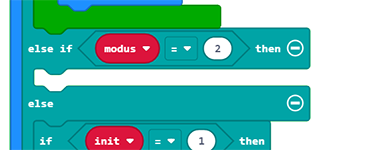
- [ ] Kopiér hele kodeblokken inni *modus 1* og legg kopien inn i *modus 2*.
- [ ] Legg til en ny `hvis..ellers`-blokk først i den innerste `gjenta for..fra`-løkka.
- [ ] Legg til en sammenligningblokk `0 = 0` i `hvis..ellers`-blokken.
- [ ] Fra *Matematikk* dra inn en `divisjonsrest`-blokk og legg denne til venstre i sammenligningblokka.
- [ ] Regn ut resten av `indeks` delt på 2 i denne. Da blir annen hver indeks sann.
- [ ] Kopier `strip set pixel`-blokka under og legg de to i hver sin del av `hvis..ellers`-blokken.  
- [ ] I den ene kopien, legg til fra *Matematikk* en `0 + 0`-blokk slik at `hue` settes til `alfa`+ 180.

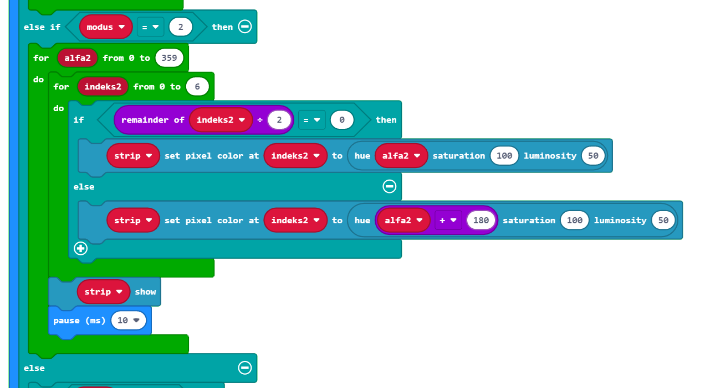

Last ned og kopiér programmet over på micro:bit'en. Se at du nå har tre modi. Et med regnbuens farger, et med flytende farger rundt fargesirkelen og et med flytende farger og komplimentær farger. 

# Videre utvikling
Nå har du lært helt grunnleggende hvordan du koder en micro:bit og litt om farger. Bruk denne kunnskapen til å finne på nye modi med morsomme lys-show. PS - du kan også utforske de andre HSL-parametrene. Micro:bit'en har også høyttaler, så prøv *Musikk*-menyen og kode en julesang.

PS - har du barn? Ta de med på kodingen. Barn fra 6år og oppover gjør dette på kodeklubb. Sannsynligvis tar de kodingen fortere enn deg! Forhåpentligvis vekkes en interesse for koding, de velger rett utdanning og kan bli verdifulle utviklere i DIPS en gang i fremtiden!

\
\
\
**Gratulerer! Du har nå kodet en dekorativ greie som kan stå på peishylla og pynte til jul! :)**
  
