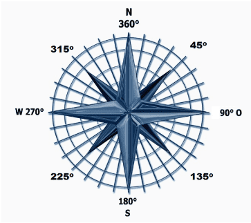

# Introduksjon {.intro}

Micro:biten har en magnetisk sensor innebygd, noe også de fleste
smarttelefonene har. Vi kan bruke denne sensoren til å lage et digitalt
kompass. I et vanlig analogt kompass har vi en magnetisk nål som peker
mot nord uansett hvilken vei vi snur det. På en lignende måte skal vi få
micro:biten til å vise en pil som alltid peker mot nord.


# Steg 1: Vi finner kompassretning {.activity}

Micro:biten leser av kompassretningen i grader. 0<sup>o</sup> er Nord,
90<sup>o</sup> er øst, 180<sup>o</sup> er sør og 270<sup>o</sup> er vest.
Siden vi vet i hvilken retning micro:biten peker, kan vi beregne
i hvilken retning et pilbilde på micro:biten må peke for å vise retning mot
nord.



## Sjekkliste {.check}

- [ ] Start et nytt PXT-prosjekt, for eksempel ved å gå til
  [makecode.microbit.org](https://makecode.microbit.org/?lang=no){target=blank}

- [ ] Lag en ny varibel som heter `retning`{.microbitvariables} inne i
kategorien `Variabler`{.microbitvariables}.

- [ ] Inne i en `for alltid`{.microbitbasic}-kloss legger du inn en
`sett retning til`{.microbitvariables}-kloss fra kategorien `Variabler`{.microbitvariables}.
Du skal sette `retning`{.microbitvariables} til `kompassretning`{.microbitinput}
som du finner i `Inndata`{.microbitinput} kategorien.

- [ ] Legg inn en `vis tall`{.microbitbasic}-kloss fra `Basis`{.microbitbasic}-kategorien
og erstatt __0__ med variabelen `retning`{.microbitvariables}. Slik kan du vise
verdien `retning`{.microbitvariables} inneholder.

```microbit
let retning = 0
basic.forever(function () {
    retning = input.compassHeading()
    basic.showNumber(retning)
})
```

## Test prosjektet {.flag}

- [ ] Til venstre på skjermen er det et bilde av en micro:bit. Dette er en faktisk
simulator. Her kan du teste at kompassretningen vises som tall.

- [ ] Last ned programmet til til micro:biten. Første gang du bruker
magnet-sensoren etter at du har lastet opp et nytt program på micro:biten,
må den kalibreres. Du blir bedt om å vippe på micro:biten slik at det blir
lys på hele skjermen eller tegne en sirkel. Følg med på instruksjonen
micro:biten gir. Her er et eksempel på
  [kalibrering av kompass](https://dzwonsemrish7.cloudfront.net/items/3e0K2a0V3p0q1z1T352Y/compass%20calibration.mp4){target=blank}


# Steg 2: Vi viser pilen {.activity}

Det er mye lettere å finne ut hvilken vei Nord er ved å legge inn en pil'
som alltid peker mot nord. Vi skal bruke et pilbilde som kan peke i __8__
ulike retninger. Vi må derfor tenke at vi deler kompassrosa opp i __8__
kakestykker eller segmenter som alle har en åpning på
__360<sup>o</sup> / 8 = 45<sup>o</sup>__. Segmentene for de __8__ ulike
himmelretningene blir da:
* Nord: __337.5<sup>o</sup>__ til __22.5<sup>o</sup>__.
* Nord-vest: __22.5<sup>o</sup>__ til __67.5<sup>o</sup>__.
* Vest: __67.5<sup>o</sup>__ til __112.5<sup>o</sup>__.
* Sør-vest: __112.5<sup>o</sup>__ til __157.5<sup>o</sup>__.
* Sør: __157.5<sup>o</sup>__ til __202.5<sup>o</sup>__.
* Sør-øst: __202.5<sup>o</sup>__ til __247.5<sup>o</sup>__.
* Øst: __247.5<sup>o</sup>__ til __292.5<sup>o</sup>__.
* Nord-øst: __292.5<sup>o</sup>__ til __337.5<sup>o</sup>__.
Da kan vi sette i gang med å teste for i hvilken retning micro:biten peker.

- [ ] Legg inn en `hvis ellers`{.microbitlogic}-kloss fra `Logikk`{.microbitlogic}-kategorien.
Trykk på `+`{.microbitlogic}-tegnet __7__ ganger slik at du kan legge nye
klosser inn i totalt __9__ åpninger.

- [ ] For å vise en pil, kan du legge inn en `vis pil`{.microbitbasic}-kloss
fra `Basis`{.microbitbasic}-kategorien. Velg så en pilretning. Hver av de __9__
åpningene i den utvidede `hvis ellers`{.microbitlogic}-klossen skal ha en
`vis pil`{.microbitbasic}-kloss. På denne måten får vi til å vise alle
pilretningene.

- [ ] Nå må vi teste systematisk hvilken retning micro:biten peker i. Dette
gjør vi ved å teste for verdien av variabelen `retning`{.microbitvariables} som
har fått verdi fra micro:biten sin kompassretning. Vi må legge inn en
sammenlignings-kloss fra `Logikk`{.microbitlogic}-kategorien, og i første `hvis`{.microbitlogic}-test
må vi finne ut om `retning`{.microbitvariables} er mindre enn __22.5__. Da peker
micro:biten omtrent mot nord, og vi viser en pil som peker mot nord.

- [ ] I påfølgende `ellers hvis`{.microbitlogic}-test må vi finne ut om `retning`{.microbitvariables}
er mindre enn __67.5__. Da peker micro:biten mot nordøst, mens micro:bitens
nordvest peker mot ekte nord. Siden vi vil at pilen skal peke mot ekte nord, må
vi velge at `vis pil`{.microbitbasic} peker mot `Nordvest`{.microbitimages}.

- [ ] I påfølgende `ellers hvis`{.microbitlogic}-test må vi finne ut om `retning`{.microbitvariables}
er mindre enn __112.5__. Da peker micro:biten mot øst, mens micro:bitens vest
peker mot ekte nord. Siden vi vil at pilen skal peke mot ekte nord, må vi velge at
`vis pil`{.microbitimages} peker mot `Vest`{.microbitimages}.

- [ ] Slik fortsetter vi rundt hele sirkelen. Vi tester for om `retning`{.microbitvariables}
er mindre enn __157.5__, __202.5__, __247.5__, __292.5__ og __337.5__ og viser
en pil som peker mot hhv.  `Sørvest`{.microbitimages}, `Sør`{.microbitimages},
`Sørøst`{.microbitimages}, `Øst`{.microbitimages}, `Nordøst`{.microbitimages},
og på siste ledige plass, trenger vi ikke å teste for `retning`{.microbitvariables}
siden den er større enn __337.5__, og vi vil vise en pil mot `Nord`{.microbitimages}.

```microbit
let retning = 0
basic.forever(function () {
    retning = input.compassHeading()
    if (retning < 22.5) {
        basic.showArrow(ArrowNames.North)
    } else if (retning < 67.5) {
        basic.showArrow(ArrowNames.NorthWest)
    } else if (retning < 112.5) {
        basic.showArrow(ArrowNames.West)
    } else if (retning < 157.5) {
        basic.showArrow(ArrowNames.SouthWest)
    } else if (retning < 202.5) {
        basic.showArrow(ArrowNames.South)
    } else if (retning < 247.5) {
        basic.showArrow(ArrowNames.SouthEast)
    } else if (retning < 292.5) {
        basic.showArrow(ArrowNames.East)
    } else if (retning < 337.5) {
        basic.showArrow(ArrowNames.NorthEast)
    } else {
        basic.showArrow(ArrowNames.North)
    }
})
```

## Test prosjektet {.flag}

- [ ] Til venstre på skjermen er det et bilde av en micro:bit. Her
kan du teste om pilen snurrer når du endrer retningen på micro:biten.

- [ ] Du kan laste ned programmet til micro:biten. Nå må du kalibrere
kompasset på nytt siden du har lastet opp et nytt program.

- [ ] Peker pilen på micro:biten i omtrent samme himmelretning etter hvert
som du snur den rundt?

- [ ] Har du et analogt kompass? Sammenlign om ditt micro:bit-kompass og det
analoge kompasset peker i samme retning.
