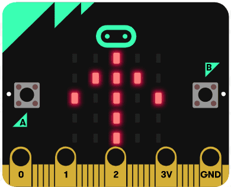

# Introduksjon {.intro}

Micro:biten har innebygd en magnetisk sensor, noe også de fleste 
smarttelefonene har. Vi kan bruke denne sensoren til å lage et digitalt
kompass. I et vanlig analogt kompass har vi en magnetisk nål som peker
mot nord uansett hvilken vei vi snur det. På en lignende måte skal vi få 
micro:biten til å vise en pil som alltid peker mot nord.

# Steg 1: Vi finner kompassretning {.activity}

Micro:biten leser av kompassretningen i grader. 0o er Nord, 
90o er øst, 180o er sør og 270o er vest. 
Siden vi vet i hvilken retning micro:biten peker, kan vi beregne 
i hvilken retning et pilbilde på micro:biten må peke for å vise retning mot 
nord.

## Sjekkliste {.check}

- [ ] Start et nytt PXT-prosjekt, for eksempel ved å gå til
  [makecode.microbit.org](https://makecode.microbit.org/?lang=no){target=_blank}

- [ ] Lag en ny varibel som heter `retning` inne i `Variabler` kategorien.

- [ ] Inne i en `for alltid`-kloss legger du inn en `sett retning til`-kloss 
fra `Variabler` kategorien. Du skal sette `retning` til `kompassretning` som 
du finner i `Inndata` kategorien.

- [ ] Legg inn en `vis tall`-kloss fra `Basis` kategorien og legg inn 
variabelen `retning`.

## Test prosjektet {.flag}

- [ ] Til venstre på skjermen er det et bilde av en micro:bit. Her 
kan du teste at kompassretningen vises som tall.

- [ ] Last ned programmet til til micro:biten. Første gang du bruker 
magnet-sensoren etter at du har lastet opp et nytt program på micro:biten, 
må den kalibreres. Du blir bedt om å vippe på micro:biten slik at det blir 
lys på hele skjermen eller tegne en sirkel. Følg med på instruksjonen 
micro:biten gir. Her er et eksempel på 
  [kalibrering av kompass](https://dzwonsemrish7.cloudfront.net/items/3e0K2a0V3p0q1z1T352Y/compass%20calibration.mp4){target=_blank}

# Steg 2: Vi viser pilen {.activity}

Det er mye lettere å finne ut hvilken vei Nord er ved å legge inn en pil'
som alltid peker mot nord. Vi skal bruke et pilbilde som kan peke i `8` 
ulike retninger. Vi må derfor tenke at vi deler kompassrosa opp i `8` 
kakestykker eller segmenter som alle har en åpning på 
`360`o / `8` = `45`o. Segmentene for de `8` ulike 
himmelretningene blir da:
* Nord: `337.5`o til `22.5`o. 
* Nord-vest: `22.5`o til `67.5`o. 
* Vest:`67.5`o til `112.5`o.'
* Sør-vest: `112.5`o til `157.5`o. 
* Sør: `157.5`o til `202.5`o. 
* Sør-øst: `202.5`o til `247.5`o.
* Øst: `247.5`o til `292.5`o. 
* Nord-øst: `292.5`o til `337.5`o.
Da kan vi sette i gang med å teste for i hvilken retning micro:biten peker.

- [ ] Legg inn en `hvis ellers`-kloss fra `logikk`-kategorien. Trykk på 
`+`-tegnet `7` ganger slik at du kan legge nye klosser inn i totalt `9` 
åpninger. 

- [ ] For å vise pil, kan du legge inn en `show image`-kloss fra 
`Bilde`-kategorien som du finner under `Bilde`. Velg også en
`pilbilde`-kloss og legg den inne i `show image`-klossen. Hver av de `9` 
åpningene i den utvida `hvis ellers`-klossen skal ha en `show image`-kloss.

- [ ] Nå må vi teste systematisk hvilken retning micro:biten peker i. Dette 
gjør vi ved å teste for verdien av variabelen `retning` som har fått verdi 
fra micro:biten sin kompassretning. Vi må legge inn en sammenlignings-kloss
fra `logikk`-kategorien, og i første `hvis`-test må vi finne ut om `retning` 
er mindre enn `22.5`. Da peker micro:biten omtrent mot nord, og vi viser 
pilbildet som peker mot nord. 

- [ ] I påfølgende `ellers hvis`-test må vi finne ut om `retning` er mindre enn 
`67.5`. Da peker micro:biten mot nordøst, mens micro:bitens nordvest peker mot
ekte nord. Siden vi vil at pilen skal peke mot ekte nord, må vi velge at 
`pilbilde` viser `Nordvest`. 

- [ ] I påfølgende `ellers hvis`-test må vi finne ut om `retning` er mindre 
enn `112.5`. Da peker micro:biten mot øst, mens micro:bitens vest peker mot
ekte nord. Siden vi vil at pilen skal peke mot ekte nord, må vi velge at 
`pilbilde` viser `Vest`. 

- [ ] Slik fortsetter vi rundt hele sirkelen. Vi tester for om `retning` er 
mindre enn `157.5`, `202.5`, `247.5`, `292.5` og `337.5` og vise `pilbilde` 
som peker mot hhv  `Sørvest`, `Sør`, `Sørøst`, `Øst`, `Nordøst`og på siste 
plass der vi ikke trenger å teste for `retning` siden den nødvendigvis er 
større enn `337.5` vises `pilbilde` som heter `Nord`.

## Test prosjektet {.flag}

- [ ] Til venstre på skjermen er det et bilde av en micro:bit. Her 
kan du teste om pilen snurrer når du endre retningen på micro:biten.

- [ ] Du kan laste ned programmet til til micro:biten. Nå må du kalibrere 
kompasset på nytt siden du har lastet opp et nytt program.

- [ ] Peker pilen på micro:biten omtrent i samme himmel-retning etter hvert 
som du snur den rundt? 

- [ ] Har du et analogt kompass. Sammenlign om ditt micro:bit-kompass og det 
analoge kompasset peker i samme retning.
