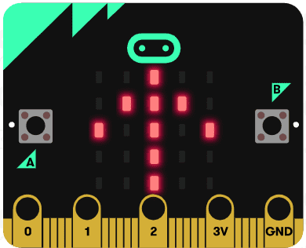
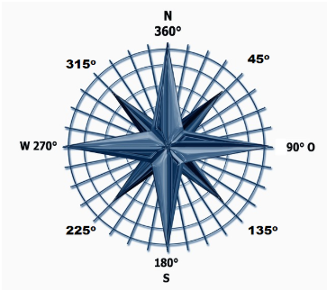

# Introduksjon {.intro}

Micro:bit-en har ein innebygd magnetisk sensor, det har òg dei fleste
smarttelefonar. Me kan bruke denne sensoren til å lage eit digitalt kompass. I
eit vanleg analogt kompass har me ei magnetisk nål som peikar mot nord uansett
kva veg me snur det. På ein liknande måte skal me få micro:bit-en til å vise ei
pil som alltid peikar mot nord.




# Steg 1: Me finn kompassretning {.activity}

Micro:bit-en les av kompassretninga i gradar. Den viser kor mange grader frå
nord, målt med klokka, micro:bit-en peikar. Altså er 0° nord,
90° er aust, 180° er sør og 270° er vest. Sidan
me veit i kva retning micro:bit-en peikar kan me berekne kva retning ei pil på
skjermen må peike for å vise retning mot nord.



## Sjekkliste {.check}

- [ ] Start eit nytt PXT-prosjekt, til dømes ved å gå til
  [makecode.microbit.org](https://makecode.microbit.org/?lang=no){target=blank}

- [ ] Lag ein ny varibel som heiter `retning`{.microbitvariables} inne i
  `Variablar`{.microbitvariables}-kategorien.

- [ ] Inne i ein `for alltid`{.microbitbasic}-kloss legg du inn ein `set retning
  til`{.microbitvariables}-kloss  frå
  `Variablar`{.microbitvariables}-kategorien. Du skal setje
  `retning`{.microbitvariables} til `kompassretning`{.microbitinput} som du finn
  i `Inndata`{.microbitinput}-kategorien.

- [ ] Legg inn ein `vis tal`{.microbitbasic}-kloss frå
  `Basis`{.microbitbasic}-kategorien og legg inn variabelen
  `retning`{.microbitvariables}.

```microbit
let retning = 0
basic.forever(function () {
    retning = input.compassHeading()
    basic.showNumber(retning)
})
```

## Test prosjektet {.flag}

- [ ] Til venstre på skjermen er det eit bilete av ein micro:bit. Her kan du
  teste at kompassretninga blir vist som tal.

- [ ] Last ned programmet til micro:bit-en. Fyrste gong du brukar
  magnet-sensoren etter at du har lasta inn eit nytt program på micro:bit-en må
  den kalibrerast. Du blir bedt om å vippe på micro:bit-en slik at det blir lys
  på heile skjermen, eller om å teikne ein sirkel. Følg med på instruksjonane
  micro:bit-en gir. Her er eit døme på [kalibrering av
  kompass](https://dzwonsemrish7.cloudfront.net/items/3e0K2a0V3p0q1z1T352Y/compass%20calibration.mp4){target=blank}


# Steg 2: Me viser pila {.activity}

Det er mykje lettare å finne ut kva veg nord er ved å leggje inn ei pil som
alltid peikar mot nord. Me skal bruke ei pil som kan peike i __8__ ulike
retningar. Difor må me tenke oss at me deler kompassrosa inn i __8__ kakestykke
eller delar som alle har ei opning på __360° / 8 =
45°__. Kvar retning er då innanfor følgjande vinklar:

* Nord: __337.5<sup>o</sup>__ til __22.5<sup>o</sup>__.
* Nordvest: __22.5<sup>o</sup>__ til __67.5<sup>o</sup>__.
* Vest: __67.5<sup>o</sup>__ til __112.5<sup>o</sup>__.
* Sørvest: __112.5<sup>o</sup>__ til __157.5<sup>o</sup>__.
* Sør: __157.5<sup>o</sup>__ til __202.5<sup>o</sup>__.
* Søraust: __202.5<sup>o</sup>__ til __247.5<sup>o</sup>__.
* Aust: __247.5<sup>o</sup>__ til __292.5<sup>o</sup>__.
* Nordaust: __292.5<sup>o</sup>__ til __337.5<sup>o</sup>__.

Då kan me starte å teste kva retning micro:bit-en peikar i.

- [ ] Legg inn ein `viss elles`{.microbitlogic}-kloss frå
  `logikk`{.microbitlogic}-kategorien. Trykk på `+`{.microbitlogic}-teiknet 7
  gonger slik at du kan leggje inn nye klossar i totalt __9__ opningar.

- [ ] For å vise ei pil kan du leggje inn ein `vis pil`{.microbitbasic} frå
  `Basis`{.microbitbasic}-kategorien. Legg den inne i `show
  image`{.microbitimages}-klossen. Kvar av dei 9 opningane i den utvida `viss
  elles`{.microbitlogic}-klossen skal ha ein `vis pil`{.microbitbasic}-kloss.

- [ ] No skal me teste systematisk kva retning micro:bit-en peikar i. Det gjer
  me ved å teste for verdien av variabelen `retning`{.microbitvariables} som har
  fått verdi frå retninga micro:bit-en peikar i. Me må leggje inn ein
  samanlikningskloss frå `logikk`{.microbitlogic}-kategorien, og i den fyrste
  `viss`{.microbitlogic}-testen må me finne ut om `retning`{.microbitvariables}
  er mindre enn __22.5__. Då peikar micro:bit-en omtrent mot nord, og me viser
  pilbiletet som peikar mot `nord`{.microbitimages}.

- [ ] I neste `elles viss`{.microbitlogic}-test må me finne ut om
  `retning`{.microbitvariables} er mindre enn __67.5__. Då peikar micro:bit-en mot
  nordaust, og retning nordvest på micro:bit-en peikar mot ekte nord. Sidan me
  vil at pila skal peike mot ekte nord må me velje at pila viser
  `nordvest`{.microbitimages}.

- [ ] I neste `elles viss`{.microbitlogic}-test må me finne ut om
  `retning`{.microbitvariables} er mindre enn __112.5__. Då peikar micro:bit-en
  mot aust, og retning vest på micro:bit-en peikar mot ekte nord. Sidan me vil
  at pila skal peike mot ekte nord må me velje at pila viser
  `vest`{.microbitimages}.

- [ ] Slik fortset me heile sirkelen. Me testar om `retning`{.microbitvariables}
  er mindre enn __157.5__, __202.5__, __247.5__, __292.5__ og __337.5__ og viser piler som
  peikar mot høvesvis `sørvest`{.microbitimages}, `sør`{.microbitimages},
  `søraust`{.microbitimages}, `aust`{.microbitimages},
  `nordaust`{.microbitimages} og på siste plass der me ikkje treng å teste for
  `retning`{.microbitvariables}, sidan den må vere større enn __337.5__, viser me
  pil mot `nord`{.microbitimages}.

```microbit
let retning = 0
basic.forever(function () {
    retning = input.compassHeading()
    if (retning < 22.5) {
        basic.showArrow(ArrowNames.North)
    } else if (retning < 67.5) {
        basic.showArrow(ArrowNames.NorthWest)
    } else if (retning < 112.5) {
        basic.showArrow(ArrowNames.West)
    } else if (retning < 157.5) {
        basic.showArrow(ArrowNames.SouthWest)
    } else if (retning < 202.5) {
        basic.showArrow(ArrowNames.South)
    } else if (retning < 247.5) {
        basic.showArrow(ArrowNames.SouthEast)
    } else if (retning < 292.5) {
        basic.showArrow(ArrowNames.East)
    } else if (retning < 337.5) {
        basic.showArrow(ArrowNames.NorthEast)
    } else {
        basic.showArrow(ArrowNames.North)
    }
})
```

## Test prosjektet {.flag}

- [ ] Til venstre på skjermen er det eit bilete av ein micro:bit. Her kan du
  teste om pila snurrar når du endrar retninga på micro:bit-en.

- [ ] Du kan laste ned programmet til til micro:bit-en. No må du kalibrere
  kompasset på nytt sidan du har lasta opp eit nytt programm.

- [ ] Peikar pila på micro:bit-en omlag i same himmelretning etter kvart som du
  snur den rundt?

- [ ] Har du eit analogt kompass? Samanlikne micro:bit-kompasset ditt med det,
  og sjå om dei peikar i same retning.
