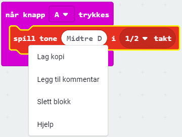
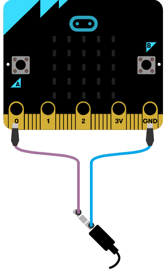

# Introduksjon {.intro}

I denne oppgaven skal vi koble micro:biten til hodetelefoner eller en liten
høyttaler for å kunne spille av en melodi vi lager selv.

Vi trenger litt ekstra utstyr:
- 2 ledninger med krokodilleklemmer
- Hodetelefoner eller 1 buzzer (en liten høyttaler)

Micro:biten har fem store tilkoblinger på brettet, som vi kaller porter. Disse
er koblet til store hull og er merket: 0, 1, 2, 3V og GND på micro:biten.


GND porten blir brukt for å fullføre en krets. Hvis du holder på GND-porten med
en hånd, kan du programmere micro:biten til å oppdage at du berører 0, 1 eller
2 pinnen med den andre hånden (da bruker du kroppen din til å fullføre en
elektrisk krets). Dette kan du bruke for å få micro:biten til å gjøre eller
vise ulike ting. Du kan også få micro:biten til å sende signaler ut gjennom
portene. For eksempel kan du programmere micro:biten til å sende ut lyd, og
kobler du på en høyttaler med krokodilleklemmer kan du høre på lyden.

Du kan lese mer om portene på micro:biten her:
[microbit.org](https://microbit.org/no/guide/hardware/pins/){target=blank}


# Steg 1: Interaksjon {.activity}

## Sjekkliste {.check}

- [ ] Finn `når knapp A trykkes`{.microbitinput}-klossen. Du kan finne den i
`Inndata`{.microbitinput}-kategorien.

```microbit
input.onButtonPressed(Button.A, function () {

})
```


# Steg 2: Komponer melodi {.activity}

Du kan nå komponere din helt egen sang som spilles når knapp A trykkes. Du kan
selv bestemme hvilke toner som skal spilles, og hvor lenge de skal spilles.
Setter du sammen tonene får du en melodi. Vi skal nå vise hvordan vi kan
komponere den velkjente sangen 'Happy birthday'. Skriver vi den som noter ser
den slik ut:


## Sjekkliste {.check}

- [ ] Du starter med å legge inn en `spill tone`{.microbitmusic} kloss fra `Musikk`{.microbitmusic}-kategorien.
```microbit
input.onButtonPressed(Button.A, function () {
    music.playTone(262, music.beat(BeatFraction.Whole))
})
```

Merk at her kan du bestemme hvilken tone som skal spilles og hvor lenge den skal
spilles.

- [ ] Du starter med velge tonen `midtre D`{.microbitmusic} inne i `spill tone`{.microbitmusic}-klossen.
Da må du finne riktig tangent på piano-klaviaturet som dukker opp!


- [ ] Deretter velger du i hvor mange takter tonen skal spilles. Velg
`1/2 takt`{.microbitmusic} inne i `spill tone`{.microbitmusic} klossen.

```microbit
input.onButtonPressed(Button.A, function () {
	music.playTone(294, music.beat(BeatFraction.Half))
})
```

Nå får du spilt av den første tonen. Du må nå legge til resten av tonene for å
få hele sangen. Ett lite triks er da å kopiere den første `spill tone`{.microbitmusic}-klossen
ved å klikke med høyre musetast på klossen:



- [ ] Lag kode for å spille av 'Happy birthday to you'. Da trenger du seks
`spill tone`{.microbitmusic}-klosser.

```microbit
	input.onButtonPressed(Button.A, function () {
	    music.playTone(294, music.beat(BeatFraction.Half))
	    music.playTone(294, music.beat(BeatFraction.Half))
	    music.playTone(330, music.beat(BeatFraction.Whole))
	    music.playTone(294, music.beat(BeatFraction.Whole))
	    music.playTone(392, music.beat(BeatFraction.Whole))
	    music.playTone(370, music.beat(BeatFraction.Double))
	})
```

- [ ] Lag kode for å spille av 'Happy birthday to you' andre gang: Da trenger
du seks ekstra `spill tone`{.microbitmusic}-klosser.


- [ ] Lag kode for å spille av 'Happy birthday dear Ole': Da trenger du
	sju nye `spill tone`{.microbitmusic}-klosser.


- [ ] Lag kode for å spille av 'Happy birthday to you' dor siste gang: Da
	trenger du enda seks nye `spill tone`{.microbitmusic} klosser. Hele koden ser
	nå slik ut:

```microbit
input.onButtonPressed(Button.A, function () {
    music.playTone(294, music.beat(BeatFraction.Half))
    music.playTone(294, music.beat(BeatFraction.Half))
    music.playTone(330, music.beat(BeatFraction.Whole))
    music.playTone(294, music.beat(BeatFraction.Whole))
    music.playTone(392, music.beat(BeatFraction.Whole))
    music.playTone(370, music.beat(BeatFraction.Double))
    music.playTone(294, music.beat(BeatFraction.Half))
    music.playTone(294, music.beat(BeatFraction.Half))
    music.playTone(330, music.beat(BeatFraction.Whole))
    music.playTone(294, music.beat(BeatFraction.Whole))
    music.playTone(440, music.beat(BeatFraction.Whole))
    music.playTone(392, music.beat(BeatFraction.Double))
    music.playTone(294, music.beat(BeatFraction.Half))
    music.playTone(294, music.beat(BeatFraction.Half))
    music.playTone(587, music.beat(BeatFraction.Whole))
    music.playTone(494, music.beat(BeatFraction.Whole))
    music.playTone(392, music.beat(BeatFraction.Whole))
    music.playTone(370, music.beat(BeatFraction.Whole))
    music.playTone(330, music.beat(BeatFraction.Whole))
    music.playTone(523, music.beat(BeatFraction.Half))
    music.playTone(523, music.beat(BeatFraction.Half))
    music.playTone(494, music.beat(BeatFraction.Whole))
    music.playTone(392, music.beat(BeatFraction.Whole))
    music.playTone(440, music.beat(BeatFraction.Whole))
    music.playTone(392, music.beat(BeatFraction.Double))
})
```


# Steg 3: Gjør klart til lyd {.activity}

*Micro:biten har ikke høyttalere. Derfor må vi koble til en buzzer eller
hodetelefoner. Måten vi kobler til en buzzer er litt forskjellig fra måten
vi kobler til hodetelefoner. Først kommer en sjekkliste for hvordan du kobler
til en buzzer, og etterpå kommer sjekklisten for deg som vil bruker hodetelefoner.*

## Buzzer sjekkliste {.check}

- [ ] Fest en ledning fra port 0 på micro:biten til pinnen det står pluss
(+) ved på buzzeren.

- [ ] Fest den andre ledningen fra der det står GND på micro:biten til den
andre pinnen på buzzeren.

## Hodetelefoner sjekkliste {.check}

- [ ] Fest en ledning fra GND-porten på micro:biten til helt øverst på den
metaliske delen av hodetelefonene.

- [ ] Fest den andre ledningen fra port 0 på micro:biten til helt nederst på
den metalliske delen av hodetelefonene.

- [ ] Simulatoren viser hvordan det nå skal se ut:



## Test prosjektet {.flag}

*Nå er det tid for å se om micro:biten klarer å spille melodien du har
komponert!*

- [ ] Last ned prosjektet til micro:biten og lytt!


## Noen utfordringer {.challenge}

*Noen forslag til endringer og utvidelser, men prøv selv dine ideer!*

Du har nå lært hvordan du kan skrive en melodi i micro:biten. Nedenfor er noen
ideer til videreutvikling, men finn gjerne på noe
helt eget!

- [ ] Kan du endre hvor fort melodien spilles?

- [ ] Kan du spille melodien to ganger?

- [ ] Kan du spille en annen melodi når knapp B trykkes?
