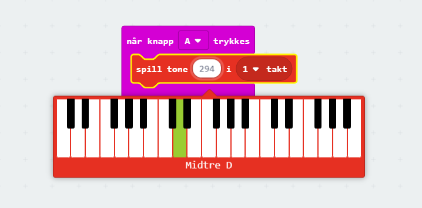

# Introduksjon {.intro}

I denne oppgåva skal me kople micro:bit-en til hovudtelefonar eller ein liten
høgtalar og spele av ein melodi du kodar sjølv.

Me treng litt ekstra utstyr:

- 2 ledningar med krokodilleklemmer

- Hovudtelefonar eller ein buzzar (ein liten høgtalar)

Micro:bit-en har fem store tilkoplingar på brettet som me kallar portar. Desse
er kopla til store hol og er merka `0`, `1`, `2`, `3V` og `GND` på micro:bit-en.

Me brukar `GND`-porten for å fullføre ein krins. Viss du heldt på `GND`-porten
med ei hand kan du programmere micro:bit-en til å oppdage at du tek på `0`, `1`
eller `2` med den andre handa (då brukar du kroppen din til å fullføre ein
elektrisk krins). Dette kan du bruke for å få micro:bit-en til å gjere eller
vise ulike ting. Du kan òg få micro:bit-en til å sende signal ut gjennom
portane. Til dømes kan du programmere micro:bit-en til å sende ut lyd, og viss
du koplar på ein høgtalar med krokodilleklemmer kan du høyre på lyden.

Du kan lese meir om portane på micro:bit-en her:
[microbit.org](https://microbit.org/no/guide/hardware/pins/){target=_blank}.

# Steg 1: Interaksjon {.activity}

## Sjekkliste {.check}

- [ ] Finn `når knapp A vert trykt`-klossen. Du finn den i `Inndata`-kategorien.

	

# Steg 2: Komponer melodi {.activity}

No kan du komponere din eigen song som ved spelt av når knapp A vert trykt. Du
bestemmer sjølv kva toner som skal spelast og kor lenge dei skal spelast av.
Viss du set saman fleire toner får du ein melodi. No skal me vise korleis du kan
komponere den velkjente "Happy Birthday". Viss me skriv den som noter ser den
slik ut:

## Sjekkliste {.check}

- [ ] Du startar med å leggje inn ein `spel tone`-kloss frå `Musikk`-kategorien.

	

Merk at her kan du bestemme kva tone som skal spelast og kor lenge den spelast
av.

- [ ] Du startar med å velje tona `midtre D` inne i `spel tone`-klossen. Då må
  du finne riktig tangent på piano-klaviaturet som dukkar opp!

	

- [ ] Så vel du i kor mange taktar tona skal spelast. Vel `1/2 takt` inne i
  `spel tone`-klossen.

	

No får du spelt av den fyrste tona. Så må du leggje til reisten av tonene for å
få heile songen. Eit lite triks er å kopiere den fyrste `spel tone`-klossen ved
å klikke på den med høgre museknapp: 

- [ ] Lag kode for å spele av `Happy birthday to you`. Då treng du seks `spel
  tone`-klossar.

	

- [ ] Lag kode for å spele av 'Happy birthday to you' for andre gong: Då treng
  du seks nye `spel tone`-klossar.

	

- [ ] Lag kode for å spele av 'Happy birthday dear Ole': Då treng du sju nye
  `spel tone`-klossar.

	

- [ ] Lag kode for å spele av 'Happy birthday to you' for siste gong: Då treng
  du seks nye `spel tone`-klossar att.

# Steg 3: Gjer klart for lyd {.activity}

*Micro:bit-en har ikkje høgtalarar. Derfor må me kople til ein buzzar eller
 hovudtelefonar. Måten me koplar til ein buzzar er litt ulik måten me koplar til
 hovudtelefonar. Fyrst får du ei sjekkliste for korleis du koplar til ein
 buzzar, og så kjem sjekklista for korleis du kan kople til hovudtelefonar.*

## Buzzar - sjekkliste {.check}

- [ ] Fest ein ledning frå port `0` på micro:bit-en til pinnen som det står
  pluss (`+`) ved på buzzaren.

- [ ] Fest den andre ledningen frå der det står `GND` på micro:bit-en til den
  andre pinnen på buzzaren.

## Hovudtelefonar - sjekkliste {.check}

- [ ] Fest ein ledning frå `GND`-porten på micro:biten til heilt øvst på den
  metalliske delen av hovudtelefonane.

- [ ] Fest den andre ledningen frå port `0` på micro:bit-en til heilt nedst på
  den metalliske delen av hovudtelefonane.

- [ ] Simulatoren viser korleis det skal sjå ut:

	

## Test prosjektet {.flag}

*No er det på tide å sjå om micro:bit-en klarar å spele melodien du har
 komponert!*

- [ ] Last ned prosjektet til micro:bit-en og lytt!

# Steg 4: Nokre utfordringar {.activity}

*Nokre forslag til endringar og utvidingar, men prøv å kome på andre ting
 sjølv!*

## Fleire idear {.check}

No har du lært korleis du kan skrive ein melodi i micro:bit-en. Under er nokre
idear til vidareutvikling, men finn gjerne på noko heilt eige!

- [ ] Kan du endre kor fort melodien vert spelt?

- [ ] Kan du spele melodien to gonger?

- [ ] Kan du spele ein annan melodi når knapp B vert trykt?
