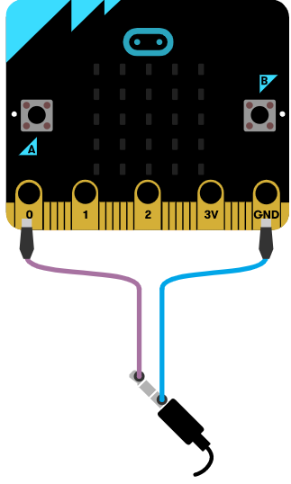

# Introduksjon {.intro}

I denne oppgaven skal vi få micro:biten til å spille ulike toner avhengig av
hvor mye lys som treffer micro:biten sin lyssensor. Dette kan du bruke til å
lage musikk!

Vi trenger litt ekstra utstyr:
- 2 ledninger med krokodilleklemmer
- 1 buzzer (liten, sort høytaler) eller hodetelefoner


# Steg 1: Lysnivå {.activity}

*Micro:biten har en lyssensor som måler lysstyrke. Lysstyrken blir oppgitt som
et tall mellom 0 (mørkt) og 255 (lyst), og lagres i klossen* `lysnivå`{.microbitinput}
*som du finner i kategorien* `Inndata`{.microbitinput}.

## Sjekkliste {.check}

- [ ] Lag en variabel som heter "lysnivå" (`Variabler`{.microbitvariables} ->
	`Lag en variabel`{.microbitvariables} -> skriv inn: lysnivå) og bruk en
	`sett variabel til`{.microbitvariables}-kloss for å lagre målt lysstyrke i den.

```microbit
let lysnivå = input.lightLevel()
```


# Steg 2: Musikk {.activity}

## Sjekkliste {.check}

- [ ] Lag koden som er vist under. Klossen `spill tone midtre C i 1 takt`{.microbitmusic}
	finner du i kategorien `Musikk`{.microbitmusic}. Legg merke til at du skal
	bytte fra 1 til 1/2 takt.

```microbit
let lysnivå = input.lightLevel()
if (input.lightLevel() < 10) {
    music.playTone(262, music.beat(BeatFraction.Half))
} else if (input.lightLevel() < 20) {

} else if (input.lightLevel() < 30) {

} else if (input.lightLevel() < 40) {

} else if (input.lightLevel() < 60) {

} else {

}
```

- [ ] Kopier `spill tone ...`{.microbitmusic}-klossen ved å høyreklikke på den
	og velg `Lag kopi`{.microbitmusic}. Du endrer tonen ved å klikke på den.

- [ ] Fyll resten av de ledige plassene i `hvis-ellers`{.microbitlogic}-klossen
	med klosser som spiller tonene Midtre D, Midtre E, Midtre F, Midtre G og Midtre A.

## {.tip}

For å få flere plasser i `hvis-ellers`{.microbitlogic}-klossen, trykk på
pluss-tegnet (+) som står helt nederst på klossen.

# Steg 3: Velg når tonene skal spilles av {.activity}

## Sjekkliste {.check}

- [ ] Velg selv om du skal spille av toner hele tiden (`gjenta for alltid`{.microbitbasic}),
	hver gang du trykker på en knapp, når du rister micro:biten eller lignende.
	Finn passende kloss og legg resten av koden inn i den.


# Steg 4: Gjør klart til lyd {.activity}

*Micro:biten har ikke høytalere. Derfor må vi koble til en buzzer eller
hodetelefoner. Måten vi kobler til en buzzer er litt forskjellig fra måten vi
kobler til hodetelefoner. Først kommer en sjekkliste for hvordan du kobler til
en buzzer, og etter det kommer sjekklisten for om du bruker hodetelefoner.*

## Buzzer sjekkliste {.check}

- [ ] Fest en ledning fra der det står 0 på micro:biten til pinnen som det står
	pluss (+) ved på buzzeren.

- [ ] Fest den andre ledningen fra der det står GND på micro:biten til den andre
	pinnen (-) på buzzeren.

## Hodetelefoner sjekkliste {.check}

- [ ] Fest en ledning fra der det står GND på micro:biten til helt øverst på den
	metalliske delen av hodetelefonene.

- [ ] Fest den andre ledningen fra der det står 0 på micro:biten til helt
	nederst på den metalliske delen av hodetelefonene.

- [ ] Simulatoren viser hvordan det nå skal se ut:

	

## Test prosjektet {.flag}

- [ ] Last ned programmet til micro:biten.

- [ ] Kjør programmet. Prøv å endre lysnivået ved å skygge for med hånden.

## {.tip}

Hvis du ikke hører alle tonene kan du justere tallene i `hvis-ellers`{.microbitlogic}-klossen.


## Utfordringer {.challenge}

- [ ] Prøv å spille tonene lengre eller kortere enn i en 1/2 takt

- [ ] Utvid `hvis-ellers`{.microbitlogic}-klossen og legg til flere toner for
	flere lysnivåer.
