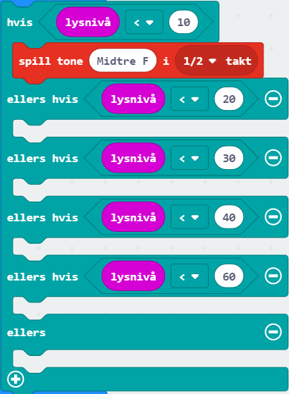

# Introduksjon {.intro}

I denne oppgåva skal me få micro:bit-en til å spele ulike toner avhengig av kor
mykje lys som treff lyssensoren. Dette kan du bruke til å lage musikk!

Me treng litt ekstra utstyr:
- 2 ledningar med krokodilleklemmer
- 1 buzzar (liten, svart høgtalar) eller hovudtelefonar

# Steg 1: Lysnivå {.activity}

*Micro:biten har ein lyssensor som måler lysstyrke. Lysstyrken blir oppgitt som
 eit tal mellom 0 (mørkt) og 255 (lyst), og vert lagra i klossen `lysnivå` som
 du finn i kategorien `Inndata`.*

## Sjekkliste {.check}

- [ ] Lag ein variabel som heiter `lysnivå` (`Variablar` -> `Lag ein variabel`
  -> skriv inn: `lysnivå`) og bruk ein `set variabel til`-kloss for å lagre den
  målte lysstyrken i den.

	

# Steg 2: Musikk {.activity}

## Sjekkliste {.check}

- [ ] Lag koden som er vist under. Du finn -klossen i kategorien `Musikk`. Legg
  merke til at du skal bytte frå `1` til `1/2` takt.

	

- [ ] Kopier `spel tone ...`-klossen ved å høgreklikke på den og vel `Lag kopi`.
  Du endrar tona ved å klikke på den.

- [ ] Fyll reisten av dei ledige plassane i `viss-elles`-klossen med klossar som
  speler tonene Middle D, Middle E, Middle F, Middle G og Middle A.

## {.tip}

For å få fleire plassar i `viss-elles`-klossen, trykk på pluss-teiknet (`+`) som
står heilt nedst på klossen.

# Steg 3: Vel når tonene skal spelast av {.activity}

## Sjekkliste {.check}

- [ ] Du vel sjølv om du skal spele av toner heile tida (`gjenta for alltid`),
  kvar gong du trykkar på ein knapp, når du ristar micro:bit-en eller liknande.
  Finn ein passande kloss og legg reisten av koden inn i den.

# Steg 4: Gjer klart til lyd {.activity}

*Micro:bit-en har ikkje høgtalarar. Derfor må me kople til ein buzzar eller
 hovudtelefonar. Måten me koplar til ein buzzar er litt ulik måten me koplar til
 hovudtelefonar. Fyrst får du ei sjekkliste for korleis du koplar til ein
 buzzar, og så kjem sjekklista for korleis du kan kople til hovudtelefonar.*

## Buzzar - sjekkliste {.check}

- [ ] Fest ein ledning frå port `0` på micro:bit-en til pinnen som det står
  pluss (`+`) ved på buzzaren.

- [ ] Fest den andre ledningen frå der det står `GND` på micro:bit-en til den
  andre pinnen på buzzaren.

## Hovudtelefonar - sjekkliste {.check}

- [ ] Fest ein ledning frå `GND`-porten på micro:biten til heilt øvst på den
  metalliske delen av hovudtelefonane.

- [ ] Fest den andre ledningen frå port `0` på micro:bit-en til heilt nedst på
  den metalliske delen av hovudtelefonane.

- [ ] Simulatoren viser korleis det skal sjå ut:

	

## Test prosjektet {.flag}

- [ ] Last ned programmet til micro:bit-en.

- [ ] Køyr programmet. Prøv å endre lysnivået ved å skugge for med handa di.

## {.tip}

Viss du ikkje høyrer alle tonene kan du justere tala i `viss-elles`-klossen.

## Utfordringar {.challenge}

- [ ] Prøv å spele tonene lengre eller kortare enn i ei halv takt.

- [ ] Utvid `viss-elles`-klossen og legg til fleire toner for fleire lysnivå.
