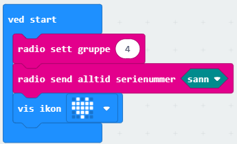
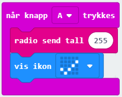
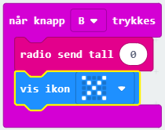
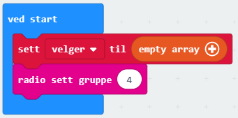
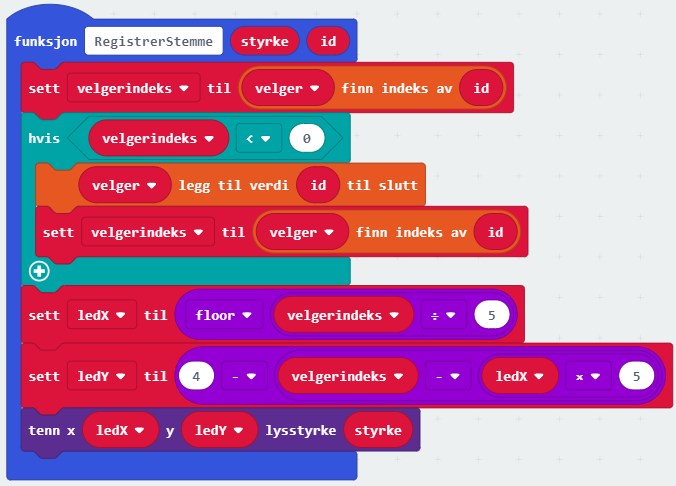
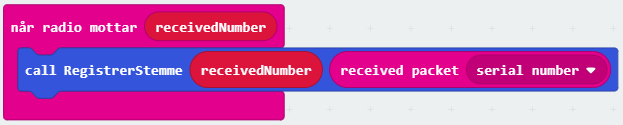
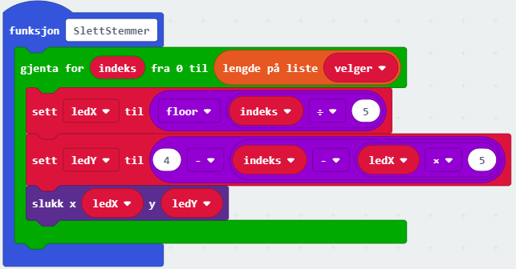
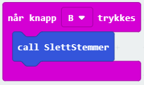

# Introduksjon {.intro}

Et mentometer er en slags stemmeteller som brukes til å måle hva folk mener ved
at hver enkelt trykker på en knapp. Noen av dere voksne husker sikkert mentometeret 
fra flere av NRK sine TV-show på 80 og 90-tallet. I denne oppgaven skal vi lage 
vårt eget mentometer ved hjelp av mange micro:biter. Vi bruker en micro:bit til 
å registrere stemmer. Vi kan kalle denne mentometer. Siden vi bruker LED-lysene 
for å registrere stemmer, kan vi ha maksimalt 25 velgere. Vi må også kode 25 
micro:biter til å sende stemmer til mentometeret. Da setter vi i gang!

# Steg 1: Vi koder velger-brikkene {.activity}

Først lager vi koden for micro:bitene som skal sende stemmer. 

## Sjekkliste {.check}

- [ ] Bruk `start`-blokken og legg inn en `radio sett gruppe`-kloss fra 
`Radio`-kategorien. Alle micro-bitene må bruke samme radio-gruppe, bruk 
for eksempel `4`. Vi må også sikre oss at hver brikke kan kun sende en 
stemme. Det gjør vi ved å si at micro:biten må sende sin serie-id ved å 
legge inn `radio send serienummer` til `sann` inne i `start`-blokken. 
Til sist kan du la micro:biten vise et hyggelig ikon. for eksempel et 
hjerte.

	

- [ ] Du kan stemme `Ja` ved å trykke på A-knappen. Dette gjør vi ved
å be micro:biten sende verdien `255` i en `radio send tall`-kloss fra 
`Radio`-kategorien når vi tykker på denne knappen. Da vil mentometert 
lyse opp en led med full lysstyrke. Til slutt inne i 
`når knapp A trykkes`-klossen kan du legge inn et ikon som viser at du 
har stemt ja.

	

- [ ] Du kan stemme `Nei` ved å trykke på B-knappen. Dette gjør vi ved
å be micro:biten sende verdien `0` i en `radio send tall`-kloss fra 
`Radio`-kategorien når vi tykker på denne knappen. Da vil mentometert 
lyse opp en led med null lysstyrke. Til slutt inne i 
`når knapp B trykkes`-klossen kan du legge inn et ikon som viser at du 
har stemt nei.

	

- [ ] Lagre denne koden og kall den for eksempel `stemmebrikke`. 

# Steg 2: Vi koder mentometeret {.activity}

Vi skal nå lage koden for micro:biten som skal telle opp og vise stemmene.
Du må da starte et nytt prosjekt. 
Denne vil la hver micro:bit som sender stemme få sin egen LED, og denne 
LED-en lyser med lysstyrken som stemmebrikkene sender. Trykker en sendebrikke
på `A`, blir lysstyrken `255`, trykkes `B`, blir lysstyrken `0`. 
For å sikre at hver micro:bit kan stemme bare en gang, må 
vi sjekke hvilket serienummer micro:bitene som sender stemmene har og lagre
alle serienummer i en egen liste.

## Sjekkliste {.check}

- [ ] Lag en variabel som heter `velger` og sett den til å være `empty array` 
inne i `start`-klossen. Da blir variabelen `velger` en liste vi kan fylle opp 
med serienummer til micro:bitene som sender inn stemmer, og slik kan vi holde 
styr på hvem som har stemt. Du må også sette radio-gruppe til `4`.  

	
 
- [ ] For å registrere stemmer, kan vi lage en ny funksjon som heter 
`Registrer stemme`. Den må ha to parametre som heter `styrke` og `id`. 
`styrke` bestemmer hvor sterkt LED-en skal lyse mens `id` er serienumer
til micro:biten som har sendt inn en stemme.

- [ ] Aller først i denne funksjonen må vi sjekke om lista `velger` allerede 
har et element med samme nummer som `id`. Dette gjør vi ved å lage en 
varibel som heter `velgerindeks` og bruke en `list finn indeks av`-kloss for 
å sette verdien på `velgerindeks`. Vi skal bruke lista '`velger` og finne 
indeksen til det elementet som har verdien `id`.

- [ ] Hvis `velgerindeks` er negativ, finnes ikke `id` i `velger`-lista. Da 
må vi legge til et nytt elemnt i `velger`-lista ved å bruke 
`list legg til verdi til slutt`-kloss. Vi skal legge til verdien `id` 
i lista `velger`. Deretter kan i sette `velgerindeks` til 
`velger finn indeks av id`.
 
Nå vet vi hvilken velger vi har mottatt stemme fra, og kan da tenne på 
riktig LED. Det er mange måter å gjøre dette på. Her tennes ledene kolonne 
for kolonne der kolonne 1 er lengst til venstre. For hver kolonne brukes 
først den nederste LED-en. Micro:biten har nummerert LED-ene slik at LED
med indeks 0,0 er øverst til venstre og led med indeks 4,4 er nederst til 
høyre. Da trenger vi en liten algoritme som regner ut vilken LED som hører'
til hvilken `velgerindeks`

- [ ] Vi lager to variabler `ledX` og `ledY`. For `velgerindeks` mellom `0` 
og `4`, vil vi at `ledX` skal være `0` (dvs vi lyser opp en LED i kolonnen 
lengst til venstre), for verdier mellom `5` og `9` vil vi at `ledX` skal 
være `1` osv. Dette klarer vi ved å sette `ledX` til `floor` av 
`velgerindeks / 5`. Merk at `floor`-klossen finner du i `Matematikk`-kategorien 
og er en funskjon som gjør desimaltall til heltall ved å utelate alle siffer 
etter komma.

- [ ] Videre vil vi at `ledY` skal være `4` når velgerinde er `0`, `5`, 
`10` etc (dvs vi bruker LED-ene i nederste rad), `3` når `velgerindeks` 
er `1`, `6`, `11` etc. Dette får vi til ved å sette `ledY` til  
`4 - (velgerindeks - ledX * 5)`

 - [ ] Nå kan vi denne LED-en identifisert ved variablene `ledX` og `ledY`
 ved å bruke en `tenn`-kloss fra `skjerm`-kategorien. Nå er funksjonen
`RegistrerStemme` ferdig, og den ser slik ut:

	 

 - [ ] Nå kan vi kalle på funksjonen `RegistrerStemme` inne i en 
`når radio mottar receviedNumber`-kloss fra `Radio`-kategorien. 
Vi må da sende med `receviedNumber` og 
`recieved packet serial number`. Merk at `receviedNumber` er tallet som
stemme-brikken har sendt mens `recieved packet serial number` er 
stemme-brikken sitt serienummer.

	 

- [ ] For å slette alle de mottatte stemmene, kan vi f.eks. bruke knapp `B`. 
Da må vi gå gjennom lista `velger` og slukke alle LED-lys som er tatt i bruk.
Dette gjør vi ved å lage en funksjon som heter `SlettStemmer` der vi legger 
inn en `gjenta for indeks fra 0 til`-kloss og legger inn en 
`lengde på liste`-kloss der vi finner lengden på `velger`. Da kan vi slukke
LED-ene en etter en ved å bruke samme aloritme som i 
`RegisterStemmer`-funksjonen. Koden ser slik ut:

	 

	 

- [ ] For å slette alle velgere, kan vi f.eks. bruke knapp `A+B`. 
da kan vi først gjenbruke funksjonen `SlettStemmer`. Deretter setter vi
`velger` til å være `empty array`. Da har vi slettet lista med velgere 
og kan starte en helt ny avstemning.

- [ ] Lagre dette prosjktet og kall det for eksempel `mentometer`. 

## Test mentometeret {.flag}

Nå er det på tide å sjekke om stemmebrikkene og mentometeret fungerer. 

- [ ] Last in mentometeret på en micro:bit og stemmebrikke-filen på de andre.

- [ ] Man kan bruke et web-kamera for å få resultater av avstemninger på en storskjerm

- [ ] Lag deres egen avstemning. Et spørsmål kan være 'Er koding gøy?'

# Steg 4: Noen utfordringer {.activity}

*Noen forslag til endringer og utvidelser, men prøv selv dine ideer!*

## Flere ideer {.check}

Nedenfor er noen 
ideer til videreutvikling, men finn gjerne på noe helt eget!

- [ ] Kan du endre lysstyrken på nei-stemmen slik at LED-en lyser svakt når du 
stemmer nei?

- [ ] Kan du legge inn en tidsbegrensing på hvor lenge stemmer mottas?

- [ ] Kan du legge til en klokke som gjør at stemmene slukkes etter en hvis tid?

- [ ] Kan du telle opp antall ja- og nei stemmer og sende til stemme-brikkene
og få stemme-brikkene til å motta disse to tallene og vise resultatet?

