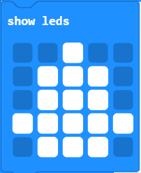
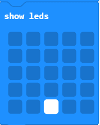
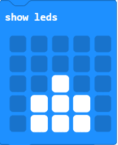
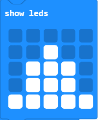
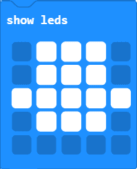
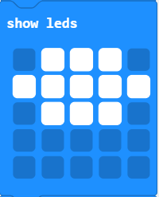
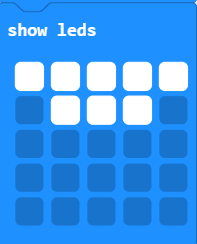

# Introduksjon {.intro}
Her skal vi først telle ned fra fem, og så lage en animasjon av en rakett som flyr av gårde.

# Steg 1: Nedtelling {.activity}

Først skal vi lage nedtelleren. Du vil at tallet 5 skal vises i et sekund, så 4, så 3 osv. Dette kan du få til ved å bruke en kombinasjon av blokkene `vis tall` og `pause` fra `Basis` kategorien.

## Sjekkliste {.check}

- [ ] Få micro:biten til å telle ned fra 5. *Husk at 1000 ms er det samme som 1 sekund*	

- [ ] Koden burde nå se slik ut:

# Steg 2: Raketten {.activity}

Nå som vi har fått til nedtelingen trenger vi en rakett. Min rakett ser slik ut:

Du kan designe raketten din akkurat som du vil.

## Sjekkliste {.check}

- [ ] For å skape inntrykket av at raketten skytes opp tegner du ett etter ett bilde der raketten har flyttet seg et steg. Bildene du tegner henger du etter koden i steg 1. 

Eksempel på bilder du kan ende opp med:

          

# Videre arbeid {.activity}

- [ ] Synes du noe går for fort? Legg til et par `pause`-klosser da vel!

- [ ] Kanskje raketten trenger noen flammer etter seg? Kanskje den faller ned igjen? Eller aknskje det skal komme en ny rakettoppskytning hver gang du trykker A? Her er det bare fantasien som setter grenser, og husk at det er lov å leke seg!

## Utfordring {.challenge}

- [ ] Kan man løse nedtellingen med løkker? Hvordan?
