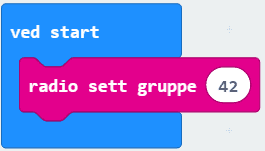
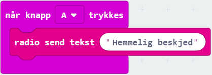
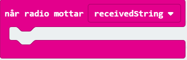
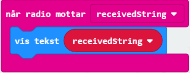

# Introduksjon {.intro}

I denne oppgaven skal du sende og motta hemmelige beskjeder til/fra en annen sin micro:bit ved å bruke radiosignaler. Du trenger derfor en å utveksle hemmelige beskjeder med! Finn noen som har lyst til å gjøre denne oppgaven samtidig med deg.

# Steg 1: Sett opp en radiogruppe {.activity}

## Sjekkliste {.check}

- [ ] Finn en `ved start`-kloss (den ligger allerede i kodefeltet eller du finner den nederst i `Basis`). 

- [ ] Gå til `Radio`og klikk på `radio sett gruppe`-klossen. 

- [ ] Velg dere et gruppenummer mellom 0 og 255 som dere tror ingen andre har. Alle micro:biter som er i samme gruppe kan kommunisere, og du vil ikke at noen andre skal høre den hemmelige beskjeden!

# Steg 2: Lag hemmelig beskjed {.activity}

## Sjekkliste {.check}

- [ ] Gå til `Inndata`og finn klossen `når knapp A trykkes`. Vi bruker denne fordi vi vil sende den hemmelige beskjeden når vi trykker på A. 

- [ ] Finn klossen `radio send tekst`i `Radio`. Legg den inn i `når knapp A trykkes`og skriv inn den hemmelige beskjeden du vil sende. 

### OBS! {.protip}

Micro:biten klarer ikke å vise Æ, Ø eller Å. Bruk heller AE, OE og AA. Beskjeden må heller ikke være for lang. 

# Steg 3: Lag sender og mottaker {.activity}

Du er nå klar til å sende hemmelige beskjeder. Men før du gjør det trenger vi å skrive kode slik at de hemmelige beskjedene kan bli mottatt og lest. 

- [ ] Gå til `Radio`igjen og finn `når radio mottar recievedString`-blokka:

"RecievedString" betyr "Mottatt tekst" på norsk, og beskjeden som mottas blir lagret i klossen som heter dette. 

- [ ] Legg til en `vis tekst`-kloss (fra `Basis`) og `recievedString`-kloss (fra `Variabler`). Legg dem slik at koden din for å motta beskjeder ser slik ut:

## Test prosjektet {.flag}

Nå er vi klare til å både sende og motta beskjeder!

- [ ] Last ned koden til micro:biten og send de hemmelige beskjedene til hverandre ved å trykke på A. 

## {.tip}

For å laste ned koden må du først ha koblet micro:biten til datamaskinen med en USB-kabel. Klikk deretter på knappen `Last ned`nede til venstre på skjermen. Det lastes nå ned en fil som heter `microbit-Uten-navn.hex` til datamaskinen
  din. Samtidig dukker det opp et vindu som sier at du må flytte denne filen til
  MICROBIT-disken på datamaskinen din.

# Ekstra testing {.activity}

## Sjekkliste {.check}

- [ ] Test hvor langt unna hverandre dere kan stå og fremdeles klare og motta beskjeder.

- [ ] Klarer dere å sende beskjeder gjennom et pledd?

- [ ] Hva med vegger?
