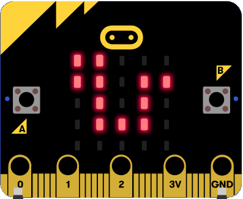
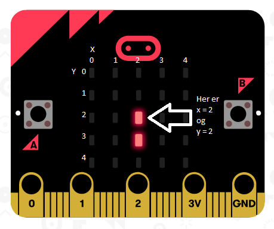

# Introduksjon {.intro}

En eller annen variant av Snake har eksistert på datamaskiner helt siden slutten
av 1970-tallet. Mange voksne kjenner spillet fra Nokias mobiltelefoner, mens
mange barn kjenner det fra moderne versjoner som slither.io.

I spillet styres en slange rundt på skjermen, og slangen må unngå å krasje i
kanten av skjermen og seg selv. Slangen vokser når den spiser mat som dukker
opp tilfeldige steder, og spillet går fortere og fortere etterhvert som slangen
vokser.

I denne oppgaven bruker vi engelske navn på klossene og variabler. Dette er bla.
for at det skal være lettere å finne igjen innebygde funksjoner når vi bytter
mellom klossprogrammering og javascript siden funksjonene har engelske navn i
javascript. Det er veldig vanlig å bruke engelske navn på funksjoner og
variabeler blant programmerere. Dette gjør det blant annet enklere å poste kode
på internettforum og få hjelp fra hele verden.

Denne oppgaven er forholdsvis lang, men vi tar det skritt for skritt og
forklarer underveis. La oss sette i gang.




# Steg 1: Tegne slangen {.activity}

Det første vi trenger er en liten kodesnutt som tegner slangen vår. Skjermen vår
består av 5x5 ledlys. Disse kan vi skru av og på som vi vil med litt kode.

For å tegne slangen trenger vi noe som kan passe på hvor vi skal tegne slangen.
Til dette skal vi bruke en array, en type variabel som inneholder en liste med
verdier.

I listen vår bruker vi to verdier for å tegne en bit av slangen, den første
verdien sier hvilken rad (`Y`) og hvilken kolonne (`X`) vi skal tegne i. Sammen
gir dette oss en `(X,Y)`-posisjon til leden som vi skal skru på.




## Steg for steg {.check}

- [ ] Først starter vi med å lage en array og sette de første verdiene. Arrays
  finner du under `Advanced`. Finn klossen `set list to` og endre variabelnavnet
  til `snake`. Legg den inn i `on start`-klossen. Trykk `+` til du har fire
  verdier i listen og sett dem til `2`, `2`, `2` og `3`. Da skal det se slik ut:

```microbit
let snake: number[] = []
snake = [
2,
2,
2,
3
]
```

Nå trenger vi litt kode for å tegne slangen. For å gjøre det litt enklere å
holde oversikt over programmet vårt så gjør vi dette med en funksjon.

- [ ] Lag en ny funksjon som heter `drawSnake()` og legg en for-loop inni denne.
  En for-løkke er en vanlig måte å gå gjennom en liste. For-løkken starter på
  `0` og skal slutte når den har kommet til lengden av arrayen `snake` minus en.

## {.tip}

Hvorfor begynner vi på 0 og går til antall minus en? Tenk deg at du har en
stabel med ark, f.eks. en oppgave som denne. Hvor mange ganger må du bla for å
lese den første siden?  Hvor mange ganger må du bla for å lese alle arkene? Slik
er det med en array også, arrayen begynner på posisjon 0,  og du må da bruke
antall minus en for å bla igjennom alle. Hvis dette er vanskelig å forstå, så
tenk "sånn er det bare".

##

- [ ] Lag to variabler, `x` og `y`. Inni løkken henter vi ført ut en verdi fra
  snake arrayen med `get value at` med index og  legger i `x`-variabelen,
  deretter teller vi opp `index` med en, og henter ut ut en verdi til og putter
  i `y`.  Nå har vi det vi trenger for å tegne et punkt i slangen. Til dette
  bruker vi `plot(x,y)` funksjonen som ligger under `led`-fanen.

```microbit
function drawSnake () {
    for (let index = 0; index <= snake.length - 1; index++) {
        x = snake[index]
        index += 1
        y = snake[index]
        led.plot(x, y)
    }
}
```

- [ ] Nå må vi bare kalle denne funksjonen fra et sted. Vi legger inn et kall
  til `drawSnake()` i `forever()`.

```microbit
basic.forever(function () {
    drawSnake()
})
```

## Test prosjektet {.flag}

__Prøv spillet i simulatoren for å teste koden så langt. Sjekk at det blir
tegnet to punkter.__

- [ ] Prøv å legge til et punkt til i `snake`. Da må du legge til to verdier.
  Sjekk at det nye punktet også blir tegnet.

- [ ] Bytt til javascript. Klarer du å kjenne igjen koden som er generert fra
  klossprogrammeringen når du bytter til javascript?

## {.tip}

Egentlig er det vi skriver noe som heter Typescript som er en variant av
Javascript. I vanlig Javascript trenger vi ikke bruke type  på variabler, men
det må man noen steder i Typescript. F.eks. hvis en variabel skal inneholde tall
må vi spesifisere at det er  et tall med `let x: number`.

##

Da har vi det vi trenger for å tegne slangen. Men det er litt kjedelig når den
står stille. Det må vi gjøre noe med!


# Steg 2: Slithering snake {.activity}

Nå skal vi få slangen til å bevege seg. Siden slangen kan bevege seg opp, ned,
venstre og høyre så trenger vi en variabel som  sier hvilken retning den er på
vei. Vi beveger slangen ved å legge til et nytt punkt i begynnelsen og ta vekk
det siste punktet  på halen.

## Steg for steg {.check}

- [ ] Lag en ny variabel. Kall variabelen `direction`. Sett variabelen til `up`
  i oppstartsklossen.

- [ ] Nå skal vi lage en funksjon som oppdaterer `snake`.

```microbit
function updateSnake(){
}
```

- [ ] Først i funksjonen henter vi ut "hodet" til slangen dvs. det første
  punktet, `x`- og `y`-koordinater, i fra `snake`.

```microbit
function updateSnake(){
    x = snake[0]
    y = snake[1]
}
```

- [ ] Deretter skal vi trekke i fra en på `y` hvis direction er `up`, plusse på
  en på `y` hvis `down`,  trekke fra en på `x` hvis `left` og plusse på en på
  `x` hvis `right`.

```microbit
function updateSnake(){
    if (direction == 'up') {
        y = y - 1;
    }
    if (direction == 'down') {
        y = y + 1;
    }
    if (direction == 'left') {
        x = x - 1
    }
    if (direction == 'right') {
        x = x + 1
    }
}
```

- [ ] Så dytter vi inn `x` og `y` i begynnelsen av arrayen `snake` med
  javascript funksjon `unshift()` (eller `insert at begin`-klossen) og
  fjerne et punkt (to verdier, x og y) fra halen med javascript funksjonen
  `pop()` (eller `remove last from`-klossen), slik at slangen beveger seg et
  hakk.

```microbit
function updateSnake(){
    snake.unshift(y);
    snake.unshift(x);
    snake.pop();
    snake.pop();
}
```

- [ ] Til slutt legger vi til et kall til `updateSnake()` i `forever()`

```microbit
basic.forever(function () {
    drawSnake();
    updateSnake();
})
```

- [ ] Hvis du ikke har gjort det alt er det på tide å lagre koden. Gi prosjektet
  navn "Snake" og trykk save.

## Test prosjektet {.flag}

__Prøv koden i simulatoren for å teste koden så langt.__

- [ ] Ta en titt på programmet i simulatoren. Oppfører det seg som du forventet?
  Ikke? Forstår du hvorfor dette skjer?

- [ ] Hvis du har gjort alt riktig fram til nå så har du nå fire prikker på
  rekke midt på skjermen. Det er fordi vi aldri skrur  av ledlyset der slangen
  har vært. Vi legger til en funksjon til i `forever()`:

```microbit
basic.forever(function () {
	basic.clearScreen();
	drawSnake();
	updateSnake();
})
```

- [ ] Men vi må gjøre en liten ting til for at det skal fungere skikkelig. Hvis
  du tester det slik det er nå vil du kanskje se et  par kjappe blink før
  skjermen er tom. Skjønner du hvorfor? Dette er et godt tidspunkt for å teste
  en funksjon i microbitsimulatoren.  Vi kan kjøre programmet i sakte fart ved å
  trykke på sneglen for å se hva som skjer, steg for steg. Nå skjønner du
  kanskje hva som  er problemet? Det går for fort! La oss legge inn en liten
  pause:

```microbit
basic.forever(function () {
	basic.clearScreen();
	drawSnake();
	updateSnake();
	basic.pause(1000);
})
```


# Steg 3: Styring {.activity}

Nå er det på tide at vi legger inn litt styring av slangen. Men først lager vi
en liten startskjerm.

## Steg for steg {.check}

- [ ] Lag en ny variabel. Kall variabelen `isPlaying` og sett til `false` i
  startklossen. Aller først i startklossen legger du en  `show icon`-kloss med
  "snake"-ikonet.

```microbit
basic.showIcon(IconNames.Snake)
let isPlaying = false
```

- [ ] I `forever`-funksjonen legger du en `if` som tester om `isPlaying` er
  sant(`true`). I så fall skal programmet tegne og oppdatere, så dette putter du
  inni `if`-klossen.

```microbit
basic.forever(function () {
    if (isPlaying) {
        basic.clearScreen()
        drawSnake();
        updateSnake();
        basic.pause(1000);
    }
})
```

- [ ] Så legger vi til funksjoner for knappene. Når knappen blir trykket setter
  du `isPlaying` til `true`

```microbit
input.onButtonPressed(Button.A, function () {
    isPlaying = true
})
input.onButtonPressed(Button.B, function () {
    isPlaying = true

})
```

## Test prosjektet i simulatoren {.flag}

Nå skal slangeikonet vises til du trykker på en knapp, da starter spillet. Men
vi trenger litt mer kode for å styre. Når man spiller skal A-knappen styre
slangen 90 grader mot venstre fra nåværende retning  mens B-knappen styre
slangen 90 grader mot høyre.

## Steg for steg {.check}

- [ ] Legg til en `if-else` i knappekoden. Hvis vi er i `isPlaying`-modus, så
  skal knappetrykket styre slangen. Hvis vi trykker på A knappen og  direction
  er `up` så endrer vi den til `left`, hvis den er `left` så endrer vi til
  `down` , osv. Og motsatt for B kanppen.  Hvis vi ikke er i `isPlaying`-modus
  så må vi skru den på.

```microbit
input.onButtonPressed(Button.A, function () {
    if (isPlaying) {
        if (direction == 'up') {
        	direction = 'left';
        }
        else if (direction == 'left') {
            direction = 'down';
        }
        else if (direction == 'down') {
            direction = 'right';
        }
        else if (direction == 'right') {
            direction = 'up';
        }
    } else {
        isPlaying = true
    }
})
input.onButtonPressed(Button.B, function () {
    if (isPlaying) {
        if (direction == 'up') {
            direction = 'right';
        }
        else if (direction == 'right') {
            direction = 'down';
        }
        else if (direction == 'down') {
            direction = 'left';
        }
        else if (direction == 'left') {
            direction = 'up';
        }
    } else {
        isPlaying = true;
    }
})
```

## Test prosjektet {.flag}

__Prøv spillet i simulatoren for å teste koden så langt. Sjekk at styringen
virker.__

Nå kan du styre slangen, men det er et lite problem. Hvis vi trykker for to
ganger på en knapp så går slangen i stikk motsatt retning.  Det vil vi ikke
siden slangen på denne måten går gjennom seg selv og det blir bare tull.

## Steg for steg {.check}

- [ ] Legg til en ny variabel som heter `buttonPressed`

- [ ] Endre begge `onButtonPressed` funksjonene med følgende kode

```microbit
input.onButtonPressed(Button.A, function () {
    if (isPlaying) {
        if (buttonPressed) {
            return;
        }
        buttonPressed = true;
		}
})
```

- [ ] Sett `buttonPressed` til `false` i `updateSnake()`


## Test prosjektet {.flag}

__Prøv spillet i simulatoren for å teste koden så langt. Hvis alt stemmer nå er
det bare ett knappetrykk som gjelder for hvert hakk slangen beveger seg.__


# Steg 4: GAME OVER! {.activity}

Men vi kan jo styre slangen selv om den kjører utenfor skjermen, det skal
selvfølgelig ikke være lov!

## Steg for steg {.check}

- [ ] Lag en ny funksjon som du kaller `checkGameOver(x,y)`. I denne sjekke vi
  om x og y er innenfor skjermen. Hvis x eller y er utenfor  er det game over.
  Det viser vi med en hodeskalle. Vi må også sette `isPlaying` til `false`, og
  slange og retning tilbake til utgangspunktet  ved start. Så venter vi litt før
  vi setter "snake"-ikonet som i startskjermen.

```microbit
function checkGameOver(x: number, y: number) {
    if(x < 0 || x > 4 || y < 0 || y > 4)
    {
        direction = 'up';
        snake = [2, 1, 2, 2]

        basic.showIcon(IconNames.Skull);
        basic.pause(2000);
        basic.showIcon(IconNames.Snake);
        isPlaying = false;
    }
}
```

- [ ] Vi kaller `checkGameOver()` i `updateSnake()` før `unshift()` og bruker
  `x` og `y` som vi har der som parametere til funksjonen.

## Test prosjektet {.flag}

__På tide å prøve spillet på micro:bit__


# Steg 5: Litt lyd, takk! {.activity}

## Steg for steg {.check}

- [ ] La oss legge til et blip for hver gang slangen beveger seg. Vi legger til
  denne kodelinjen i begynnelsen av `updateSnake()`.  Den spiller noten C, femte
  oktav i 20 ms som blir et fint lite blip.

```microbit
function updateSnake(){
    music.playTone(Note.C5, 20)
}
```

- [ ] Så vil vi spille en liten melodi når det er game over. Microbitten har
  noen innebygde melodier som vi kan spille.  Melodien **Wawawawa** eller
  **Funeral** passer kanskje best? Legg til denne kodelinjen i `checkGameOver()`
  rett før du viser hodeskallen.

```microbit
function checkGameOver(){
    music.beginMelody(music.builtInMelody(Melodies.Wawawawaa), MelodyOptions.Once);
}
```

## Test prosjektet {.flag}

__Koble til hodetelefoner eller høytaler til micro:bit og sjekk at du får lyd.
Test i simulatoren hvis du ikke har mulighet til å koble til noe.__


# Steg 6: Mat {.activity}

Nå har kan man styre slangen, det blir game over og vi har litt lyd. På tide å
legge til litt mat slik at vi får et skikkelig spill.  Maten skal vi generere på
et tilfeldig sted, men vi må passe på at det ikke er på slangen. Slik gjør vi:

## Steg for steg {.check}

- [ ] Lag to nye variabler, `foodX` og `foodY`. Øverst i koden legger du til
  disse kodelinjene

```microbit
let foodX: number = 0
let foodY: number = 0
```

- [ ] Så trenger vi en funksjon for å generere maten et tilfeldig sted

```microbit
function generateFood(){
    foodX = Math.randomRange(0, 4);
    foodY = Math.randomRange(0, 4);
}
```

- [ ] Men hvis vi er skikkelig uheldige nå så er maten et sted på slangen. Det
  må vi passe på at den ikke er. Først lager vi en funksjon  som sjekker om et
  punkt er på slangen. Vi bruker samme metoden som i `drawSnake()` for å hente
  en og en posisjon på slangen  (du kan kopiere `innmaten` i fra `drawSnake()`
  og endre den hvis du vil) og sammenligner den med de posisjonene vi sender
  inn. Hvis begge  stemmer er vi på slangen.

```microbit
function isOnSnake(myX: number, myY: number) {
    for (let index = 0; index <= snake.length - 1; index+=2) {
        if (myX === snake[index] && myY === snake[index+1]) {
            return true;
        }
    }
    return false;
}
```

- [ ] Oppdater `generateFood()` slik
```microbit
function generateFood() {
    foodX = Math.randomRange(0, 4);
    foodY = Math.randomRange(0, 4);
    if (isOnSnake(foodX, foodY)) {
        generateFood();
    }
}
```

- [ ] Kall `generateFood()` under oppstart, like etter der du setter
  koordinatene i `snake`-arrayen.

- [ ] Da har vi en posisjon til maten, men vi må også tegne den. Lag en ny
  funksjon `drawFood()` slik

```microbit
function drawFood() {
    led.plot(foodX, foodY);
}
```

- [ ] Kall `drawFood()` i fra `forever()`, etter `clearScreen()`

```microbit
basic.forever(function () {
    if (isPlaying) {
        basic.clearScreen()
        drawFood();
        drawSnake();
        basic.pause(1000);
        updateSnake();
    }
})
```

## Test prosjektet {.flag}

__Test i simulatoren for å sjekke at maten blir tegnet.__

Nå har vi laget maten, da gjenstår det bare å spise den. Hvordan vet vi at vi er
på riktig sted for å spise maten?  Jo, hvis `x` og `y` i `updateSnake()` er den
samme posisjonen som `foodX` og `foodY`. Da skal slangen vokse med et punkt.
Hvordan gjør vi det? Vi lar bare være å fjerne det siste punktet på halen i
`updateSnake()`. Smart?

## Steg for steg {.check}

- [ ] Vi legger til denne lille kodesnutten som spiller en liten trudelutt når
  vi er på samme sted som maten,  og genererer ny mat i `updateSnake()`. Hvis
  slangen ikke spiser mat, gjør vi det samme som før.

```microbit
function updateSnake(){
    if (x == foodX && y == foodY) {
        music.beginMelody(music.builtInMelody(Melodies.BaDing), MelodyOptions.Once);
        generateFood();
    } else {
        snake.pop();
        snake.pop();
    }
}
```

- [ ] Etterhvert som slangen vokser må vi sjekke at den ikke biter seg selv. Vi
  har allerede en funksjon for å sjekke  om x og y er på slangen. Vi legger til
  denne sjekken i `checkGameOver()`

```microbit
function checkGameOver(x: number, y: number) {
    if (x < 0 || x > 4 || y < 0 || y > 4 || isOnSnake(x,y)) {
        direction = 'up';
        snake = [2, 1, 2, 2]

        music.beginMelody(music.builtInMelody(Melodies.Wawawawaa), MelodyOptions.Once);
        basic.showIcon(IconNames.Skull);
        basic.pause(2000);
        basic.showIcon(IconNames.Snake);
        isPlaying = false;
    }
}
```

- [ ] I tilegg til at slangen vokser og gjør det vanskeligere på den måten, så
  skal spillet også gå fortere etterhvert.  Det gjør vi med å redusere pausen
  mellom hver oppdatering. Til det trenger vi en variabel som vi kaller for
  `updateRate`.  La den være 1000 til å begynne med. Så skal vi trekke fra litt
  for hver oppdatering og litt mer hver gang slangen spiser mat.  Endre slutten
  av `updateSnake()` slik

```microbit
function updateSnake(){
    if (x === foodX && y === foodY) {
        music.beginMelody(music.builtInMelody(Melodies.BaDing), MelodyOptions.Once);
        updateRate *= 0.95;
        generateFood();
    } else {
        snake.pop();
        snake.pop();
    }
    buttonPressed = false
    updateRate -= 5;
}
```

- [ ] Så bruker vi `updateRate` i pausen i `forever()`

```microbit
basic.forever(function () {
    if (isPlaying) {
        basic.clearScreen();
        drawSnake();
        drawFood();
        basic.pause(updateRate);
        updateSnake();
    }
})
```

## Test prosjektet {.flag}

__Prøv spillet på micro:bit og sjekk at alt fungerer.__


# Steg 7: Litt pynt {.activity}

Nå har vi i grunnen et fungerede spill. Men vi skal pynte bittelitt på det for å
gjøre det litt bedre. Det kan være litt vanskelig  å se maten noen ganger siden
den kan komme hvor som helst og er lik slangen. For å gjøre det lettere å se den
skal vi få den til  å blinke. Det gjør vi med å bruke `input.runningTime()`.
Denne funksjonen gir oss antall millisekund  siden siden microbiten ble skrudd
på.

## Steg for steg {.check}

- [ ] Hent ut `input.runningTime()` i begynnelsen av `drawFood()` og legg den i
  en variabel.  Vi bruker et "triks" med `%`-operatoren  for å dele i 500
  millisekunder. Vi tegner bare maten hvis den resterende verdien er større enn
  250, det gir oss ganske rask blinking.  Koden ser slik ut:

```microbit
function drawFood() {
    const currentTime = input.runningTime();
    if(currentTime%500 > 250){
        led.plot(foodX, foodY);
    }
}
```

- [ ] Nå kan vi ikke lenger bruke `pause()` i `forever()`. Ta bort den
  kodelinjen.

- [ ] Spillet må fremdeles vente mellom hver oppdatering av slangen. Til dette
  trenger vi en variabel som vi kan kalle `lastUpdateTime`.  Denne må vi resette
  samme sted som vi setter `isPlaying = true` på første knappetrykk.

```microbit
input.onButtonPressed(Button.A, function () {
    lastUpdateTime = input.runningTime();
}
```

- [ ] I `forever()` henter vi ut tiden og ser om det har gått lengre tid enn
  `updateRate` siden vi gjorde en oppdatering. I så fall er det på  tide med en
  ny oppdatering, og til slutt settes `lastUpdateTime` slik at det er klart til
  å vente til neste gang vi skal gjøre en oppdatering.

```microbit
basic.forever(function () {
	  if (isPlaying) {
	      basic.clearScreen();
	      drawSnake();
	      drawFood();
	      const currentTime = input.runningTime();
	      if(currentTime - lastUpdateTime >= updateRate)
	      {            
	          updateSnake();
	          lastUpdateTime = currentTime;
	      }
	  }
})
```

## Test prosjektet på micro:bit {.flag}

__Prøv spillet på micro:bit. Forhåpentligvis fungerer det brillefint.
Gratulerer, du har nå gjort ferdig spillet.__

Her kommer et par utfordringer!

## Utfordring {.challenge}

Legg til score og highscore som vises etter at du dør. Spill en liten melodi og
vis New highscore hvis spilleren slo rekorden.

**Tips:** Du kan bruke lengden til snake-arrayen til å regne ut poeng.

## Utfordring {.challenge}

Styr slangen automagisk. Få den til å gå rundt og finne mat selv og prøve å ikke
krasje.

**Tips:** Du har allerede skrevet kode som sjekker om slangen kjører utenfor
eller kolliderer med seg selv. Du kan bruke den samme koden  til å sjekke
posisjonen og endre retning(`direction`) mot høyre eller venstre hvis den
krasjer, finne ny posisjon og sjekke om den også krasjer. For å finne maten kan
du snu mot den når du kommer på samme rad eller kolonne som maten.
