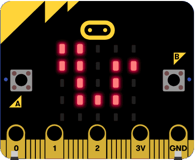
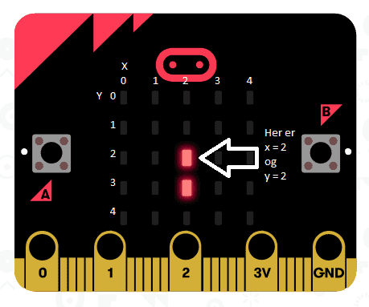

# Introduksjon {.intro}

Ein eller annan variant av Snake har eksistert på datamaskiner heilt sidan
slutten av 1970-talet. Mange vaksne kjenner spelet frå Nokia sine
mobiltelefonar, medan mange born kjenner det frå moderne versjonar som
[slither.io](http://slither.io/).

I spelet styrer me ein slange rundt på skjermen, og slangen må unngå å krasje i
kanten av skjermen og seg sjølv. Slangen veks når den et mat som dukkar opp
tilfeldige stader, og spelet går fortare og fortare etter kvart som slangen
veks.

I denne oppgåva brukar me engelske namn på klossar og variablar. Dette er mellom
anna for at det skal vere enklare å finne att innebygde funksjonar når me byttar
mellom klossprogrammering og Javascript, sidan funksjonane har engelske namn i
Javascript. Det er veldig vanleg at programmerarar brukar engelske namn på
funksjonar og variablar. Dette gjer det mellom anna enklare å poste kode på
internettforum og få hjelp frå heile verda.

Denne oppgåva er ganske lang, men me tek det steg for steg og forklarar
undervegs. La oss setje i gong.




# Steg 1: Teikne slangen {.activity}

Det fyrste me treng er ein liten kodesnutt som teiknar slangen vår. Skjermen
består av 5x5 ledlys. Desse kan me skru av og på som me vil med litt kode. For å
teikne slangen treng me noko som kan passe på kor me skal teikne den. Til det
skal me bruke eit *array*, ein type variabel som inneheldt ei liste med verdiar.
I lista vår brukar me to verdiar for å teikne ein bit av slangen. Den fyrste
verdien seier kva kolonne me skal teikne i (`X`), og den neste seier kva rad me
skal teikne i (`Y`). Saman får me ein koordinat `(X, Y)` for ledlyset som me
skal skru på.



## Steg for steg {.check}

- [ ] Fyrst startar me med å lage eit *array* og setje dei fyrste verdiane. Du
  finn *array* under `Advanced`. Finn blokka `set list to` og endre
  variabelnamnet til `snake`. Legg den inn i `on start`-klossen. Trykk `+` til
  du har fire verdiar i lista, og set dei til `2`, `2`, `2` og `3`. Då skal det
  sjå slik ut:

	

No treng me kode for å teikne slangen. For å gjere det enklare å halde oversikt
over programmet vårt, så gjer me dette med ein funksjon.

- [ ] Lag ein ny funksjon som heiter `drawSnake()` og legg ei for-løkke inni
  denne. Ei for-løkke er ein vanleg måte å gå gjennom ei liste på. For-løkka
  startar på `0` og skal slutte når den har kome til lengda av `snake` minus
  éin.

## {.tip}

__Kvifor startar me på `0` og går til lengda minus éin?__

Tenk deg at du har ein stabel med ark, til dømes ei oppgåve som denne. Kor mange
gonger må du bla for å lese den fyrste sida? Kor mange gonger må du bla for å
lese alle arka? Slik fungerer eit array, du startar i posisjon 0, og må bruke
antal minus éin for å bla gjennom alle. Viss det er vanskeleg å forstå, så kan
du prøve å tenke "slik er det berre" no, og så blir du vant til det seinare.

##

- [ ] Lag to variablar, `x` og `y`. Inni løkka hentar me fyrst ut ein verdi frå
  snake-arrayet med `get value at`, der me brukar `index` for å hente riktig
  `x`- og `y`-verdi. No har me det me treng for å teikne eit punkt i slangen.
  Til det brukar me `plot(x,y)`-funksjonen som ligg under `led`-fana.


- [ ] No må me berre finne ein stad å kalle funksjonen frå. Me legg inn eit kall
  til `drawSnake()` i `forever()`


## Test prosjektet {.flag}

__Prøv spelet i simulatoren for å teste koden så langt. Sjekk at det blir teikna
to punkt.__

- [ ] Prøv å leggje til eit punkt til i `snake`. Då må du leggje til to verdiar.
  Sjekk at det nye punktet blir teikna.

- [ ] Bytt til Javascript. Klarar du å kjenne att koden som er generert frå
  klossprogrammeringa når du byttar?

## {.tip}

Eigentleg er det me skriv noko som heiter Typescript. Det er ein variant av
Javascript. I vanleg Javascript treng me ikkje bruke type på variablar, men det
må ein nokre stader i Typescript. Til dømes må me spesifisere at ein variabel
som skal innehalde tal skal gjere det med `let x: number`.

##

Då har me det me treng for å teikne slangen. Men det er litt keisamt at den
berre står stille. Det må me gjere noko med!


# Steg 2: Slithering snake {.activity}

No skal me få slangen til å bevege seg. Sidan slangen kan bevege seg opp, ned,
til venstre og til høgre, så treng me ein variabel som seier kva retning den er
på veg akkurat no. Me beveger slangen ved å leggje til eit nytt punkt på
starten, og å ta bort det siste punktet på halen.

## Tips {.tip}

I denne oppgåva brukar me både klossprogrammering og handskrive kode. Før me
byttar mellom klossprogrammering og Javascript kan det vere lurt å lagre spelet.
Det brukar å gå fint å bytte mellom desse sjølv om nokre av klossane kan bli
grå. Det hender at Makecode ikkje forstår at noko kode forsvinn, då er det
veldig greitt å ha eit lagra punkt å gå tilbake til. Men du treng ikkje å bry
deg viss det berre er nokre variablar som flyttar seg litt på skjermen.

## Steg for steg {.check}

- [ ] Lag ein ny variabel. Kall variabelen `direction`. Set variabelen til `up`
  i oppstartsblokka.

- [ ] No skal me lage ein funksjon som oppdaterer `snake`. For å få til dette
  skal me skrive litt Javascript. Start med å lage funksjonen `updateSnake()`.

```Javascript
function updateSnake(){
}
```

- [ ] Fyrst i funksjonen hentar me ut "hovudet" til slangen, altså det fyrste
  punktet (`x`- og `y`-koordinatane) frå `snake`.

```Javascript
	x = snake[0]
	y = snake[1]
```

- [ ] Så skal me trekke frå ein på `y` viss `direction` er `up`, leggje på ein
  viss `direction` er `down`, trekkje frå ein på `x` viss `direction` er `left`
  og leggje på ein viss `direction` er `right`.

```Javascript
    if (direction == 'up') {
        y = y - 1;
    }
    if (direction == 'down') {
        y = y + 1;
    }
    if (direction == 'left') {
        x = x - 1
    }
    if (direction == 'right') {
        x = x + 1
    }
```

- [ ] Så dyttar me inn `x` og `y` i starten av arrayet `snake` med funksjonen
  `unshift()`, og så fjernar med eit punkt (dei to siste verdiane) frå halen med
  funksjonen `pop()`, slik at slangen bevegar seg eit hakk.

```Javascript
    snake.unshift(y);
    snake.unshift(x);
    snake.pop();
    snake.pop();
```

- [ ] Til slutt legg me til eitt kall til `updateSnake()` i `forever()`

```Javascript
basic.forever(function () {
    drawSnake();
    updateSnake();
})
```

- [ ] Viss du ikkje allereie har gjort det er det på tide å lagre koden. Gi
  prosjektet namnet `Snake` og trykk på *save* (lagre på norsk).

## Test prosjektet {.flag}

__Prøv koden i simulatoren for å teste koden så langt.__

- [ ] Ta ein kikk på programmet i simulatoren. Oppfører det seg som du forventa?
  Ikkje? Forstår du kvifor dette skjer?

- [ ] Viss du har gjort alt riktig fram til no har du fire prikkar på rekke midt
  på skjermen. Det er fordi me aldri skrur av ledlyset der slangen har vore. Me
  legg til ein funksjon til i `forever()`:

	```Javascript
	basic.forever(function () {
		basic.clearScreen();
		drawSnake();
		updateSnake();
	})
	```

- [ ] Men me må gjere ein liten ting til for at det skal fungere skikkeleg. Viss
  du testar det slik det er no ser du kanskje at det er eit par kjappe blink før
  skjermen er tom. Forstår du kvifor? Dette er eit godt tidspunkt for å teste
  ein funksjon i micro:bit-simulatoren. Me kan køyre programmet i sakte fart for
  å sjå kva som skjer! Trykk på snegla, så køyrer me koden steg for steg. No
  forstår du kanskje kva som er problemet? Det går for fort! La oss leggje inn
  ei lita pause:

	```Javascript
	basic.forever(function () {
		basic.clearScreen();
		drawSnake();
		updateSnake();
		basic.pause(1000);
	})
	```

# Steg 3: Styring {.activity}

No er det på tide å leggje inn styring av slangen. Men fyrst lagar me ein liten
startskjerm.

## Steg for steg {.check}

- [ ] Lag ein ny variabel. Kall variabelen `isPlaying` og set den til `false` i
  startblokka. Aller fyrst i startblokka legg du ein `show icon`-kloss med
  "snake"-ikonet.


- [ ] I `forever`-funksjonen legg du ein `if` som testar om `isPlaying` er sann
  (`true`). I så fall skal programmet teikne og oppdatere, så dette puttar du
  inni `if`-klossen.


- [ ] Så legg me til funksjonar for knappane. Når knappen vert trykt set du
  `isPlaying` til `true`


## Test prosjektet i simulatoren {.flag}

No skal slangeikonet visast til du trykkar på ein knapp, då startar spelet. Men
me treng meir kode for å styre. Når ein speler skal A-knappen styre slangen 90
grader mot venstre frå noverande retning, medan B-knappen styrer slangen 90
grader mot høgre.

## Steg for steg {.check}

- [ ] Legg til ein `if-else` i knappekoden. Viss me er i `isPlaying`-modus, så
  skal knappetrykket styre slangen. Viss me trykkar på A-knappen og `direction`
  er `up`, så endrar me den til `left`. Viss den er `left` endrar me til `down`,
  osb. Og gjer motsett for B-knappen. Viss me ikkje er i `isPlaying`-modus, så
  må me skru den på.

```Javascript
input.onButtonPressed(Button.A, function () {
    if (isPlaying) {
        if (direction == 'up') {
        	direction = 'left';
        }
        else if (direction == 'left') {
            direction = 'down';
        }
        else if (direction == 'down') {
            direction = 'right';
        }
        else if (direction == 'right') {
            direction = 'up';
        }
    } else {
        isPlaying = true
    }
})
input.onButtonPressed(Button.B, function () {
    if (isPlaying) {
        if (direction == 'up') {
            direction = 'right';
        }
        else if (direction == 'right') {
            direction = 'down';
        }
        else if (direction == 'down') {
            direction = 'left';
        }
        else if (direction == 'left') {
            direction = 'up';
        }
    } else {
        isPlaying = true;
    }
})
```

## Test prosjektet {.flag}

__Prøv spelet i simulatoren for å teste koden så langt. Sjekk at styringa
virkar.__

No kan du styre slangen, men det er eit lite problem. Viss me trykkar fort to
gonger på ein knapp går slangen i motsett retning. Det vil me ikkje, sidan det
tyder at slangen går gjennom seg sjølv, og det blir berre tull.

## Steg for steg {.check}

- [ ] Legg til ein ny variabel som heiter `buttonPressed`.

- [ ] Endre begge `onButtonPressed`-funksjonane med følgjande kode:

```Javascript
input.onButtonPressed(Button.A, function () {
    if (isPlaying) {
        if (buttonPressed) {
            return;
        }
        buttonPressed = true;
		}
})
```

- [ ] Set `buttonPressed` til `false` i `updateSnake()`.

## Test prosjektet {.flag}

__Prøv spelet i simulatoren for å teste koden så langt. Viss alt stemmer no er
det berre eitt knappetrykk som gjeld for kvart hakk slangen beveger seg.__


# Steg 4: GAME OVER! {.activity}

Men me kan jo styre slangen sjølv om den køyrer utanfor skjermen. Det skal
sjølvsagt ikkje vere lov!

## Steg for steg {.check}

- [ ] Lag ein ny funksjon som du kallar `checkGameOver(x,y)`. I denne sjekkar me
  om `x` og `y` er innanfor skjermen. Viss `x` eller `y` er utanfor er det game
  over. Det viser me med ein hovudskalle. Me må dessutan setje `isPlaying` til
  `false`, og slange og retning tilbake til utgangspunktet ved start. Så ventar
  me litt før me set "snake"-ikonet tilbake, slik som på startskjermen.

```Javascript
function checkGameOver(x: number, y: number) {
    if(x < 0 || x > 4 || y < 0 || y > 4)
    {
        direction = 'up';
        snake = [2, 1, 2, 2]

        basic.showIcon(IconNames.Skull);
        basic.pause(2000);
        basic.showIcon(IconNames.Snake);
        isPlaying = false;
    }
}
```

- [ ] Me kallar `checkGameOver()` i `updateSnake()` før `unshift()` og brukar
  `x` og `y` som me har der som parametrar til funksjonen.

## Test prosjektet {.flag}

__På tide å prøve spelet på micro:bit__


# Steg 5: Litt lyd, takk! {.activity}

## Steg for steg {.check}

- [ ] La oss leggje til eit blip for kvar gong slangen beveger seg. Me legg til
  denne kodelinja i starten av `updateSnake()`. Den speler nota C, femte oktav i
  20 ms, som blir eit fint lite blip.

```Javascript
    music.playTone(Note.C5, 20)
```

- [ ] Så vil me spele ein liten melodi når det er game over. Micro:bit-en har
  nokre innebygde melodiar som me kan spele. Melodien **Wawawawa** eller
  **Funeral** passar kanskje best? Legg til denne kodelinja i `checkGameOver()`
  rett før du viser hovudskallen.

```Javascript
    music.beginMelody(music.builtInMelody(Melodies.Wawawawaa), MelodyOptions.Once);
```

## Test prosjektet {.flag}

__Kople til hovudtelefonar eller ein høgtalar til micro:bit-en og sjekk at du
får lyd. Test i simulatoren viss du ikkje har moglegheit til å kople til noko.__


# Steg 6: Mat {.activity}

No kan me styre slangen, det blir game over, og me har lyd. På tide å leggje til
mat slik at me får eit skikkeleg spel. Maten skal me generere på ein tilfeldig
stad, men me må passe på at det ikkje er på slangen.

## Steg for steg {.check}

- [ ] Lag to nye variablar, `foodX` og `foodY`. Øvst i koden legg du til desse
  kodelinjene

```Javascript
let foodX: number = 0
let foodY: number = 0
```

- [ ] Så treng me ein funksjon for å generere maten ein tilfeldig stad

```Javascript
function generateFood(){
    foodX = Math.randomRange(0, 4);
    foodY = Math.randomRange(0, 4);
}
```

- [ ] Men viss me er skikkeleg uheldige no, så er maten ein stad på slangen. Det
  må me passe på at den ikkje er. Fyrst lagar me ein funksjon som sjekkar om eit
  punkt er på slangen. Me brukar same metode som i `drawSnake()` for å hente ein
  og ein posisjon på slangen (du kan godt kopiere "innmaten" frå `drawSnake()`
  og endre den viss du vil), og samanliknar den med dei posisjonane me sender
  inn. Viss begge stemmer er me på slangen.

```Javascript
function isOnSnake(myX: number, myY: number) {
    for (let index = 0; index <= snake.length - 1; index+=2) {
        if (myX === snake[index] && myY === snake[index+1]) {
            return true;
        }
    }
    return false;
}
```

- [ ] Oppdater `generateFood()` slik

```Javascript
function generateFood() {
    foodX = Math.randomRange(0, 4);
    foodY = Math.randomRange(0, 4);
    if (isOnSnake(foodX, foodY)) {
        generateFood();
    }
}
```

- [ ] Kall `generateFood()` under oppstart, like etter der du set koordinatane i
  `snake`-arrayet.

- [ ] Då har me ein posisjon for maten, men me må teikne den. Lag ein ny
  funksjon `drawFood()` slik:

```Javascript
function drawFood() {
    led.plot(foodX, foodY);
}
```

- [ ] Kall `drawFood()` i `forever()`, etter `clearScreen()`:

```Javascript
basic.forever(function () {
    if (isPlaying) {
        basic.clearScreen()
        drawFood();
        drawSnake();
        basic.pause(1000);
        updateSnake();
    }
})
```

## Test prosjektet {.flag}

__Test i simulatoren for å sjekke at maten blir teikna.__

No har me laga maten, då gjenstår det berre å ete den. Korleis veit me om me er
på riktig stad for å ete maten? Jo, viss `x` og `y` i `updateSnake()` er dei
same som `foodX` og `foodY`. Då skal slangen vekse med eit punkt. Og korleis
gjer me det? Me let berre vere å fjerne det siste punktet på halen i
`updateSnake()`! Smart?

## Steg for steg {.check}

- [ ] Me legg til denne vesle kodesnutten som speler ein liten trudelutt når me
  er same stad som maten, og genererer ny mat i `updateSnake()`. Viss slangen
  ikkje et mat gjer me det same som før.

```Javascript
if (x == foodX && y == foodY) {
    music.beginMelody(music.builtInMelody(Melodies.BaDing), MelodyOptions.Once);
    generateFood();
} else {
    snake.pop();
    snake.pop();
}
```

- [ ] Etter kvart som slangen veks må me sjekke at den ikkje bit seg sjølv. Me
  har allereie ein funksjon for å sjekke om `x` og `y` er på slangen. Me legg
  til denne sjekken i `checkGameOver()`

```Javascript
function checkGameOver(x: number, y: number) {
    if (x < 0 || x > 4 || y < 0 || y > 4 || isOnSnake(x,y)) {
        direction = 'up';
        snake = [2, 1, 2, 2]

        music.beginMelody(music.builtInMelody(Melodies.Wawawawaa), MelodyOptions.Once);
        basic.showIcon(IconNames.Skull);
        basic.pause(2000);
        basic.showIcon(IconNames.Snake);
        isPlaying = false;
    }
}
```

- [ ] I tillegg til at slangen veks og gjer det vanskelegare på den måten, så
  skal spelet gå raskare etter kvart. Det gjer me ved å redusere pausa mellom
  kvar oppdatering. Til det treng me ein variabel me kallar for `updateRate`. La
  den vere `1000` til å byrje med. Så skal me trekke frå litt for kvar
  oppdatering, og litt meir kvar gong slangen et mat. Endre slutten av
  `updateSnake()` slik:

```Javascript
if (x === foodX && y === foodY) {
    music.beginMelody(music.builtInMelody(Melodies.BaDing), MelodyOptions.Once);
    updateRate *= 0.95;
    generateFood();
} else {
    snake.pop();
    snake.pop();
}
buttonPressed = false
updateRate -= 5;
```

- [ ] Så brukar me `updateRate` i pausa i `forever()`:

```Javascript
basic.forever(function () {
    if (isPlaying) {
        basic.clearScreen();
        drawSnake();
        drawFood();
        basic.pause(updateRate);
        updateSnake();
    }
})
```

## Test prosjektet {.flag}

__Prøv spelet på micro:bit og sjekk at alt fungerer.__


# Steg 7: Litt pynt {.activity}

No har me i grunnen eit fungerande spel. Men me skal pynte litt på det for å
gjere det endå betre. Det kan vere vanskeleg å sjå maten nokre gonger, fordi den
kan kome kor som helst, og er lik slangen. For å gjere det enklare skal me få
den til å blinke. Det gjer me ved å bruke `input.runningTime()`. Denne
funksjonen gir oss antal millisekund sidan micro:bit-en vart skrudd på.

## Steg for steg {.check}

- [ ] Hent ut `input.runningTime()` i starten av `drawFood()` og legg den i ein
  variabel. Me brukar eit "triks" med `%`-operatoren for å dele i 500
  millisekund. Me teiknar berre maten viss den resterande verdien er større enn
  250, det gir oss ganske rask blinking. Koden ser slik ut:

```Javascript
function drawFood() {
    const currentTime = input.runningTime();
    if(currentTime%500 > 250){
        led.plot(foodX, foodY);
    }
}
```

- [ ] No kan me ikkje lengre bruke `pause()` i `forever()`. Ta bort den
  kodelinja.

- [ ] Spelet må framleis vente mellom kvar oppdatering av slangen. Til det treng
  me ein variabel som me kan kalle `lastUpdateTime`. Denne må me nullstille same
  stad som me set `isPlaying = true` på fyrste knappetrykk.

```Javascript
lastUpdateTime = input.runningTime();
```

- [ ] I `forever()` hentar me ut tida og ser om det har gått lengre tid enn
  `updateRate` sidan sist me gjorde ei oppdatering. I så fall er det på tide med
  ei ny oppdatering, og til slutt set me `lastUpdateTime` slik at det er klart
  til å vente til neste gong me skal gjere ei oppdatering.

```Javascript
basic.forever(function () {
    if (isPlaying) {
        basic.clearScreen();
        drawSnake();
        drawFood();
        const currentTime = input.runningTime();
        if(currentTime - lastUpdateTime >= updateRate)
        {            
            updateSnake();
            lastUpdateTime = currentTime;
        }
    }
})
```

## Test prosjektet på micro:bit {.flag}

__Prøv spelet på micro:bit. Forhåpentlegvis fungerer det brillefint. Gratulerer,
du har gjort ferdig spelet!__

Her kjem eit par utfordringar!

## Utfordring {.challenge}

Legg til score og highscore som blir vist når du døyr. Spel ein liten melodi og
vis "New highscore" viss spelaren slo rekorden.

**Tips:** Du kan bruke lengda til snake-arrayet til å rekne ut poeng.

## Utfordring {.challenge}

Styr slangen automagisk. Få den til å gå rundt og finne mat sjølv, samstundes
som den prøver å ikkje krasje.

**Tips:** Du har allereie skrive kode som sjekkar om slangen køyrer utanfor
eller kolliderer med seg sjølv. Du kan bruke den same koden til å sjekke
posisjonen og endre retning (`direction`) mot høgre eller venstre viss den
krasjar, finne ny posisjon og sjekke om den krasjar der òg.

For å finne maten kan du snu mot den når du kjem på same rad eller kolonne som
maten.
