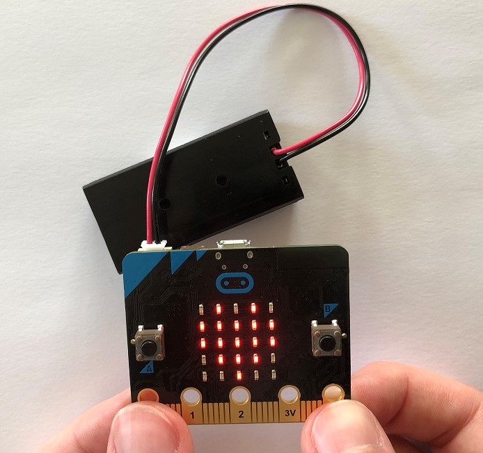
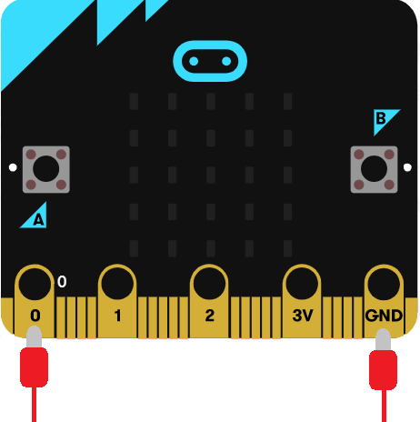
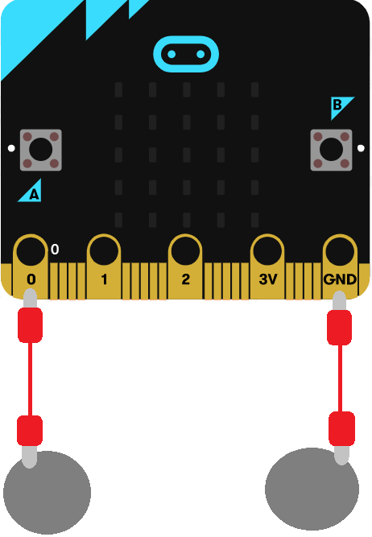

# Introduksjon {.intro}

I denne oppgaven skal vi opprette en liste med bilder, og ved å trykke på port
0 på micro:biten skal et tilfeldig bilde vises på skjermen. Dette kan du bruke
til å spå andre med!



Micro:biten har fem store tilkoblinger på brettet, som vi kaller porter. Disse
er koblet til store hull og er merket: 0, 1, 2, 3V og GND, på micro:biten.



GND porten blir brukt for å fullføre en krets. Hvis du holder på GND-porten med
en hånd, kan du programmere micro:biten til å oppdage at du berører 0, 1 eller
2 pinnen med den andre hånden (da bruker du kroppen din til å fullføre en
elektrisk krets). Dette kan du bruke for å få micro:biten til å gjøre eller
vise ulike ting. Du kan også få micro:biten til å sende signaler ut gjennom
portene. Da kan du for eksempel sende ut en elektrisk spenning, og ved å koble
på et leddlys med krokodilleklemmer, kan du få det til å lyse.

Du kan lese mer om portene på micro:biten her:
[microbit.org](https://microbit.org/no/guide/hardware/pins/){target=blank}


# Steg 1: Opprett liste {.activity}

*Klossene* `vis bilde`{.microbitbasic} *og* `vis ikon`{.microbitbasic} *i*
`Basis`{.microbitbasic} *lar deg vise bilder med en gang på micro:biten, men man
kan også lagre bilder eller lister med bilder i variabler. I denne oppgaven skal
vi gjøre sistnevnte.*

## Sjekkliste {.check}

- [ ] Gå til kategorien `Variabler`{.microbitvariables}, trykk på
	`Lag en variabel`{.microbitvariables} og skriv inn "Bildeliste".

- [ ] Klikk på __Avansert__, deretter på `Lister`{.microbitarrays} og finn
	klossen som heter `sett list til array of`{.microbitarrays} ("array of" betyr
	"liste av" på norsk). Plasser klossen i `ved start`{.microbitbasic} og bytt
	navn på variabelen til "Bildeliste".

- [ ] Fyll ut plassene i listen (der hvor det står tall) med klossen`ikonbilde`{.microbitimages}
	som ligger i __Avansert__ -> `Bilder`{.microbitimages}. Du kan utvide listen
	og legge til så mange bilder du vil ved å trykke på plusstegnet helt til høyre
	på liste-klossen. Legg til minst 5 bilder/ikoner.

```microbit
let Bildeliste = [images.iconImage(IconNames.Heart), images.iconImage(IconNames.No)]
```

# Steg 2: Velg et tilfeldig bilde {.activity}

Når noen holder på portene GND og 0 på micro:biten skal et tilfeldig bilde
velges. Vi gjør dette ved å velge et tilfeldig tall og lagre det i en variabel.

## Sjekkliste {.check}

- [ ] Lag en ny variabel som heter `Tilfeldig bildenummer`{.microbitvariables}.

Elementene (her: bildene) i en liste er nummerert. Det første elementet har
nummer 0, neste nummer 1 osv. Hvis listen din har 5 bilder, er de nummerert 0, 1,
2, 3, 4. Vi må derfor velge et tilfeldig tall mellom 0 og lengden av listen - 1.

- [ ] Lag en kode som gjør at når man trykker på port 0, så settes variabelen
	`Tilfeldig bildenummer`{.microbitvariables} til et tilfeldig tall.
	`Lengde på liste`{.microbitarrays}-klossen finner du i `Lister`{.microbitarrays}.

- [ ] Koden din burde se ut som den under:

```microbit
input.onPinPressed(TouchPin.P0, function () {
		let Bildeliste: Image[] = []
    Tilfeldig_bildenummer = Math.randomRange(0, Bildeliste.length - 1)
})
```

## {.tip}

Kan man ikke bare velge et tilfeldig tall fra 0 til 4, tenker du kanskje? Jo,
det kan du. Men nå kan du legge til flere bilder i listen uten å måtte oppdatere
resten av koden. Dette trikset er nyttig når man har lang kode og store lister,
så det er greit å lære seg.


# Steg 3: Vis bilde {.activity}

*Nå skal vi vise bildet med det valgte bildenummeret på micro:biten.*

## Sjekkliste {.check}

- [ ] Gå til kategorien `Bilder`{.microbitimages} og finn `show image variabel at offset 0`{.microbitimages}-klossen
	(vis bilde variabel med forskyvning 0). Vi skal ikke forskyve bildet, så la
	det stå 0 bakerst. Legg klossen under `sett Tilfeldig bildenummer til... `{.microbitvariables}
	fra forrige steg.

Hadde vi lagret et bilde i en variabel, hadde vi brukt den variabelen nå til å
erstatte `myImage`{.microbitvariables}. Men her vi må hente ut et element (bilde)
fra listen istedenfor.

- [ ] Bruk klossen `får en verdi ved`{.microbitarrays} fra `Lister`{.microbitarrays}
	og erstatt `list`{.microbitvariables} med variabelen vi har lagret bildelisten
	vår i, nemlig `Bildeliste`{.microbitvariables}. Vi vil hente ut elementet med
	det nummeret som er lagret i `Tilfeldig bildenummer`{.microbitvariables}, så
	vi erstatter 0 med denne variabelen. Erstatt `myImage`{.microbitvariables} i
	klossen fra forrige punkt med blokken du nå har laget.

## Test prosjektet {.flag}

*Nå har du laget alt du trenger!*

- [ ] Test koden din på simulatoren og/eller last den ned til micro:biten. Pass
	på at du holder jordporten (GND) samtidig som du trykker på port 0 hvis du
	tester på micro:biten.

- [ ] Nå kan du prøve å spå fremtiden til den som tar på portene, om du vil.

## Utfordring {.challenge}

- [ ] Når man spår med kort trekker man ofte flere kort og tolker dem sammen.
	Klarer du å oppdatere koden din slik at en bildeserie på tre tilfeldige bilder
	vises istedenfor bare ett?

## Flere ideer {.check}

- [ ] Hvis du vil at spåen din skal se litt bedre ut, og bli litt enklere for
	den som blir spådd, kan du lage to store knapper som den som blir spådd kan
	holde på. Klipp ut to sirkler i papp og ta aluminiumsfolie rundt. Fest en
	krokodilleklemme på hver av sirklene. Den andre enden av krokodilleklemmene
	skal på port 0 og GND på micro:biten.

	

- [ ] Prøv å spå flere personer. La en holde på 0 porten, og en annen holde på
	GND porten. Disse to må da holde hender eller ta high five for at elektriske
	signaler skal bli sendt gjennom. Kanskje går det an med flere enn to personer
	også hvis de lager en lenke?
