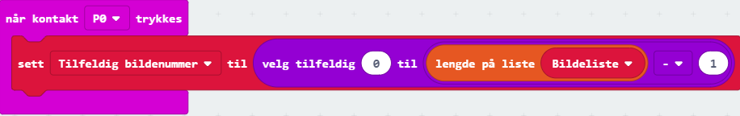

# Introduksjon {.intro}

I denne oppgaven skal vi lage en liste med bilder og ved å trykke på kontakt 0 på micro:biten skal et tilfeldig bilde vise seg. Dette kan du bruke til å spå andre med!

# Steg 1: Opprett liste {.activity}

*Klossene `vis bilde` og `vis ikon` i `Basis` lar deg vise bilder med en gang på micro:biten, men man kan også lagre bilder eller lister med bilder i variabler. I denne oppgaven skal vi gjøre sistnevnte.*

## Sjekkliste {.check}

- [ ] Gå til kategorien `Variabler`, trykk på `Lag en variabel` og skriv inn "Bildeliste". 

- [ ] Klikk på `Avansert`, deretter på `Lister` og finn klossen som heter `sett list til array of` ("array of" betyr "liste av" på norsk). Plasser klossen i `ved start` og bytt navn på variabelen til "Bildeliste". 

- [ ] Fyll ut plassene i listen (der hvor det står tall) med klossene `create image` (lag bilde på norsk) og `ikonbilde` som ligger i `Avansert` -> `Bilder`. Du kan utvide listen og legge til så mange bilder du vil ved å trykke på plusstegnet helt til høyre på liste-klossen. Legg til minst 5 bilder/ikoner. 

	

# Steg 2: Velg et tilfeldig bilde {.activity}

Når noen holder på kontaktene GND og 0 på micro:biten skal et tilfeldig bilde velges. Vi gjør dette ved å velge et tilfeldig tall og lagre det i en variabel. 

## Sjekkliste {.check}

- [ ] Lag en ny variabel som heter "Tilfeldig bildenummer".

Elementene (her: bildene) i en liste er nummerert. Det første elementet har nummer 0, neste nummer 1 osv. Hvis listen din har 5 bilder, er de nummerert 0, 1, 2, 3, 4. Vi må derfor velge et tilfeldig tall mellom 0 og lengden av listen - 1. 

- [ ] Lag en kode som gjør at når man trykker på kontakt 0, så settes variabelen "Tilfeldig bildenummer" til et tilfeldig tall. `Lengde på liste`-klossen finner du i `Lister`. 

- [ ] Koden din burde se ut som den under: 

	

## {.tip}

Kan man ikke bare velge et tilfeldig tall fra 0 til 4, tenker du kanskje deg? Jo, det kan du. men nå kan du legge til flere bilder i listen uten å måtte oppdatere resten av koden. Dette trikset er nyttig når man har lang kode og store lister, så det er greit å ha lært seg. 

# Steg 3: Vis bilde {.activity}

*Nå skal vi vise bildet med det valgte bildenummeret på micro:biten.*

## Sjekkliste {.check}

- [ ] Gå til kategorien `Bilder` og finn  -klossen (vis bilde variabel med forskyvning 0). Vi skal ikke forskyve bilde, så la det stå 0 bakerst. Legg klossen under `sett Tilfeldig bildenummer til... ` fra forrige steg.

Hadde vi lagret ett bilde i en variabel, hadde vi brukt den variabelen nå til å erstatte `myImage`. Men vi må hente ut ett element (bilde) fra listen istedenfor. 

- [ ] Bruk klossen  fra `Lister` og erstatt `list` med variabelen vi har lagret bildelisten vår i, nemlig "Bildeliste". Vi vil hente ut elementet med det nummeret som er lagret i "Tilfeldig bildenummer", så vi erstatter 0 med den variabelen. Ersatt `myImage` i klossen fra forrige punkt med blokken du nå har laget. 

## Test prosjektet {.flag}

*Nå har du laget alt du trenger!*

- [ ] Test koden din på simulatoren og/eller last den ned til micro:biten. Pass på at du holder jordkontakten (GND) samtidig som du trykker på kontakt 0 hvis du tester ut på micro:biten. 

- [ ] Nå kan du prøve å spå fremtiden til den som tar på kontaktene, om du vil. 

## Utfordring {.challenge}

- [ ] Når man spår med kort trekker man ofte flere kort og tolker dem sammen. Klarer du å oppdatere koden din slik at en bildeserie på tre tilfeldige bilder vises istedenfor bare ett?
