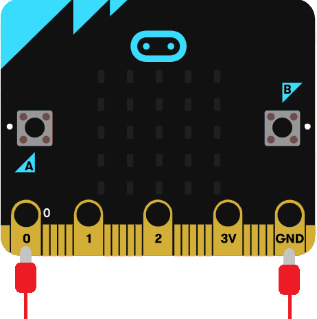
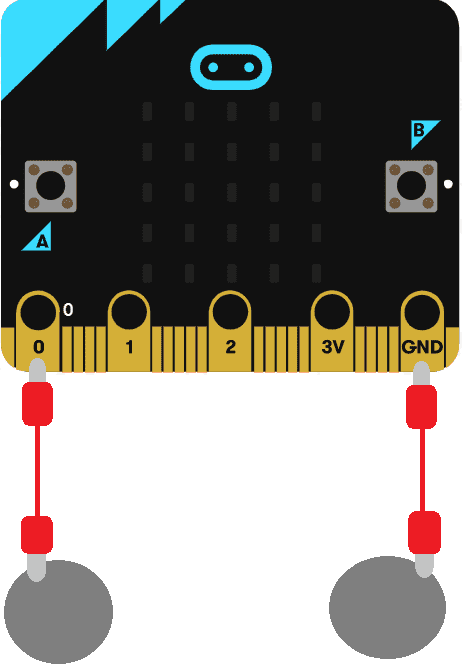

# Introduksjon {.intro}

I denne oppgåva skal me lage ei liste med bilete, og ved å trykke på port `0` på
micro:bit-en skal eit tilfeldig bilete visast på skjermen. Dette kan du bruke
til å spå!

Micro:bit-en har fem store tilkoplingar på brettet som me kallar portar. Desse
er kopla til store hol og er merka `0`, `1`, `2`, `3V` og `GND` på micro:bit-en.

Me brukar `GND`-porten for å fullføre ein krins. Viss du heldt på `GND`-porten
med ei hand kan du programmere micro:bit-en til å oppdage at du tek på `0`, `1`
eller `2` med den andre handa (då brukar du kroppen din til å fullføre ein
elektrisk krins). Dette kan du bruke for å få micro:bit-en til å gjere eller
vise ulike ting. Du kan òg få micro:bit-en til å sende signal ut gjennom
portane. Til dømes kan du programmere micro:bit-en til å sende ut lyd, og viss
du koplar på ein høgtalar med krokodilleklemmer kan du høyre på lyden.

Du kan lese meir om portane på micro:bit-en her:
[microbit.org](https://microbit.org/no/guide/hardware/pins/){target=_blank}.

# Steg 1: Opprett liste {.activity}

*Klossane `vis bilete` og `vis ikon` i `Basis` let deg vise bilete med ein gong
*på micro:bit-en, men ein kan òg lagre bilete eller lister av bilete i
*variablar. I denne oppgåva skal me gjere det siste.*

## Sjekkliste {.check}

- [ ] Gå til kategorien `Variablar`, trykk på `Lag ein variabel` og skriv inn
  "Bileteliste".

- [ ] Klikk på `Avansert`, så på `Lister` og finn klossen som heiter `sett list
  til array of` ("array of" tyder "liste av" på norsk). Plasser klossen i `ved
  start` og byt namn på variabelen til "Bileteliste".

- [ ] Fyll ut plassane i lista (der det står tal) med klossane `create image`
  (lag bilete på norsk) og `ikonbilete` som ligg i `Avansert` -> `Bilete`. Du
  kan utvide lista og leggje til så mange bilete du vil ved å trykkje på
  plussteiknet heilt til høgre på liste-klossen. Legg til minst 5 bilete/ikon.

	

# Steg 2: Vel eit tilfeldig bilete {.activity}

Når nokon heldt på portane `GND` og `0` på micro:bit-en skal eit tilfeldig
bilete bli valt. Me gjer dette ved å velje eit tilfeldig tal og lagre det i ein
variabel.

## Sjekkliste {.check}

- [ ] Lag ein ny variabel som heiter "Tilfeldig biletenummer".

Elementa (her: bileta) i ei liste er nummererte. Det fyrste elementet har nummer
`0`, neste nummer `1` osb. Viss lista di har 5 bilete er dei nummererte `0`,
`1`, `2`, `3`, `4`. Derfor må me velje eit tilfeldig tal mellom `0` og `lengda
av lista -1`.

- [ ] Lag kode som gjer at når ein trykkar på port 0, så vert variabelen
  "Tilfeldig biletenummer" sett til eit tilfeldig tal. `Lengde på liste`-klossen
  finn du i `Lister`.

- [ ] Koden din burde sjå ut som den under:

	

## {.tip}

Kan ein ikkje berre velje eit tilfeldig tal frå 0 til 4, tenker du kanskje? Jo,
det kan du. Men no kan du leggje til fleire bilete i lista utan å måtte
oppdatere reisten av koden. Dette trikset er nyttig når ein har lang kode og
store lister, så det er greitt å lære seg først som sist.

# Steg 3: Vis bilete {.activity}

*No skal me vise biletet med det valte biletenummeret på micro:bit-en.*

## Sjekkliste {.check}

- [ ] Gå til kategorien `Bilete` og finn -klossen (vis biletevariabel med
  forskyvning 0). Me skal ikkje forskyve biletet, så la det stå 0 bakerst. Legg
  klossen under `set Tilfeldig biletenummer til...` frå førre steg.

Hadde me lagra eit bilete i ein variabel hadde me brukt den variabelen til å
erstatte `myImage` no. Men her må me hente ut eit element (bilete) frå lista i
staden.

- [ ] Bruk klossen  frå `Lister` og erstatt `list` med
  variabelen me har lagra biletelista vår i, nemleg "Bileteliste". Me vil hente
  ut elementet med det nummeret som er lagra i "Tilfeldig biletenummer", så me
  erstattar 0 med denne variabelen. Erstatt `myImage` i klossen frå førre punkt
  med blokka du akkurat laga.

## Test prosjektet {.flag}

*No har du laga alt du treng!*

- [ ] Test koden din på simulatoren og/eller last den ned til micro:bit-en. Pass
  på at du heldt jordporten (`GND`) samstundes som du trykkar på port `0` viss
  du testar på micro:bit-en.

- [ ] No kan du prøve å spå framtida til den som tek på portane, om du vil.

## Utfordring {.challenge}

- [ ] Når ein spår med kort er det vanleg å trekke fleire kort og tolke dei
  saman. Klarar du å oppdatere koden din slik at ei bileteserie på tre
  tilfeldige bilete blir vist i staden for berre eitt?

## Fleire idear {.check}

- [ ] Viss du vil at spåen din skal sjå litt betre ut, og bli enklare for den
  som vil bli spådd, kan du lage to store knappar som den som blir spådd kan
  halde på. Klypp ut to sirklar i papp og legg aluminiumsfolie rundt. Fest ei
  krokodilleklemme til kvar av diskane. Den andre enden av krokodilleklemmene
  skal på port `0` og `GND` på micro:bit-en.

	

- [ ] Prøv å spå fleire personar. La ein halde på `0`-porten, og ein annan halde
  på `GND`-porten. Desse to må halde hender eller ta high five for at elektriske
  signal skal bli sendt gjennom. Kanskje går det an med fleire enn to personer
  som lagar ei lenke?
