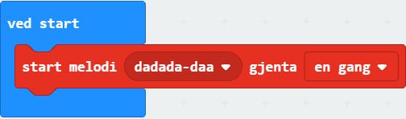

# Introduksjon {.intro} 

I denne oppgaven skal vi koble micro:biten til hodetelefoner eller en liten høyttaler og spille av en liten melodi. 

Vi trenger litt ekstra utstyr:
- 2 ledninger med krokodilleklemmer
- Hodetelefoner eller 1 buzzer (en liten høyttaler)

# Steg 1: Grunnkoden {.activity}

## Sjekkliste {.check}

- [ ] Finn `ved start`-klossen. Den ligger allerede i kodefeltet ditt, eller du kan finne den i `Basis`-kategorien. 

	

- [ ] Finn `start melodi dadada-daa gjenta en gang`-klossen i kategorien `Musikk` og legg den inn i `ved start`. Koden din skal nå se slik ut:

	

# Steg 2: Velg melodi {.activity}

## Sjekkliste {.check}

- [ ] Klikk på `dadada-daa`. Da dukker det opp en meny med alle melodiene du kan velge mellom. Velg en melodi du har lyst til å spille. *Du må gjerne teste ut mer enn en melodi!*

# Steg 3: Gjør klart til lyd {.activity}

*Micro:biten har ikke høytalere. Derfor må vi koble til en buzzer eller hodetelefoner. Måten vi kobler til en buzzer er litt forskjellig fra måten vi kobler til hodetelefoner. Først kommer en sjekkliste for hvordan du kobler til en buzzer, og etter det kommer sjekklisten for om du bruker hodetelefoner.*

## Buzzer sjekkliste {.check}

- [ ] Fest en ledning fra der det står 0 på micro:biten til pinnen som det står pluss (+) ved på buzzeren. 

- [ ] Fest den andre ledningen fra der det står GND på micro:biten til den andre pinnen på buzzeren.

## Hodetelefoner sjekkliste {.check}

- [ ] Fest en ledning fra der det står GND på micro:biten til helt øverst på den metaliske delen av hodetelefonene.

- [ ] Fest den andre ledningen fra der det står 0 på micro:biten til helt nederst på den metaliske delen av hodetelefonene.

- [ ] Simulatoren viser hvordan det nå skal se ut:

	

## Test prosjektet {.flag}

*Nå er det tid for å se om micro:biten klarer å lage lyd!*

- [ ] Last ned prosjektet til micro:biten og lytt!
