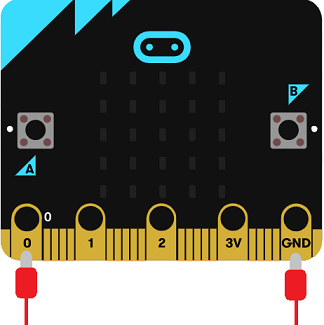
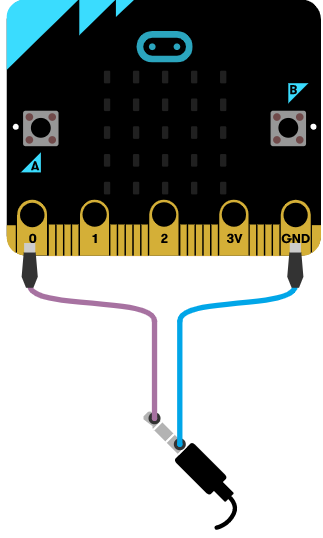

# Introduksjon {.intro}

I denne oppgåva skal me kople micro:bit-en til hovudtelefonar eller ein liten
høgtalar og spele av ein liten melodi.

Me treng litt ekstra utstyr:

- 2 ledningar med krokodilleklemmer

- Hovudtelefonar eller ein buzzar (ein liten høgtalar)

Micro:bit-en har fem store tilkoplingar på brettet som me kallar portar. Desse
er kopla til store hol og er merka __0__, __1__, __2__, __3V__ og __GND__ på micro:bit-en.



Me brukar __GND__-porten for å fullføre ein krins. Viss du heldt på __GND__-porten
med ei hand kan du programmere micro:bit-en til å oppdage at du tek på __0__,__1__
eller __2__ med den andre handa (då brukar du kroppen din til å fullføre ein
elektrisk krins). Dette kan du bruke for å få micro:bit-en til å gjere eller
vise ulike ting. Du kan òg få micro:bit-en til å sende signal ut gjennom
portane. Til dømes kan du programmere micro:bit-en til å sende ut lyd, og viss
du koplar på ein høgtalar med krokodilleklemmer kan du høyre på lyden.

Du kan lese meir om portane på micro:bit-en her:
[microbit.org](https://microbit.org/no/guide/hardware/pins/){target=blank}.


# Steg 1: Grunnkoden {.activity}

## Sjekkliste {.check}

- [ ] Finn `ved start`{.microbitbasic}-klossen. Den ligg allereie i kodefeltet
  ditt, elles kan du finne den i `Basis`{.microbitbasic}-kategorien.

	

- [ ] Finn `start melodi dadada-daa gjenta ein gong`{.microbitmusic}-klossen i
  kategorien `Musikk`{.microbitmusic} og legg den inn i `ved start`{.microbitbasic}.
  No skal koden din sjå slik ut:

  ```microbit
  music.startMelody(music.builtInMelody(Melodies.Dadadadum), MelodyOptions.Once)
  ```


# Steg 2: Vel melodi {.activity}

## Sjekkliste {.check}

- [ ] Klikk på `dadada-daa`{.microbitmusic}. Då dukkar det opp ein meny med alle
  melodiane du kan velje mellom. Vel ein melodi du har lyst til å spele.
  *Du må gjerne teste ut meir enn ein melodi!*


# Steg 3: Gjer klart for lyd {.activity}

*Micro:bit-en har ikkje høgtalarar. Derfor må me kople til ein buzzar eller
 hovudtelefonar. Måten me koplar til ein buzzar er litt ulik måten me koplar til
 hovudtelefonar. Fyrst får du ei sjekkliste for korleis du koplar til ein
 buzzar, og så kjem sjekklista for korleis du kan kople til hovudtelefonar.*

## Buzzar - sjekkliste {.check}

- [ ] Fest ein ledning frå port __0__ på micro:bit-en til pinnen som det står
  pluss (+) ved på buzzaren.

- [ ] Fest den andre ledningen frå der det står __GND__ på micro:bit-en til den
  andre pinnen på buzzaren.

## Hovudtelefonar - sjekkliste {.check}

- [ ] Fest ein ledning frå __GND__-porten på micro:biten til heilt øvst på den
  metalliske delen av hovudtelefonane.

- [ ] Fest den andre ledningen frå port __0__ på micro:bit-en til heilt nedst på
  den metalliske delen av hovudtelefonane.

- [ ] Simulatoren viser korleis det skal sjå ut:

	

## Test prosjektet {.flag}

*No er det på tide å sjå om micro:bit-en klarar å lage lyd!*

- [ ] Last ned prosjektet til micro:bit-en og lytt!
