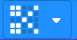

# Introduksjon {.intro}

Her skal du lære å programmere micro:biten slik at du kan spille stein, saks, papir med den eller mot den.

# Steg 1: Velge tilfeldig tall {.activity}

*Du skal få micro:biten til å velge et tilfeldig tall når du rister på den. For at du senere skal kunne bruke tallet som ble valgt, må tallet lagres i en variabel.*

## Sjekkliste {.check}

- [ ] Start et nytt PXT-prosjekt, for eksempel ved å gå til
  [makecode.microbit.org](https://makecode.microbit.org/?lang=no).

- [ ] Micro:biten skal velge et tilfeldig tall når du rister på den. Til dette skal du bruke `når ristes`-blokken som finnes i kategorien `Inndata`.

- [ ] Klikk på `Variabler`-kategorien og deretter på knappen `Lag en variabel`. Gi den nye variabelen navnet `trekk` og klikk `OK`. Du vil se at det dukker opp en blokk som heter `trekk` i `Variabler`-kategorien.

- [ ] Ta `sett variabel til 0`-blokken og plasser denne inne i `når ristes`-blokken. Trykk på den lille pilen bak `variabel` og endre til den bye variabelen du lagde - `trekk`.  

- [ ] For å få micro:biten til å lage et forskjellig tall hver gang vi spiller kan du bruke blokken `plukk et tilfeldig tall mellom 0 og 4` i `Matematikk`-kategorien. Koble denne til `sett trekk til`-blokken i stedet for tallet `0`.

- [ ] Du kan se hvilket tall som ble valgt ved å bruke `Basis`-blokken `vis tall 0` og bytt ut `0` med variablen `trekk`. Denne settes sammen med med de andre klossene slik at programmet ditt ser slikt ut:

    

## Test prosjektet {.flag}

Det er to forskjellige måter du kan teste micro:bit-programmer på:

- [ ] Til venstre på skjermen er det et bilde av en micro:bit. Dette er 
en simulator som kan kjøre programmet ditt uten at du trenger å laste det ned på din PC og overføre det til din micro:bit:

    Siden din kode skal reagere når du rister på micro:biten kan du simulere
    dette ved å klikke på den hvite prikken til venstre for teksten `SHAKE` på
    micro:bit-simulatoren. Det tilfeldige tallet som ble valgt skal vises på skjermen til micro:bit-simulatoren. Prøv flere ganger og se at tallet forandrer seg.

- [ ] Enda morsommere er det å teste programmet på micro:biten din! Koble
  micro:biten din til datamaskinen med en USB-kabel. Gi prosjektet ditt navn `stein-saks-papir` i feltet til høyre for `Last ned`-knappen nede i venstre hjørne av skjermen. Trykk på `Last ned`-knappen for å laste ned programmet.

  Det lastes nå ned en fil som heter `stein-saks-papir.hex` til datamaskinen
  din. Samtidig dukker det opp et vindu som sier at du må flytte denne filen
  til MICROBIT-disken. Dersom du trenger hjelp til dette så spør en av
  veilederne.

# Steg 2: Vis det valgte trekket {.activity}

*Micro:biten skal vise om det er stein, saks eller papir som ble valgt.*

## Sjekkliste {.check}

- [ ] Du har bare tre mulige trekk å velge mellom i stein, saks, papir. Siden blokken som velger et tilfeldig tall starter å telle på null, må vi endre den slik at den velger et tall mellom `0` og `2`. 

- [ ] Variabelen `trekk` skal nå inneholde en av verdiene `0`, `1` eller `2`. La `0` være stein, `1` være saks og `2` være papir.

- [ ] Du skal tegne forskjellig bilde på skjermen avhengig av hvilket tall som ble valgt. Start med en `hvis`-blokk i kategorien `Logikk`. Plasser den nederst inne i `når ristes`-blokken. For å sammenligne to tall trenger du `0 = 0`-blokken. Denne ersatter `sann` i øverste del av `hvis`-blokken.

- [ ] Du skal sammenligne og se om variabelen `trekk` er lik `0`. For å få dette til klikker du på kategorien `Variabler` og erstatter det venstre `0`-tallet i `0 = 0`-blokken med variabelen `trekk`.

- [ ] Dersom variablen `trekk` innholder verdien `0` ønsker du å tegne et bilde av en stein. Velg blokken `vis bilde` fra `Basis`-katekorien og plasser den inne i `hvis`-blokken.

- [ ] Klikk på de midterste lampene på bildet, det er de som skal tennes når du skal vise bilde av en stein. Programmet bør nå se slik ut:

    

## Test prosjektet {.flag}

Nå skal du teste programmet ditt ved å trykke på den hvite `SHAKE`-knappen.

- [ ] Hvis tallet `0` velges, vises `0` en kort stund før det erstattes av bildet du tegnet av en stein.

- [ ] Hvis tallet `1` eller `2` velges, vises kun det valgte tallet. Resten av programmet skal du lage nå.

# Steg 3: Vise saks {.activity}

*Tegne saks når tallet `1` blir valgt.*

## Sjekkliste {.check}

- [ ] Du trenger en ny `hvis`-blokk for å tegne en saks når tallet 1 er valgt. Denne plasseres rett under den forrige `hvis`-blokken.

- [ ] På samme måte som du gjorde med stein, skal du bruke en `0 = 0`-blokk, men erstatte det venstre `0`-tallet med variabelen `trekk`.

- [ ] Du skal vise en saks når variablen `trekk` inneholder tallet `1`, så erstatt det høyre `0`-tallet med et `1`-tall. Programmet ser nå slik ut:

    

- [ ] Det finnes et ferdig bilde av en saks som du kan bruke. Gå til kategorien `Basis` og dra blokken `vis ikon` inn i `hvis`-blokken du jobber med nå.

- [ ] Ikonet har en liten pil oppe i høyre hjørne. Trykk på den og et vindu med mange ferdige ikoner vil åpne seg. Velg ikonet som ligner på en saks:

    

## Test prosjektet {.flag}

Før du går videre er det på tide å teste programmet igjen. Det skal vise bildet av stein hvis `0` blir valgt og saks hvis tallet er `1`. Fortsatt vil det bare vise tallet `2` når det er valgt.

# Steg 4: Vise papir {.activity}

*Å Tegne papir når variabelen `trekk` har verdien `2` blir veldig likt steg 1 du gjorde tidligere.*

## Sjekkliste {.check}

- [ ] Legg til en `hvis`-blokk nuder de to andre `hvis`-blokkene.

- [ ] Bruk her også en `0 = 0`-blokk og endre slik at det blir til `trekk = 2`

- [ ] Inne i `hvis`-blokken plasserer du blokken `vis bilde` fra `Basis`-katekorien og klikker på alle lysene i blokken.

- [ ] Det ferdige programmet skal nå se slik ut: 

    

## Test prosjektet {.flag}
Nå kan du teste programmet ditt. Det skal nå vise enten stein, saks eller papir avhengig av hvilket tall som blir valgt når du trykker på `SHAKE`-knappen.

- [ ] Hvis du laster programmet ned på din microbit for å prøve, må du være veldig forsiktig når du rister den hvis den er koblet til PC-en din med USB-kabelen.

# Steg 5: Tøm skjermen mellom hvert spill {.activity}
*Når micro:biten skal velge et tilfeldig tall, så kan det hende at det samme tallet blir valgt to ganger på rad. Hvis du rister på micro:biten og den viser det samme bildet som tidligere, er det vanskelig å vite om du ikke ristet hardt nok eller om det samme tallet ble valgt to ganger på rad.*

## Sjekkliste {.check}

- [ ] Gå til kategorien `Inndata` og velg blokken `når knapp A trykkes`. Dra denne over til den delen av siden du programmerer på, og plasser den for seg selv. Den skal ikke henge sammen med noen av de andre blokkene.

- [ ] Inne i `når knapp A trykkes`-blokken legger du blokken `tøm skjerm`. Når `A`-knappen trykkes skal micro:biten slå av alle lysene slik at den er klar til nytt spill.

- [ ] Den nye programblokken ser da slik ut:

    

# Videre arbeid {.activity}

- [ ] Dersom du ikke ønsker å se tallet på skjermen før bildet tegnes, kan du fjerne `vis tall 'trekk'`-blokken vi la inn i steg 1.

- [ ] Last ned programmet til din egen maskin - husk å gi filen et godt navn.

- [ ] Kopier filen over på din micro:bit og prøv det der. Du kan spille mot en annen, men hvis micro:biten er koblet til PC-en, må du ikke riste så voldsomt at PC-en faller ned. Husk også at programmet blir borte fra micro:biten, så hvis du vil ta vare på det må du kopiere filen, ikke flytte den.