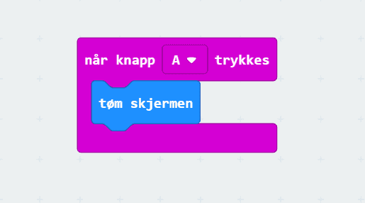

# Introduksjon {.intro}

Her skal du lære å programmere micro:biten slik at du kan spele stein, saks,
papir med den eller mot den.

# Steg 1: Velje tilfeldig tal {.activity}

*Du skal få micro:biten til å velje eit tilfeldig tal når du ristar på den. For
at du skal kunne bruke dette talet seinare, så må du lagre talet i ein
variabel.*

## Sjekkliste {.check}

- [ ] Start eit nytt PXT-prosjekt, til dømes ved å gå til
  [makecode.microbit.org](https://makecode.microbit.org/?lang=no).

- [ ] Micro:biten skal velje eit tilfeldig tal når du ristar på den. For å gjere
  det skal du bruke `når ristes`-klossen som du finn i kategorien `Inndata`.

- [ ] Klikk på `Variabler`-kategorien og så på knappen `Lag en variabel`. Gi den
  nye variabelen namnet `trekk` og klikk `OK`. Då ser du at det dukkar opp ein
  kloss som heiter `trekk` i `Variabler`-kategorien.

- [ ] Ta `sett variabel til 0`-klossen og plasser denne inne i `når
  ristes`-klossen. Trykk på den vesle pila bak `variabel` og endre til den nye
  variabelen du laga - `trekk`.

- [ ] For å få micro:biten til å lage eit nytt tilfeldig tal kvar gong me
  speler, så kan du bruke klossen `plukk et tilfeldig tall mellom 0 og 4` i
  `Matematikk`-kategorien. Kople den saman med `sett trekk til`-klossen i staden
  for talet `0`.

- [ ] Du kan sjå kva tal som vart valt ved å bruke `Basis`-klossen `vis tall 0`
  og bytte ut `0` med variabelen `trekk`. Denne set du saman med dei andre
  klossane så programmet ditt ser slik ut:

  

## Test prosjektet {.flag}

Det er to ulike måtar du kan reste micro:bit-program på:

- [ ] Til venstre på skjermen er det bilete av ein micro:bit. Dette er ein
  simulator som kan køyre programmet ditt utan at du må laste det ned på
  datamaskina di og overføre det til micro:biten din:

  Sidan koden din skal reagere når du ristar på micro:biten kan du simulere
  dette ved å klikke på den kvite prikken til venstre for teksten `SHAKE` på
  micro:bit-simulatoren. Det tilfeldige talet som vart valt skal visast på
  skjermen til micro:bit-simulatoren. Prøv fleire gonger og sjå at talet
  forandrar seg.

- [ ] Det er endå meir morosamt å teste programmet på micro:biten din! Kople
  micro:biten din til datamaskina med ein USB-kabel. Gi prosjektet ditt namnet
  `stein-saks-papir` i feltet til høgre for `Last ned`-knappen nede i venstre
  hjørne av skjermen. Trykk på `Last ned`-knappen for å laste ned programmet.

  No blir det lasta ned ei fil som heiter `stein-saks-papir.hex` til datamaskina
  di. Samstundes får du opp eit vindauge som seier at du må flytte fila til
  MICROBIT-disken. Viss du treng hjelp kan du spørje ein rettleiar.

# Steg 2: Vis det valte trekket {.activity}

*Micro:biten skal vise om det er stein, saks eller papir som vart valt.*

## Sjekkliste {.check}

- [ ] Det er berre tre moglege trekk å velje mellom i stein, saks, papir. Sidan
  klossen som vel eit tilfeldig tal startar å telje på null, så endrar me til at
  den skal velje eit tal mellom `0` og `2`.

- [ ] Variabelen `trekk` skal no ha ein av verdiane `0`, `1` eller `2`. La `0`
  vere stein, `1` vere saks og `2` vere papir.

- [ ] Du skal teikne ulike bilete på skjermen, avhengig av kva tal som vart
  valt. Start med ein `hvis`-kloss frå kategorien `Logikk`. Plasser den nedst
  inne i `når ristes`-klossen. For å samanlikne to tal treng du `0 = 0`-klossen.
  Denne erstattar `sann` i øvste del av `hvis`-klossen.

- [ ] Du skal samanlikne og sjå om variabelen `trekk` er lik `0`. For å få til
  det må du klikke på kategorien `Variabler` og erstatte det venstre `0`-talet i
  `0 = 0`-klossen med variabelen `trekk`.

- [ ] Viss variabelen `trekk` inneheldt verdien `0` vil du teikne eit bilete av
  ein stein. Vel klossen `vis bilde` frå `Basis`-kategorien og plasser den inne
  i `hvis`-klossen.

- [ ] Klikk på dei midterste lampene på biletet. Det er dei som skal tennast når
  du skal vise bilete av ein stein. Nå bør programmet sjå slik ut:

  

## Test prosjektet {.flag}

No skal du teste programmet ditt ved å trykkje på den kvite `SHAKE`-knappen.

- [ ] Viss talet `0` blir valt, så visast `0` ei kort stund før det blir ersatta
  av biletet du teikna av ein stein.

- [ ] Viss tala `1` eller `2` blir valt, så visast berre talet. No skal du lage
  reisten av programmet.

# Steg 3: Vise saks {.activity}

*Teikn saks når talet `1` blir valt.*

## Sjekkliste {.check}

- [ ] Du treng ein ny `hvis`-kloss for å teikne ei saks når talet 1 er valt.
  Denne plasserast rett under den førre `hvis`-klossen.

- [ ] På same måte som du gjorde med stein, så skal du bruke ein `0 = 0`-kloss,
  men erstatte det venstre `0`-talet med variabelen `trekk`.

- [ ] Du skal vise ei saks når variabelen `trekk` inneheldt talet `1`, så
  erstatt det høgre `0`-talet med eit `1`-tal. No ser programmet slik ut:

  

- [ ] Det finst eit ferdig bilete av ei saks som du kan bruke. Gå til kategorien
  `Basis` og dra klossen `vis ikon` inn i `hvis`-klossen du jobbar med no.

- [ ] Ikonet har ei lita pil oppe i høgre hjørne. Trykk på den, og sjå at du får
  opp eit vindauge med mange ferdige ikon. Vel ikonet som liknar på ei saks:

  

## Test prosjektet {.flag}

Før du går vidare er det på tide å teste programmet att. Det skal vise biletet
av ein stein viss `0` blir valt og saks viss det er `1`. Framleis får du berre
opp talet `2` viss det er det som er valt.

# Steg 4: Vise papir {.activity}

*Å teikne papir når variabelen `trekk` har verdien `2` blir veldig likt det du
gjorde for steinen tidlegare.*

## Sjekkliste {.check}

- [ ] Legg til ein `hvis`-kloss under dei to andre `hvis`-klossane.

- [ ] Bruk ein `0 = 0`-kloss og endre slik at det blir til `trekk = 2`.

- [ ] Inne i `hvis`-klossen plasserer du klossen `vis bilde` frå
  `Basis`-kategorien og klikkar på alle lysa i klossen.

- [ ] Det ferdige programmet skal sjå slik ut:

  

## Test prosjektet {.flag}

No kan du teste programmet ditt. Det skal vise anten stein, saks eller papir
avhengig av kva tal som blir valt når du trykkar på `SHAKE`-knappen.

- [ ] Viss du lastar ned programmet på micro:biten din for å prøve, så må du
  vere veldig forsiktig når du ristar den viss den framleis er kopla til
  datamaskina di med USB-kabelen.

# Steg 5: Tøm skjermen mellom kvar spel {.activity}

*Når micro:biten skal velje eit tilfeldig tall, så kan det hende at det same
talet blir valt to gonger på rad. Viss du ristar på micro:biten og den viser det
same biletet som før, så er det vanskeleg å vite om du ikkje rista hardt nok
eller om det same talet vart valt to gonger på rad.*

## Sjekkliste {.check}

- [ ] Gå til kategorien `Inndata` og vel klossen `når knapp A trykkes`. Dra
  denne over til den delen av sida du programmerer på, og plasser den for seg
  sjølv. Den skal ikkje henge saman med nokon av dei andre klossane.

- [ ] Inne i `når knapp A trykkes`-klossen legg du klossen `tøm skjerm`. Når
  `A`-knappen blir trykka skal micro:biten slå av alle lysa slik at den er klar
  til eit nytt spel.

- [ ] Den nye programklossen ser slik ut:

  

# Vidare arbeid {.activity}

- [ ] Viss du ikkje vil sjå talet på skjermen før du teiknar biletet, så kan du
  fjerne `vis tall 'trekk'`-klossen mei la inn i steg 1.

- [ ] Last ned programmet til di eiga datamaskin. Hugs å gi fila eit godt namn.

- [ ] Kopier fila over på micro:biten din og prøv det der. Du kan spele mot ein
  annan person. Pass på at viss micro:biten er kopla til datamaskina, så må du
  ikkje riste så voldsomt at datamaskina fell ned. Hugs at programmet blir borte
  frå micro:biten, så viss du vil ta vare på det må du kopiere fila, ikkje
  flytte ho.
