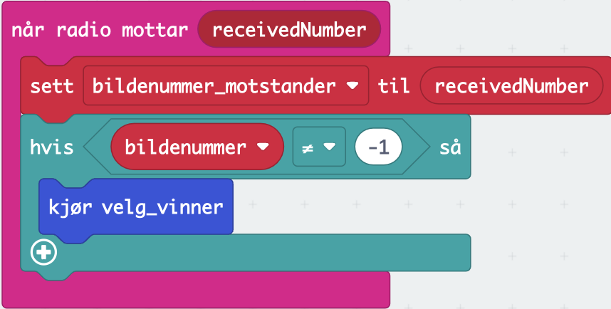
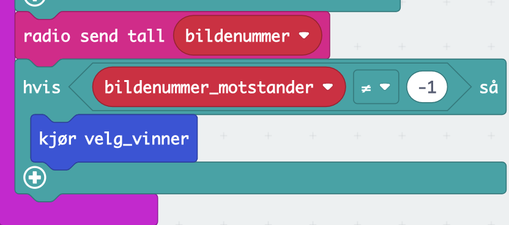

# Introduksjon {.intro}

Denne oppgaven forutsetter at du først har løst oppgaven Stein, saks, papir for én spiller. Her skal du lære å bruke radio-enheten på micro:biten slik at du kan spille stein, saks,
papir med en annen spiller.


# Steg 1: En-spiller {.activity}

Hvis du har fulgt stegene i stein, saks, papir for én spiller har du et program som ser slik ut:

```microbit
  let bildenummer = 0
  input.onGesture(Gesture.Shake, function () {
    bildenummer = Math.randomRange(0, 2)
    basic.showNumber(bildenummer)
    if (bildenummer == 0) {
        basic.showLeds(`
            . . # . .
            . # # # .
            # # # # #
            . # # # .
            . . # . .
            `)
    }
    if (bildenummer == 1) {
        basic.showIcon(IconNames.Scissors)
    }
    if (bildenummer == 2) {
        basic.showLeds(`
            # # # # #
            # # # # #
            # # # # #
            # # # # #
            # # # # #
            `)
    }
  })
```

## Tips {.protip}
Før du går videre er det lurt å lage et nytt micro:bit-prosjekt slik at du tar vare på én-spiller-programmet også.

## Sjekkliste {.check}

- [ ] Trykk på logoen til micro:bit oppe i venstre hjørne for å gå tilbake til oversikten over prosjektene dine.
- [ ] Klikk på lenken `vis alle`.
- [ ] Velg kortet for én-spiller-programmet ditt. Trykk på knappen `Lag kopi`.
- [ ] Gi kopien et godt navn og åpne den i editoren for å kode videre.

# Steg 2: Ved oppstart {.activity}
Micro:biten kan sende data til andre micro:biter som er i samme radiogruppe som den selv. Det du skal programmere i denne oppgaven er å sende ditt resultat til motstanderen, ta imot motstanderens resultat og beregne hvem som er vinneren (eller om det er uavgjort).

## Sjekkliste {.check}

Når programmet starter må du sette noen start-innstillinger. Disse skal du sette i blokken `ved start`{.microbitbasic}.

- [ ] Når spillet starter må vi sette gruppenummeret som micro:biten skal tilhøre ved å bruke blokken `radio sett gruppe`{.microbitradio}. De to som skal spille mot hverandre må sette det samme nummeret. I eksempelet her bruker vi gruppenummer `1`, men sørg for å velge et tall som ingen rundt deg bruker.

- [ ] Lag en ny variabel som heter `bildenummer_motstander`{.microbitvariables}

- [ ] Sett verdien `-1` i variablene `bildenummer`{.microbitvariables} og `bildenummer_motstander`{.microbitvariables} som betyr at vi ikke har et resultat fra oss selv eller motstander enda.

Når du er ferdig skal det se slik ut
```microbit

radio.setGroup(1)
let bildenummer_motstander = 0
let bildenummer = 0
bildenummer = -1
bildenummer_motstander = -1
```
# Steg 3: Funksjon for å beregne vinner {.activity}
Hvis du trenger de samme kodeblokkene flere steder er det unødvendig å måtte bygge de samme blokkene to ganger. Istedenfor kan du lage en funksjon som du kan kjøre fra flere steder. Her skal du lage en funksjon som beregner hvem som vinner og skriver det ut på skjermen. Lag en funksjon som heter `velg_vinner`. Blokken `Funksjoner`{.microbitfunctions} finner du i menyen under punktet `Avansert`. Blokkene du legger inni funksjonen blir kjørt når funksjonen kalles.

## Sjekkliste {.check}

- [ ] Start med å tømme skjermen

Videre skal funksjonen beregne resultatet. Ditt og motstanderens resultat ligger nå lagret i variablene `bildenummer`{.microbitvariables} og `bildenummer_motstander`{.microbitvariables}. Reglene er som følger: 

- [ ] Hvis du har stein (0) og motstander har saks (1) vinner du
- [ ] Hvis du har saks (1) og motstander har papir (2) vinner du
- [ ] Hvis du har papir (2) og motstander har stein (0) vinner du
- [ ] Hvis dere har samme verdi, er det uavgjort.
- [ ] Ellers har du tapt

Lag en stor `hvis ellers`{.microbitlogic}-blokk hvor du sjekker de forskjellige mulighetene. Hvis du vinner, vis ikonet `Glad`, hvis du taper vis ikonet `Trist` og bruk ikonet `Sover` hvis det er uavgjort.

## Tips {.protip}
For å utvide med en `ellers hvis`{.microbitlogic}-del trykk på pluss-tegnet nederst på `hvis ellers`{.microbitlogic}-blokken. 

## Sjekkliste {.check}

- [ ] Når du har vist riktig ikon, sett begge variablene tilbake til `-1` slik at du er klar for neste spill.

Når du er ferdig ser funksjonen slik ut:

```microbit
function velg_vinner(){
    basic.clearScreen()
    if (bildenummer == 0 && bildenummer_motstander == 1) {
        basic.showIcon(IconNames.Happy)
    }
    else if (bildenummer == 1 && bildenummer_motstander == 2) {
        basic.showIcon(IconNames.Happy)
    }
    else if (bildenummer == 2 && bildenummer_motstander == 0) {
        basic.showIcon(IconNames.Happy)
    }
    else if (bildenummer == bildenummer_motstander) {
        basic.showIcon(IconNames.Asleep)
    } else {
        basic.showIcon(IconNames.Sad)
    }
    bildenummer = -1
    bildenummer_motstander = -1
}
```

# Steg 4: Motta motstanderens resultat {.activity}
Her skal du lage koden som gjør at din micro:bit kan motta motstanders resultat. 

- [ ] Bruk blokken `når radio mottar (receivedNumber)`{.microbitradio}.
- [ ] Lagre mottatt verdi i variabelen `bildenummer_motstander`{.microbitvariables}
- [ ] Hvis ditt eget resultat også er klart (`bildenummer`{.microbitvariables} er ulik -1) kjør funksjonen `velg_vinner`{.microbitfunctions}

Når du er ferdig skal denne delen av programmet ditt se slik ut:



# Steg 5: Sende ditt resultat {.activity}
Den siste biten som mangler er at du må programmere micro:biten til å sende ditt eget resultat etter at du har ristet på den. Gjør dette ved å utvide nederst i `når ristes`{.microbitinput}-blokken fra steg 1.

- [ ] Bruk `radio send tall`{.microbitradio}-blokken til å sende ditt resultat til motstanderen.
- [ ] Hvis du har mottatt resultatet fra motstanderen (`bildenummer_motstander`{.microbitvariables} er ulik -1) kjør funksjonen `velg_vinner()`{.microbitfunctions}.

Når du er ferdig skal du ha lagt til følgende nederst i blokken:



## Teste spillet {.flag}
Nå gjenstår å teste spillet. Last spillet over på to micro:biter og spill.

## Utfordring {.challenge}
- [ ] Hvis du har micro:bit versjon 2 med høyttaler kan du spille en kort lyd for å signalisere resultatet.

- [ ] Du kan prøve å endre på når du tømmer skjermen og ikke. Hvis du vil ha noe stående lenger på skjermen kan du legge inn `pause`{.microbitbasic}.