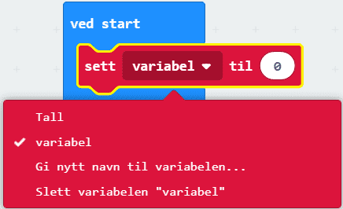
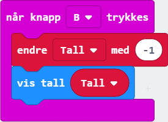

# Introduksjon {.intro}

I denne oppgåva skal me få micro:bit-en til å telje både oppover og nedover ved
å trykkje på knappane A og B.

# Steg 1: Lage ein variabel {.activity}

Før me startar å telje må me finne ein måte for micro:bit-en å hugse talet me
har kome til. Viss me ikkje gjer det, så vil den gløyme kor langt me har kome!

## Sjekkliste {.check}

- [ ] Gå til `Variablar` og klikk på `Lag ein variabel` heilt øvst.

- [ ] Skriv inn eit namn på variabelen, til dømes `Tal` og klikk OK.

Ser du at det dukka opp ein raud kloss som heiter `Tal`? Den har du laga! I
denne klossen skal me lagre talet me har kome til i teljinga. Den kallast ein
variabel fordi me kan variere kva tal me lagrar i den.

- [ ] Finn `set variabel til`-klossen i `Variablar` og set den inni ein `ved
  start`-kloss (den ligg allereie i kodefeltet ditt, elles finn du den i
  `Basis`). Så klikkar du på den vesle pila og vel variabelen du laga i stad.

Når programmet startar blir talet `0` lagra i variabelen `Tal`.

# Steg 2: Teljing {.activity}

No er det på tide å byrje å telje. Når me trykkar på knappen A ynskjer me å auke
verdien i `Tal` med éin. Slik kan me telje oppover kvar gong me trykkar på
knappen.

- [ ] Prøv å lage ei kodeblokk som aukar variabelen `Tal` med `1` når knapp A
  vert trykt. Koden din bør sjå slik ut:

## {.tip}

`Når knapp A vert trykt`-klossen finn du i menyen under `Inndata`. `Endre
variabel med 1`-klossen finn du i `Variablar`. Hugs å endre `variabel` til
`Tal`.

# Steg 3: Vis tal {.activity}

Men me ser jo ingenting! Det er fordi me ikkje har bedt programmet om å faktisk
vise oss verdien av `Tal`. Den eksisterer, men er usynleg for oss.

- [ ] For å vise den fram, legg til ein  under klossen `endre Tal med 1`.

- [ ] Viss du vil sjå talet `0` i starten kan du leggje den til nedst i `ved
  start`-klossen.

## {.tip}

Hugs at du finn `Tal`-klossen i `Variablar`.

# Steg 4: Siste bit {.activity}

- [ ] No skal me gjere noko smart. Høgreklikk på den lilla ramma til `når knapp
  A vert trykt` i koden din og vel "Lag kopi" frå menyen som dukkar opp. No får
  du ein kopi av heile den seksjonen med kode. Dette er lurt når ein skal lage
  kode som er heilt lik eller nesten heilt lik den koden ein allereie har laga,
  fordi det går så fort!

- [ ] Endre kopien din slik at koden ser ut som den under. Me har gjort om `A`
  til `B` og `1` til `-1`.

Å endre `Tal` med `-1` tyder at verdien av `Tal` minkar med 1 kvar gong me
trykkar på B.

## Test prosjektet {.flag}

- [ ] Test programmet ved å trykkje på knappane A og B i simulatoren. Tel den
  oppover og nedover som den skal?

- [ ] Last ned koden til micro:bit-en viss du er ferdig, og test ut knappane.

## Utfordring {.challenge}

- [ ] La oss lage ein ny måte å nullstille telljaren vår på. Gå til `Inndata` og
  finn klossen `når ristast`. Legg inn `set Tal til 0`-klossen.

	

- [ ] Last ned koden til micro:bit-en. Kva skjer når du ristar micro:bit-en? Kva
  anna enn risting kan du velje i denne klossen?

- [ ] Klarar du å finne fleire måtar å endre `Tal` med i programmet ditt?
  Kanskje skal me auke med `2` når du heller micro:bit-en mot høgre? Eller skal
  `Tal` setjast til `10` når både knapp A og B vert trykt inn samstundes? Prøv
  deg fram, og leik med alle moglegheitene!
