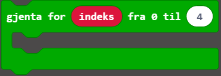
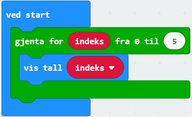
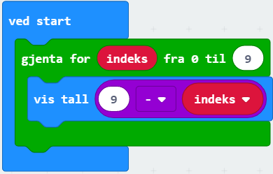
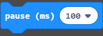

# Introduksjon {.intro}
I denne oppgaven skal vi få micro:biten til å telle både oppover og nedover med løkker.

# Steg 1: Lag en løkke {.activity}

## Sjekkliste {.check}

- [ ] Gå til `Løkker` i menyen. Som du ser finnes det flere typer, men i denne oppgaven skal vi benytte den som ser slik ut:

	

Dette er en mye brukt løkketype som er kjent som en for-løkke.

# Steg 2: Begynn å tell {.activity}

## Sjekkliste {.check}

- [ ] Lag koden som vises nedenfor. Du finner klossene `ved start` og `vis tall` i `Basis`, mens `indeks` finner du i `Variabler` etter at du legger ut løkka. Husk å endre tallet i løkka fra 4 til 5!

	

- [ ] Simulatoren til venstre skal nå ved start av programmet telle fra 0 opp til 5.

- [ ] Kan du endre koden så løkka teller fra 0 til 9 istedenfor?

## {.tip}

En løkke kjører koden som står inni flere ganger. Det som gjør for-løkka nyttig, er at variabelen `indeks` får en ny verdi hver gang. Den første løkka som kjøres har indeks lik 0. Når den viser tallet som heter indeks, viser den dermed tallet 0. Så kjører den løkka en gang til, men nå har den endret verdien av indeks til 1, og viser tallet 1 istedenfor. Slik fortsetter den å kjøre løkka for indeks = 2, indeks = 3, indeks = 4 og indeks = 5. Da stopper den, siden vi har sagt at den bare skal gjenta seg selv for indeksverdiene fra 0 til 5. 

# Steg 3: Endre indeks {.activity}

Indeks begynner på null, men hvis vi viser tallet indeks + 1 istedenfor, vil det første tallet som vises være 1.

## Sjekkliste {.check}

- [ ] Finn  -klossen i `Matematikk`-kategorien og sett den inn i `vis tall`-klossen.

- [ ] Fiks på koden din til den ser slik ut:

	

- [ ] Fra hvilket tall til hvilket tall teller løkka nå? Når indeks er lik 9, hva blir indeks + 1?

# Steg 4: Telle nedover {.activity}

Indeks øker med 1 for hver runde i løkka, men med matematikk kan vi få koden til å telle nedover likevel.

- [ ] Gjør `+`-klossen om til en `-`-kloss ved å velge `-` i nedtrekkslista (klikk på pila ved siden av +). 

- [ ] Endre resten av koden slik at den ser slik ut: 

	

- [ ] Teller programmet nedover som den skal?

## Utfordringer {.challenge}

- [ ] Programmet teller nokså fort. Bruk  med et tall du synes passer (100 ms = et tidels sekund, 1000 ms = 1 sekund) for å telle saktere. 

- [ ] Klarer du å lage et program som teller ned fra 3 (3, 2, 1) og så viser et bilde?
