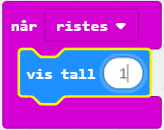
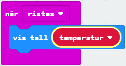

# Introduksjon {.intro}

Kan micro:biten vår brukes som et termometer? Ja, den har faktisk en temperatursensor!

# Steg 1: Vi rister løs {.activity}

*Vi begynner med å vise et tall når vi rister på micro:biten.*

## Sjekkliste {.check}

- [ ] Start et nytt PXT-prosjekt, for eksempel ved å gå til
  [makecode.microbit.org](https://makecode.microbit.org/?lang=no).

- [ ] Vi vil at noe skal skje når vi rister på micro:biten. Til dette kan vi
  bruke `når ristes`-klossen som finnes i kategorien `Inndata`.

- [ ] Aller først vil vi bare se at vi får til å vise tallet __1__. For å vise
  tall bruker vi `vis tall`-klossen i `Basis`-kategorien.

- [ ] Sett sammen disse to klossene slik at skriptet ditt ser slik ut:

    

## Test prosjektet {.flag}

Det er to forskjellige måter vi kan teste micro:bit-programmer på:

- [ ] Til venstre på skjermen er det et bilde av en micro:bit. Dette er faktisk
  en simulator som kan kjøre programmet vi nettopp laget:

  Siden vår kode skal reagere når man rister på micro:biten kan du simulere
  dette ved å klikke på den hvite prikken til venstre for teksten `SHAKE` på
  micro:bit-simulatoren. Tallet __1__ skal vises på skjermen til
  micro:bit-simulatoren.

- [ ] Enda morsommere er det å teste programmet på micro:biten din! Koble
  micro:biten din til datamaskinen med en USB-kabel. Klikk deretter på knappen
  `Last ned` nede til venstre på skjermen.

  Det lastes nå ned en fil som heter `microbit-Uten-navn.hex` til datamaskinen
  din. Samtidig dukker det opp et vindu som sier at du må flytte denne filen til
  MICROBIT-disken. Dersom du trenger hjelp til dette så spør en av veilederne.

# Steg 2: Mål temperaturen {.activity}

*Vi vil vise temperaturen i rommet der du er. Hvordan gjør vi det på en micro:bit?*

## Sjekkliste {.check}

- [ ] Micro:bit har en innebygd temperatursensor som gir temperaturen i oC. 
  Den kan du få tak i ved å bruke klossen `Temperatur (°C)` i `Inndata`-kategorien.

- [ ] Prøv selv å legge`Temperatur (°C)`-klossen inn i koden din, slik at
  den målte temperaturen vises i stedet for __1__ som tidligere.

- [ ] Bruk simulatoren eller last koden til micro:biten din for å teste som
  tidligere. Når du rister på micro:biten (eller klikker på `SHAKE`) skal
  temperaturen måles på nytt. Hvilken temperatur vises? Hva er temperaturen i et annet rom eller ute ?

# Steg 3: Temperaturen huskes og vis værtegn {.activity}

*Hva om vi vil bruke temperaturmålingen senere? Da må vi huske hva vi målte!*

## Sjekkliste {.check}

- [ ] Når vi programmerer bruker vi __variabler__ til å huske ting for oss. La
  oss lage en variabel som kan huske den målte temperaturen:

  Klikk på `Variabler`-kategorien og deretter på knappen `Lag en variabel`. Gi
  den nye variabelen navnet `temperatur` og klikk `OK`. Du vil se at det dukker opp
  en kloss som heter `temperatur` i `Variabler`-kategorien.

  

- [ ] For å bruke denne nye variabelen kan vi bestemme hva den skal huske med
  `sett variabel til 0`-klossen. La oss endre skriptet vårt slik at `temperatur`
  husker målt temperatur. Legg til og flytt på klossene slik at skriptet ditt
  ser slik ut:

  

Om du tester prosjektet ditt nå skal det oppføre seg helt likt som før! Men
denne endringen gir oss nye muligheter! Siden vi nå vet resultatet av
temperaturmålingen kan vi for eksempel vise en sol hver gang vi måler over 20 °C, en sky hver gang vi måler under 20 °C:

- [ ] Med klossen `vis bilde` som du finner i `Basis`-kategorien kan vi selv
  bestemme bildet som vises på skjermen til micro:biten. Prøv selv å tegne en
  en sol og en sky på hver sin bilde-kloss (eller andre bilder du heller vil bruke).

- [ ] For å sammenligne to ting bruker vi klosser fra `Logikk`-kategorien. Her
  vil vi sammenligne resultatet av temperaturmålingen med tallet 20. Vi kan si at
  `hvis temperatur > 20` skal vi vise sol-bildet, ellers skal vi vise paraply-bildet.

  Prøv å pusle sammen klosser fra `Logikk`- og `Variabler`-kategoriene som sier
  `hvis temperatur > 20`.

- [ ] Vi vil sjekke om temperaturen ble større enn 20°C. Det betyr at vi må legge en 
 `hvis - ellers`-kloss etter løkken vi laget
  tidligere. Programmet ditt vil tilslutt se ut omtrent som dette:

    

# Steg 4: Mer avansert termometer {.activity}

*Hva kan vi bruke temperaturmålingene våre til? Prøv selv dine ideer!*

## Flere ideer {.check}

Du har nå lært hvordan micro:biten kan måle temperatur. Men det finnes mange måter
dette kan utvikles videre på. Nedenfor er noen ideer, men finn gjerne på noe
helt eget!

- [ ] Kan man vise måleenheten (°C) etter at temperaturen er vist? 

- [ ] Kan du rekne om til Farenheit T(°F) = T(°C) × 9/5 + 3? 

