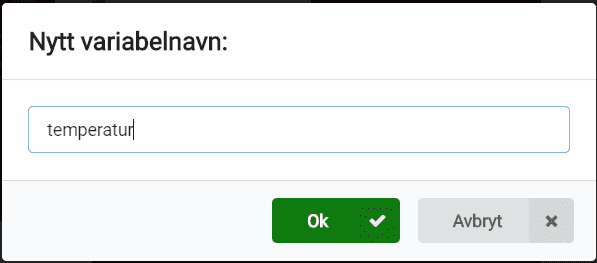

# Introduksjon {.intro}

Kan me bruke micro:biten vår som eit termometer? Ja, den har faktisk ein
temperatursensor!


# Steg 1: Me ristar laus {.activity}

*Me startar med å vise eit tal når me ristar på micro:biten.*

## Sjekkliste {.check}

- [ ] Start eit nytt PXT-prosjekt, til dømes ved å gå til
  [makecode.microbit.org](https://makecode.microbit.org/?lang=no){target=blank}.

- [ ] Me vil at det skal skje noko når me ristar på micro:biten. For å få til
  det kan me bruke `når ristes`{.microbitinput}-klossen som du finn i kategorien
  `Inndata`{.microbitinput}.

- [ ] Aller fyrst vil me berre sjå at me får til å vise talet __1__. For å vise
  tal brukar me `vis tall`{.microbitbasic}-klossen i `Basis`{.microbitbasic}-kategorien.

- [ ] Set saman desse to klossane slik at skriptet ditt ser slik ut:

```microbit
input.onGesture(Gesture.Shake, function () {
    basic.showNumber(1)
})
```

## Test prosjektet {.flag}

Det er to ulike måtar me kan teste micro:bit-program på:

- [ ] Til venstre på skjermen er det bilete av ein micro:bit. Dette er faktisk
  ein simulator som kan køyre programmet me akkurat laga:

  Sidan koden vår skal reagere når ein ristar på micro:biten, så kan du simulere
  det ved å klikke på den kvite prikken til venstre for teksten `SHAKE` på
  micro:bit-simulatoren. Talet `1` skal visast på skjermen til
  micro:bit-simulatoren.

- [ ] Det er endå meir morosamt å teste programmet på micro:biten din! Kople
  micro:biten din til datamaskina med ein USB-kabel. Så klikkar du på knappen
  `Last ned` nede til venstre på skjermen.

  No blir det lasta ned ei fil som heiter `microbit-Uten-navn.hex` til
  datamaskina di. Samstundes dukkar det opp eit vindauge som seier at du må
  flytte fila til MICROBIT-disken. Viss du treng hjelp til dette kan du spørje
  ein rettleiar.


# Steg 2: Mål temperaturen {.activity}

*Du vil vise temperaturen i rommet der du er. Korleis gjer me det på ein
 micro:bit?*

## Sjekkliste {.check}

- [ ] Micro:bit har ein innebygd temperatursensor som gir temperaturen i °C.
  Dette tyder gradar målt i Celcius, og er den eininga me vanlegvis brukar når
  me snakkar om temperatur i Noreg. Den kan du få tak i ved å bruke klossen
  `Temperatur (°C)`{.microbitinput} i `Inndata`{.microbitbasic}-kategorien.

- [ ] Prøv sjølv å legg `Temperatur (°C)`{.microbitbasic}-klossen inn i koden din,
  slik at den målte temperaturen blir vist i staden for __1__ som me fekk opp før.

- [ ] Bruk simulatoren eller last ned koden til micro:biten din for å teste,
  slik du gjorde i stad. Når du ristar på micro:biten (eller klikkar på `SHAKE`)
  skal temperaturen bli målt på nytt. Kva for temperatur visast? kva er
  temperaturen i eit anna rom eller ute ?


# Steg 4: Terningen hugsar og viser vêr-teikn {.activity}

*Kva om me vil bruke temperaturmålingen seinare? Da må me hugse kva me målte!*

## Sjekkliste {.check}

- [ ] Når me programmerer brukar me __variablar__ til å hugse ting for oss. La
  oss lage ein variabel som kan hugse det siste terningkastet:

  Klikk på `Variabler`{.microbitvariables}-kategorien og så på knappen `Lag en variabel`{.microbitvariables}.
  Gi den nye variabelen namnet `temperatur`{.microbitvariables}. Du vil sjå at
  det dukkar opp ein kloss som heiter `temperatur`{.microbitvariables} i
  `Variabler`{.microbitvariables}-kategorien.

  

- [ ] For å bruke den nye variabelen kan me bestemme kva den skal hugse med
  `sett variabel til 0`{.microbitvariables}-klossen. La oss endre skriptet vårt
  slik at `temperatur`{.microbitvariables} hugsar målt temperatur. Legg til og
  flytt på klossane så skriptet ditt ser slik ut:

  ```microbit
  let temperatur = 0
  input.onGesture(Gesture.Shake, function () {
      temperatur = input.temperature()
      basic.showNumber(temperatur)
  })
  ```

Viss du testar prosjektet ditt no skal det oppføre seg likt som før! Men denne
endringa gir oss nye moglegheiter! Sidan me no veit resultatet av
temperaturmålingen kan me til dømes vise ein sol kvar gang me måler over 20 °C,
ein paraply kvar gang me måler under 20 °C.

- [ ] Med klossen `show leds`{.microbitbasic} som du finn i `Basis`{.microbitbasic}-kategorien
  kan me sjølv bestemme biletet som visast på skjermen til micro:biten. Prøv å
  teikne ei sol og ein paraply på kvar sin bilete-kloss (eller andre bilete du
  heller vil bruke). Me kan også bruke klossen `vis ikon`{.microbitbasic} og velje
  eit ferdig bilete.

- [ ] For å samanlikne to ting brukar me klossar frå `Logikk`{.microbitlogic}-kategorien.
  Her vil me samanlikne resultatet av temperturmålingen med talet 20. Me kan seie
  at `hvis temperatur > 20`{.microbitlogic} skal me vise ei sol, ellers skal me
  vise ein paraply.

  Prøv å pusle saman klossar frå `Logikk`{.microbitlogic}- og `Variabler`{.microbitvariables}-kategoriane
  som seier `hvis temperatur > 20`{.microbitlogic}.

- [ ] Me vil sjekke om temperaturen er større enn 20 °C. Det vil seie at me må
  legge ein  `hvis - ellers`{.microbitlogic}-kloss etter løkka me laga tidlegare.
  Til slutt ser programmet ditt om lag ut som dette:

```microbit
let temperatur = 0
input.onGesture(Gesture.Shake, function () {
    temperatur = input.temperature()
    basic.showNumber(temperatur)
    if (temperatur > 20) {
        basic.showLeds(`
            # . # . #
            . # # # .
            # # # # #
            . # # # .
            # . # . #
            `)
    } else {
        basic.showIcon(IconNames.Umbrella)
    }
})
```


# Steg 5: Meir avanserte termometer {.activity}

*Kva kan me bruke temperaturmålingane våre til? Prøv sjølv viss du har nokre
 idear!*

## Fleire idear {.check}

No har du lært korleis micro:biten kan måle temperatur. Men det finst mange måtar
du kan vidareutvikle det på. Under finn du nokre idear, men finn gjerne på noko
heilt sjølv!

- [ ] Kan ein vise måleeininga (°C) etter at temperaturen er vist?

- [ ] Ei anna temperatureining er Fahreinheit, som til dømes blir nytta i USA.
  Kan du rekne om til Farenheit med formelen `T(°F) = T(°C) × 9/5 + 32`?
