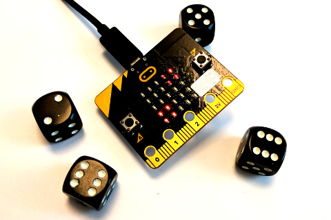
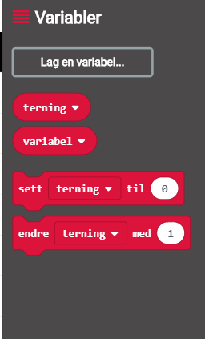

# Introduksjon {.intro}

Kan me bruke micro:biten vår som ein terning? Ja, det er faktisk ganske enkelt!




# Steg 1: Me ristar laus {.activity}

*Me startar med å vise eit tal når me ristar på micro:biten.*

## Sjekkliste {.check}

- [ ] Start eit nytt PXT-prosjekt, til dømes ved å gå til
  [makecode.microbit.org](https://makecode.microbit.org/?lang=no){target=blank}.

- [ ] Me vil at det skal skje noko når me ristar på micro:biten. For å få til
  det kan me bruke `når ristes`{.microbitinput}-klossen som du finn i kategorien
  `Inndata`{.microbitinput}.

- [ ] Aller fyrst vil me berre sjå at me får til å vise talet __1__. For å vise
  tal brukar me `vis tall`{.microbitbasic}-klossen i `Basis`{.microbitbasic}-kategorien.

- [ ] Set saman desse to klossane slik at skriptet ditt ser slik ut:

  ```microbit
  input.onGesture(Gesture.Shake, function () {
  basic.showNumber(1)
  })
  ```

## Test prosjektet {.flag}

Det er to ulike måtar me kan teste micro:bit-program på:

- [ ] Til venstre på skjermen er det bilete av ein micro:bit. Dette er faktisk
  ein simulator som kan køyre programmet me akkurat laga:

  Sidan koden vår skal reagere når ein ristar på micro:biten, så kan du simulere
  det ved å klikke på den kvite prikken til venstre for teksten `SHAKE` på
  micro:bit-simulatoren. Talet __1__ skal visast på skjermen til
  micro:bit-simulatoren.

- [ ] Det er endå meir morosamt å teste programmet på micro:biten din! Kople
  micro:biten din til datamaskina med ein USB-kabel. Så klikkar du på knappen
  `Last ned` nede til venstre på skjermen.

  No blir det lasta ned ei fil som heiter `microbit-Uten-navn.hex` til
  datamaskina di. Samstundes dukkar det opp eit vindauge som seier at du må
  flytte fila til MICROBIT-disken. Viss du treng hjelp til dette kan du spørje
  ein rettleiar.


# Steg 2: Tilfeldig terning {.activity}

*Terningar skal jo vise ulike tal. Korleis gjer me det på ein micro:bit?*

## Sjekkliste {.check}

- [ ] Før me kastar ein vanleg terning veit me ikkje kva resultatet kjem til å
  bli. Me veit at det kan bli anten 1, 2, 3, 4, 5 eller 6, men ikkje kva tal
  terningen landar på. Eit slik resultat kallar me eit __tilfeldig tal__.
  Tilfeldige tal kan me lage på micro:biten med klossen `velg tilfeldig 0 til 4`{.microbitmath}
  i `Matematikk`{.microbitmath}-kategorien.

- [ ] Prøv å leggje `velg tilfeldig`{.microbitmath}-klossen inn i koden din sjølv,
slik at det tilfeldige talet blir vist i staden for __1__ som me fekk opp før.

- [ ] Bruk simulatoren eller last ned koden til micro:biten din for å teste,
  slik du gjorde i stad. Når du ristar på micro:biten (eller klikkar på `SHAKE`)
  skal det bli laga nye tilfeldige tal. Rist fleire gonger. Forandrar talet seg?

- [ ] Ein vanleg terning viser tala 1, 2, 3, 4, 5 og 6. Viss du brukte
  `velg tilfeldig 0 til 4`{.microbitmath}-klossen vel micro:biten mellom tala
  0, 1, 2, 3 og 4. Korleis kan me få micro:biten til å velje mellom tala 1 til 6?

# Steg 3: Terningen rullar {.activity}

*Ein terning landar jo ikkje berre på ei side, den rullar og viser mange sider
før den stoppar.*

## Sjekkliste {.check}

- [ ] Me kan få micro:biten til å oppføre seg som ein rullande terning ved å
  vise forskjellige tal før den til slutt stoppar på eitt av dei.

  For å gjere ein ting fleire gonger brukar me __løkker__. Hent klossen `gjenta
  4 ganger`{.microbitloops} frå `Løkker`{.microbitloops}-kategorien. Legg den
  rundt `vis tall`{.microbitbasic}-klossen på denne måten:

  ```microbit
  input.onGesture(Gesture.Shake, function () {
    for (let i = 0; i < 4; i++) {
        basic.showNumber(Math.randomRange(1, 6))
    }
  })
  ```

- [ ] Test programmet ditt att. Forstår du kva `gjenta`{.microbitloops}-løkka
gjer? Prøv å endre dei ulike tala i koden din. Kva blir annleis når du ristar
micro:biten?


# Steg 4: Terningen hugsar {.activity}

*Kva om me vil bruke terningresultatet seinare? Då må me hugse kva me kasta!*

## Sjekkliste {.check}

- [ ] Når me programmerer brukar me __variablar__ til å hugse ting for oss. La
  oss lage ein variabel som kan hugse det siste terningkastet:

  Klikk på `Variabler`{.microbitvariables}-kategorien og så på knappen
  `Lag en variabel`{.microbitvariables}. Gi den nye variabelen namnet `terning`{.microbitvariables}
  og klikk `OK`{.microbitvariables}. Du vil sjå at det dukkar opp ein kloss som
  heiter `terning`{.microbitvariables} i `Variabler`{.microbitvariables}-kategorien.

  

- [ ] For å bruke den nye variabelen kan me bestemme kva den skal hugse med
  `sett variabel til 0`{.microbitvariables}-klossen. La oss endre skriptet vårt
  slik at `terning`{.microbitvariables} hugsar kvart terningkast. Legg til og
  flytt på klossane så skriptet ditt ser slik ut:

  ```microbit
  let terning = 0
  input.onGesture(Gesture.Shake, function () {
    for (let i = 0; i < 4; i++) {
        terning = Math.randomRange(1, 6)
        basic.showNumber(terning)
    }
  })
  ```

Viss du testar prosjektet ditt no skal det oppføre seg likt som før! Men denne
endringa gir oss nye moglegheiter! Sidan me no veit resultatet av terningkastet,
så kan me til dømes vise eit smilefjes kvar gong me kastar 6:

- [ ] Med klossen `vis bilde`{.microbitbasic} som du finn i `Basis`{.microbitbasic}-kategorien
  kan me sjølv bestemme biletet som visast på skjermen til micro:biten. Prøv å
  teikne eit smilefjes (eller eit anna bilete du heller vil bruke).

- [ ] For å samanlikne to ting brukar me klossar frå `Logikk`{.microbitlogic}-kategorien.
  Her vil me samanlikne resultatet av terningkastet med talet 6. Me kan seie at
  `hvis terning = 6`{.microbitlogic} skal me vise biletet smilefjes.

  Prøv å pusle saman klossar frå `Logikk`{.microbitlogic}- og `Variabler`{.microbitvariables}-kategoriane
  som seier `hvis terning = 6`{.microbitlogic}.

- [ ] Me vil sjekke om resultatet av terningkastet var 6 *etter* at terningen
  har rulla ferdig. Det vil seie at me må leggje `hvis`{.microbitlogic}-klossane
  etter løkka me laga tidlegare. Til slutt ser programmet ditt om lag ut som dette:

    ```microbit
    let terning = 0
    input.onGesture(Gesture.Shake, function () {
      for (let i = 0; i < 4; i++) {
        terning = Math.randomRange(1, 6)
        basic.showNumber(terning)
      }
      if (terning == 6) {
        basic.showIcon(IconNames.Happy)
      }
    })
    ```


# Steg 5: Meir avanserte terningar {.activity}

*Kva kan me bruke terningane våre til? Prøv sjølv viss du har nokre idear!*

## Fleire idear {.check}

No har du lært korleis micro:biten kan kaste terning. Men det finst mange måtar
du kan vidareutvikle det på. Under finn du nokre idear, men finn gjerne på noko
heilt sjølv!

- [ ] Kan terningen vise terningsymbol i staden for tal? Til dømes, viss du
  kastar 1 visast ein prikk på skjermen, kastar du 2 får du to prikkar og så
  bortetter.

- [ ] Med micro:biten kan du kaste to eller fleire terningar samstundes! Lag
  fleire terning-variablar, og vis summen av dei til slutt.

- [ ] Kanskje du kan bruke `A`- eller `B`-knappen til å bestemme kor mange
  terningar som skal bli kasta? Då treng du ein variabel, `antal kast`{.microbitvariables},
  og ei løkke som blir gjenteke `antal kast`{.microbitvariables} gonger.
