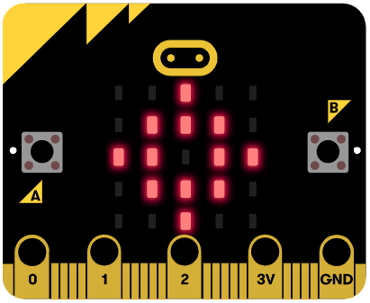
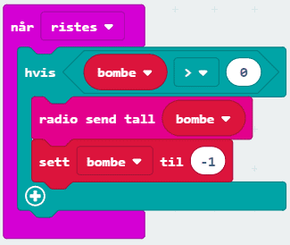
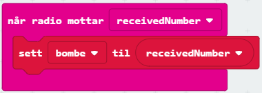
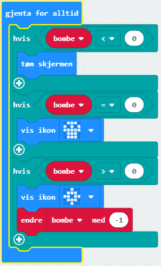

# Introduksjon {.intro}

Kjenner du "Tikkende-bombe" -spillet? Du kaster rundt en leke-bombe mens en klokke teller ned og personen som holder
den når tiden er ute, taper... Det er veldig morsomt.
I dette prosjektet vil vi bygge en lignende type spill, men i stedet bruker vi en virtuell bombe og micro:bit radio.
Den virtuelle bomben er en tall-variabel som telles ned til `0`, og vi skal sende dette tallet mellom micro:biter. 
Den som har den virtuelle bomben når den blir `0` taper. Vi kan sende tall ved hjelp av radioblokkene. De bruker antennen på micro:bit for å sende data som
radiosignaler, akkurat som telefoner eller dingser rundt deg.

# Steg 1: Vi starter spillet {.activity}

*Vi begynner med å vise et tall når vi rister på micro:biten.*

## Sjekkliste {.check}

- [ ] Start et nytt PXT-prosjekt, for eksempel ved å gå til
  [makecode.microbit.org](https://makecode.microbit.org/?lang=no){target=_blank}.

Hva betyr det å ha et tall som representerer en bombe? Vi kan lage en bombe-klokke som er et tall som sendes
mellom micro:bitene ved hjelp av radioen. Bombeklokka skal telle ned, og når den blir 0, skal den ringe.

Vi starter med å kode interaksjonen mellom micro:biten og spillerne. Vi vil da at spillet starter og den første bomben sendes ved å trykke på A + B-knappen.
Når en bombe er mottatt, viser skjermen et bilde av bomben, og videre når spilleren rister på micro:biten, sendes bomben til den andre spilleren

- [ ] Lag en variabel `bombe` og sette den til `-1` inne i `ved start` -blokken.

- [ ] For at micro:biten skal vite hvem den skal sende og få tall fra må dere lage en felles radiokanal.
Dette kan du gjøre ved å velge `radio sett gruppe` fra `Radio`-kategorien. 
Du kan velge et tall fra `0` til `255`, og de som skal spille sammen må velge samme tall.

    

- [ ] For å starte spillet, trykker vi på A + B-knappen, og gir et positivt tall til bombe-variabelen. For å gjøre
spillet mindre forutsigbart, bruker vi  `plukk tilfeldig `- blokk fra `Matematikk`-kategorien for å gi bombe-variabelen en verdi mellom `10` og `20`.:

    

- [ ] For å sende en bombe kan vi riste micro:biten. Hvis bombe-variabelen er positiv, har vi bomben og vi kan
sende den. Etter å ha sendt den, setter vi bombe-variabelen til `-1` siden vi ikke har den lenger.

   

- [ ] Mottak av bombe gjøres med en `når radio mottar` -blokk. recievedNumber representerer bombe og
lagres i bombe-variabelen.

   

Nå kan vi gå i gang med å kode selve klokka som teller ned til `0`. Dette gjør vi ved å bruke en `gjenta for alltid` blokk 
der bombe-variabelen telles ned til `0`. Inne i denne blokken må vi sjekke hvilken verdi bombe-variabelen har slik at vi 
viser bombe-ikon og teller ned kun når vi har bomben (dvs bombe-variabelen er positiv) og stopper nedtellingen og viser et hodeskalle-ikon
når vi kommer til `0`.

- [ ] Vi kan legge til en klokke med ‘gjenta for alltid’ blokken
- [ ] Hvis bombe-variabelen er lik `0` (bombe = `0`), KABOOM! du tapte, og vi viser en hodskalle!
- [ ] Hvis bombe-variabelen er negativ (bombe < `0`), har vi ikke bomben, så vi tømmer skjermen.
- [ ] Hvis bombe-variabelen er positiv (bombe > `0`), viser vi et bombe-bilde og reduserer variabelen med `1`

  

## Test prosjektet {.flag}

Det er to forskjellige måter vi kan teste micro:bit-programmer på:

- [ ] Til venstre på skjermen er det et bilde av en micro:bit. Starter du å teste her vil du få opp to bilder av 
micro:bit og kan teste ut med å sende bomben mellom disse to.

- [ ] Du og en venn kan laste opp koden på hver deres micro:bit. Den som starter spillet trykker på `A+B` 
og rister på micro:biten for å sende den videre. Hvem taper? Hva skjer hvis flere spillere er på samme kanal?

