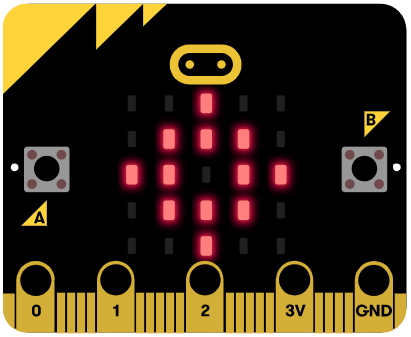

# Introduksjon {.intro}

Kjenner du "Tikkande bombe"-spelet? Spelarane kastar ei leikebombe mellom seg
medan ei klokke tel ned, og personen som heldt den når tida er ute tapar. Det er
veldig morosamt!

I dette prosjektet skal me byggje eit liknande spel, men i staden brukar me ei
virituell bombe og micro:bit-radio. Den virituelle bomba er ein tal-variabel som
tel ned til __0__, og me skal sende dette talet mellom fleire micro:bit-ar. Den
som har den virituelle bomba når me kjem til __0__ tapar. Me kan sende tal ved
hjelp av radioklossane.



# Steg 1: Me startar spelet {.activity}

_Me startar med å vise eit tal når me ristar på micro:bit-en._

## Sjekkliste {.check}

- [ ] Start eit nytt PXT-prosjekt, til dømes ved å gå til
  [makecode.microbit.org](https://makecode.microbit.org/?lang=no){target=blank}.

Kva tyder det å ha eit tal som representerer ei bombe? Me kan lage ei
bombe-klokke som er eit tal som vert sendt mellom micro:bit-ane ved hjelp av
radioen. Bombeklokka skal telje ned, og når den blir __0__ skal den ringe.

Me startar med å kode interaksjonen mellom micro:bit-en og spelarane. Då vil me
at spelet skal starte, og den fyrste bomba vert sendt ved å trykke på
A+B-knappen. Når ei bombe er motteke, viser skjermen eit bilete av bomba, og
når spelaren ristar på micro:bit-en sendast den vidare til neste spelar.

- [ ] Lag ein variabel `bombe`{.microbitvariables} og set den til `-1`{.microbitvariables}
  inne i `ved start`{.microbitbasic}-klossen.

- [ ] For at micro:bit-en skal vite kven den skal sende til og få tal frå, må de
  lage ein felles radiokanal. Dette kan du gjere ved å velje `radio set gruppe`{.microbitradio}
  frå `Radio`{.microbitradio}-kategorien. Du kan velje eit tal frå __0__ til __255__,
  og dei som skal spele saman må velje same tal.

```microbit
let bombe = -1
radio.setGroup(5)
```

- [ ] For å starte spelet trykkar me på `A+B`{.microbitinput}-knappen, og gir
  eit positivt tall til `bombe`{.microbitvariables}-variabelen. For å gjere
  spelet mindre føreseieleg brukar me `plukk tilfeldig`{.microbitmath}-klossen
  frå `Matematikk`{.microbitmath}-kategorien for å gi `bombe`{.microbitvariables}-variabelen
  ein verdi mellom __10__ og __20__:

```microbit
input.onButtonPressed(Button.AB, function () {
    bombe = Math.randomRange(10, 20)
})
```

- [ ] For å sende ei bombe kan me riste micro:bit-en. Viss `bombe`{.microbitvariables}-variabelen
  er positiv, har me bomba og me kan sende den. Etter å ha sendt den vert
  `bombe`{.microbitvariables}-variabelen sett til __-1__ sidan me ikkje har den
  lengre.

```microbit
input.onGesture(Gesture.Shake, function () {
    if (bombe > 0) {
        radio.sendNumber(bombe)
        bombe = -1
    }
})
```

- [ ] Me registrerer at bomba er motteke med ein `når radio mottek`{.microbitradio}-kloss.
  `recievedNumber`{.microbitvariables} representerer bomba og vert lagra i `bombe`{.microbitvariables}-variabelen.

```microbit
radio.onReceivedNumber(function (receivedNumber) {
    bombe = receivedNumber
})
```

No kan me gå i gang med å kode nedteljinga til __0__. Dette gjer me ved å bruke
ein `gjenta for alltid`{.microbitbasic}-kloss der `bombe`{.microbitvariables}-variabelen tel ned til __0__. Inne i
denne klossen må me sjekke kva verdi `bombe`{.microbitvariables}-variabelen har,
slik at me viser bombe-ikonet og tel ned når me har bomba (altså at `bombe`{.microbitvariables}
er positiv), og stoppar nedteljinga og viser ein hovudskalle når me kjem til __0__.

- [ ] Me kan leggjet til ei klokke med `gjenta for alltid`{.microbitbasic}-klossen.

- [ ] Viss `bombe`{.microbitvariables}-variabelen er lik __0__: KABOOM! Du tapte,
  og me viser ein hovudskalle!

- [ ] Viss `bombe`{.microbitvariables}-variabelen er negativ (`bombe`{.microbitvariables} < __0__)
  har me ikkje bomba, så me tømmer skjermen.

- [ ] Viss `bombe`{.microbitvariables}-variabelen er positiv (`bombe`{.microbitvariables} > __0__)
  viser me eit bombe-ikon og reduserer variabelen med __1__.

```microbit
let bombe = 0
basic.forever(function () {
    if (bombe < 0) {
        basic.clearScreen()
    }
    if (bombe == 0) {
        basic.showIcon(IconNames.Skull)
    }
    if (bombe > 0) {
        basic.showIcon(IconNames.Target)
        bombe += -1
    }
})
```

## Test prosjektet {.flag}

Det er to ulike måtar me kan teste micro:bit-program på:

- [ ] Til venstre på skjermen er det eit bilete av ein micro:bit. Starter du å
  teste her vil du få opp to bilete av micro:bit, og du kan prøve å sende bomba
  mellom desse.

- [ ] Du og ein venn kan laste opp koden på kvar dykkar micro:bit. Den som
  startar spelet trykkar på A+B og rister på micro:bit-en for å sende bomba
  vidare. Kven tapar? Kva skjer viss fleire spelarar er på same kanal?
