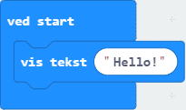

# Introduksjon {.intro}
I denne introduksjonsoppgaven skal vi få microbiten til å vise navnet ditt. 

# Steg 1: Vi finner "ved start"-klossen {.activity}

## Sjekkliste {.check}

- [ ] Start et nytt PXT-prosjekt, for eksempel ved å gå til 
  [makecode.microbit.org](https://makecode.microbit.org/?lang=no).

- [ ] Klikk på gruppa `Basis` som ligger øvert i menyen (midt på skjermen). 
	Finn klossen som heter `ved start`(den ligger nederst) og klikk på den.

- [ ] Den skal nå ha dukket opp i kodefeltet ditt. Du kan flytte den hvor du vil i feltet; det har ikke noe å si hvor den ligger hen. (Hvis du allerede hadde den fra før, slett en av den ved å dra den bort til menytfeltet og slipp.)

# Steg 2: Sett inn tekst {.activity}

## Sjekkliste {.check}

- [ ] Hvis vi legger blokker med kode inni `ved start`-klossen, vil disse skje
	når microbiten starter å kjøre programmet. 
	Finn klossen `vis tekst`i `Basis`og legg den inni `ved start`-klossen fra steg 1 sånn at koden din ser slik ut:

- [ ] Så du at det skjedde noe i simulatoren til venstre? Trykk på  hvis du vil kjøre programmet en gang til.

# Steg 3: Skriv inn ditt navn {.activity}

## Sjekkliste {.check}

- [ ] Bytt ut "Hello!" i `vis tekst`-klossen med navnet ditt. 

### OBS! {.protip}
Microbiten er opprinnelig engelsk og skjønner ikke Æ, Ø og Å. Hvis du har disse bokstavene i navnet ditt kan du erstatte dem med AE, OE og AA.

# Steg 4: Last ned programmet {.activity}

## Sjekkliste {.check}

- [ ] Last ned programmet til microbiten. Nå kan du koble den fra PC-en og koble den til batteriet istedenfor (hvis det allerede ikke er gjort).
- [ ] Gå og vis navnet ditt til en annen. 

## {.tip}

Du kan kjøre programmet på nytt ved å trykke på knappen på baksiden av microbiten. 
