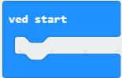

# Introduksjon {.intro}
I denne introduksjonsoppgaven skal vi få micro:biten til å vise navnet ditt.


# Steg 1: Vi finner "ved start"-klossen {.activity}

## Sjekkliste {.check}

- [ ] Start et nytt PXT-prosjekt, for eksempel ved å gå til
  [makecode.microbit.org](https://makecode.microbit.org/?lang=no){target=blank}

- [ ] Klikk på gruppa `Basis`{.microbitbasic} som ligger øverst i menyen
  (midt på skjermen).	Finn klossen som heter `ved start`{.microbitbasic}
  (den ligger nederst) og klikk på den.



- [ ] Den skal nå ha dukket opp i kodefeltet ditt. Du kan flytte den hvor du vil
  i feltet; det har ikke noe å si hvor den ligger hen. (Denne klossen hadde du
  nok allerede fra før i kodefeltet sammen med en kloss som heter `gjenta for alltid`{.microbitbasic}.
  Du kan slette disse to ved å dra dem bort til menyfeltet og slipp.)


# Steg 2: Sett inn tekst {.activity}

## Sjekkliste {.check}

- [ ] Hvis vi legger blokker med kode inni `ved start`{.microbitbasic}-klossen,
  vil disse skje når micro:biten starter å kjøre programmet.Finn klossen `vis tekst`{.microbitbasic}
  i `Basis`{.microbitbasic} og legg den inni `ved start`{.microbitbasic}-klossen
  fra steg 1 sånn at koden din ser slik ut:

```microbit
basic.showString("Hello!")
```

- [ ] Så du at det skjedde noe i simulatoren til venstre? Trykk på 
hvis du vil kjøre programmet en gang til.

# Steg 3: Skriv inn ditt navn {.activity}

## Sjekkliste {.check}

- [ ] Bytt ut "Hello!" i `vis tekst`{.microbitbasic}-klossen med navnet ditt.

### OBS! {.protip}
Micro:biten er opprinnelig engelsk og skjønner ikke Æ, Ø og Å. Hvis du har disse
bokstavene i navnet ditt kan du erstatte dem med AE, OE og AA.

# Steg 4: Last ned programmet {.activity}

## Sjekkliste {.check}

- [ ] Last ned programmet til micro:biten. Nå kan du koble den fra PC-en og
koble den til batteriet istedenfor (hvis det allerede ikke er gjort).

- [ ] Gå og vis navnet ditt til en annen.

## {.tip}

Du kan kjøre programmet på nytt ved å trykke på __RESET__ knappen på baksiden av
micro:biten.
