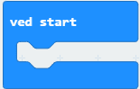

# Introduksjon {.intro}

I denne introduksjonsoppgåva skal me få micro:bit-en til å vise namnet ditt.


# Steg 1: Me finn "ved start"-klossen {.activity}

## Sjekkliste {.check}

- [ ] Start eit nytt PXT-prosjekt, til dømes ved å gå til
  [makecode.microbit.org](https://makecode.microbit.org/?lang=no){target=blank}.

- [ ] Klikk på gruppa `Basis`{.microbitbasic} som ligg øvst i menyen
  (midt på skjermen).  Finn klossen som heiter `ved start`{.microbitbasic}
  (den ligg nedst) og klikk på den.



- [ ] No skal den ha dukka opp i kodefeltet ditt. Du kan flytte den kor du vil i
  feltet - det har ikkje noko å seie kor den ligg. Du hadde nok klossen i
  kodefeltet ditt allereie, saman med ein kloss som heiter `gjenta for alltid`{.microbitbasic}.
  Du kan slette dess to ved å dra dei bort til menyfeltet og sleppe dei der.


# Steg 2: Set inn tekst {.activity}

## Sjekkliste {.check}

- [ ] Viss me legg klossar med kode inni `ved start`{.microbitbasic}-klossen,
  vil desse skje når micro:bit-en startar å køyre programmet.  Finn klossen
  `vis tekst`{.microbitbasic} i `Basis`{.microbitbasic} og legg den inni
  `ved start`{.microbitbasic}-klossen frå steg 1 sånn at koden din ser slik ut:

```microbit
basic.showString("Hello!")
```

- [ ] Såg du at det skjedde noko i simulatoren til venstre? Trykk på  viss du vil køyre programmet ein
  gong til.

# Steg 3: Skriv inn namnet ditt {.activity}

## Sjekkliste {.check}

- [ ] Bytt ut "Hello!" i `vis tekst`{.microbitbasic}-klossen med namnet ditt.

### OBS! {.protip}

Micro:bit-en er opphavleg engelsk og forstår ikkje Æ, Ø og Å. Viss du har desse
bokstavane i namnet ditt kan du bytte dei ut med AE, OE og AA.


# Steg 4: Last ned programmet {.activity}

## Sjekkliste {.check}

- [ ] Last ned programmet til micro:bit-en. No kan du kople den frå PC-en og
  kople den til batteriet i staden (viss du ikkje allereie har gjort det).

- [ ] Gå og vis namnet ditt til nokon andre.

## {.tip}

Du kan køyre programmet på nytt ved å trykkje på __RESET__-knappen på baksida av
micro:bit.en.
