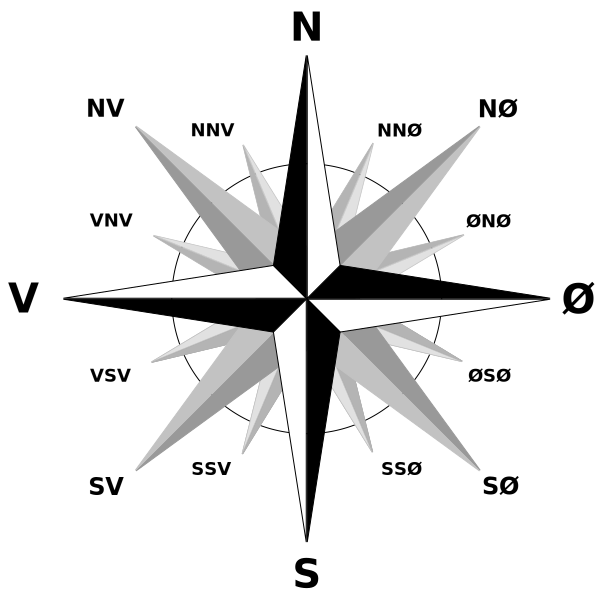

<!-- To get a box around the text about the playlist and to make it distinct from the rest of the exercise-->
# {.tip}

Denne oppgaven er en del av oppgavesamlingen _Programmering i micro-python_ og bygger videre på [Python: Rotasjon og fall](../python_gestures/python_gestures_nb.html){target=_blank}.

Vi anbefaler at du laster ned og skriver koden din i [mu editor](https://codewith.mu/){target=_blank} når du jobber med disse oppgavene. Instruksjoner for hvordan man laster ned Mu finner du på nettsiden via linken.

Når Mu er installert kan du koble micro:biten din til datamaskinen via en USB-kabel. Skriv koden din i editor-vinduet og trykk på “Flash”-knappen for å laste koden over på micro:biten. Hvis det ikke fungerer, sørg for at micro:biten har dukket opp som en USB-enhet på datamaskinen din.

# Introduksjon {.intro}

Visste du at micro:bit'en inneholder et kompass? Dersom du noen gang skal lage
en værstasjon kan du bestemme vindretningen, eller navigere deg igjennom
Amazonas.


# Kompass {.activity}

Et bruksområde for kompasset er å fortelle deg hvilken retning som er Nord:

```python
from microbit import *

compass.calibrate()

while True:
    needle = ((15 - compass.heading()) // 30) % 12
    display.show(Image.ALL_CLOCKS[needle])
```

## Merk {.tip}

**Du må kalibrere kompasset før det kan gjøre målinger.** Dersom du glemmer å
gjøre dette vil kompasset bare vise tull. `calibration` metoden kjører et kjekt
lite programm som hjelper enheten å finne ut hvor den er i forhold til jordens
magnetfelt.

For å kalibrere kompasset, snu rundt på micro:bit'en til en sirkel av pixler er
tegnet på kanten av displayet.

##

I resten av oppgaven skal vi prøve å bryte ned hva koden ovenfor gjør, da det
kan være vanskelig å forstå detaljene med en gang.

## Activity checklist {.check}

- [ ] Kjør koden ovenfor og bestem retningen til Nord, Øst, Sør og Vest.



Vi skal nå se nærmere på hva `compass.calibrate()` gjør.

- [ ] Kjør koden under

```python
from microbit import *

compass.calibrate()

while True:
    display.scroll(str(compass.calibrate()))
```

- [ ] Hvilken verdi viser koden ovenfor når du står i de fire himmelretningene?
  Bruk denne informasjonen til å bestemme hva `compass.calibrate()` gjør.

<toggle>
  <strong>Hint</strong>
  <hide>

Funksjonen `compass.calibrate()` viser altså hvor mange grader unna Nord vi
står. Med andre ord spytter funksjonen ut ett tall slik at `0 ≤
compass.calibrate() ≤ 360`.

</hide>
</toggle>

- [ ] Endre verdien til `A` til ulike heltall. Hvilke heltall er lovlige og hva
  viser displayet?

```python
from microbit import *

display.show(Image.ALL_CLOCKS[A])
```

<toggle>
  <strong>Hint</strong>
  <hide>

Som du kanskje har funnet ut er `ALL_CLOCKS` en liste som inneholder 12 ulike
bilder, disse kan velges fra og med 0 til og med 11.

</hide>
</toggle>

- [ ] Test ut koden under og varier `A` fra og med 0 til og med 360, hva skjer?

```python
from microbit import *

display.show((15 - A // 30) % 12)
```

Gratulererer. Dersom du har klart å løse oppgavene ovenfor er du klar til å gå
ut og utforske verden med kompasset ditt!

<!--To get the link to the next exercise in a box. -->
# {.tip}

Neste oppgave i samlingen er [Python: Input og output](../python_input_output/python_input_output_nb.html){target=_blank}.
Klikk videre for å fortsette gjennom samlingen.
