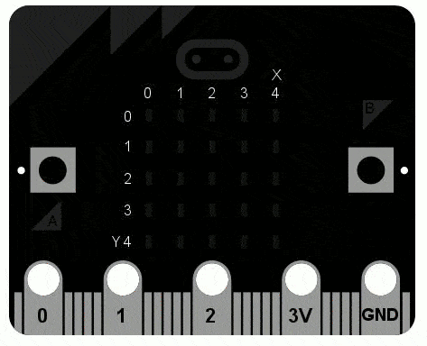

<!-- To get a box around the text about the playlist and to make it distinct from the rest of the exercise-->
# {.tip}

Denne oppgåva er den første i oppgåvesamlinga "Programmering i micro-python".

Me tilrår at du lastar ned og skriv koden din i [mu editor](https://codewith.mu/){target=_blank} når du jobbar med desse oppgåvene. Instruksjonar for korleis ein lastar ned Mu finn du på nettsida via linken.

Når Mu er installert kan du kople micro:biten din til datamaskinen via ein USB-kabel. Skriv koden din i editor-vindauget og trykk på “Flash”-knappen for å laste koden over på micro:biten. Dersom det ikkje fungerer, sørg for at micro:biten har dukka opp som ei USB-eining på datamaskinen din.

# Introduksjon {.intro}

Den tradisjonelle måten å starte å programmere på i eit nytt språk er å få
datamaskina til å seie "Hello, World!" (Altså "Hei, verda!").



Med MicroPython gjer du dette på følgjande måte:

```python
from microbit import *
display.scroll("Hello, World!")
```

Kvar linje gjer noko spesielt. Den fyrste linja

```python
from microbit import *
```

fortel MicroPython at den skal hente alle tinga den treng for å samarbeide med
micro:bit-en. Alle desse tinga er i ein modul som heiter `microbit` (ein modul
er eit slags bibliotek, ei samling av eksisterande kode). Når du skriv `import`
så fortel du MicroPython at du vil bruke det, og `*` er Python sin måte å seie
*alt* på. Så `from microbit import *` tyder på godt norsk "Eg vil bruke alt frå
MicroBit-kodebiblioteket".

Den andre linja:

```python
display.scroll("Hello, World!")
```

fortel MicroPython at den skal bruke displayet sitt til å scrolle teksten
"Hello, World!" over skjermen. Biten `display` er eit *objekt* frå
`microbit`-modulen som representerer det fysiske displayet, altså skjermen. Me
kan be displayet gjere ting ved å bruke punktum (`.`) og så ein kommando (som
programmerarar gjerne kallar for ein *metode*). Her brukar me metoden `scroll`.
Sidan `scroll` må vite kva teikn som skal rulle over skjermen brukar me `"` for
å fortelje at "dette er ein tekst" inni parentesane `(` og `)`. Teksten blir då
kalla for eit *argument*. Så koden `display.scroll("Hello, World!")` tyder "Eg
vil at du skal bruke skjermen til å vise teksten Hello, World!". Viss ein metode
ikkje treng argument gjer me det heilt klart ved å bruke tomme parentesar, slik
som dette: `()`.


# Di eiga melding {.activity}

## Sjekkliste {.check}

- [ ] Kopier "Hello, World!" koden inn i editoren din og flash den til
  micro:bit-en.

- [ ] Endre meldinga slik at den seier hallo til deg. Til dømes kunne er ha fått
  den til å seie "Hallo, Stein Olav!".

Hint: Du må endre argumentet i `scroll`-metoden.

## Advarsel {.tip}

Dette virkar kanskje ikkje, då må du finne ut kvifor.

For no prøver MicroPython å vere hjelpsam. Viss den finn ein feil (altså at den
ikkje forstår koden din), vil den scrolle ei "hjelpsam" melding over skjermen.
Viss den kan, så seier den kva linjenummer du finn feilen på.

Python forventar at du skriv __akkurat__ riktig kode. Til dømes er  `Microbit`,
`microbit`, `microBit` ulike ting for Python. Viss MicroPython klagar på ein
`NameError` er det sannsynlegvis fordi du har stava eit ord feil. Viss du heiter
Bjarte og nokon ropar på Bjarne, så kan det hende du forstår at det var deg dei
ropte etter, men stakkars Python blir forvirra.

Viss MicroPython klagar på ein `SyntaxError` har du skrive kode på ein måte
MicroPython ikkje klarar å tolke. Sjekk at du ikkje manglar nokon spesielle
teikn, som `"` eller `:`. Viss du plasserer desse på feil stad eller gløymer dei
bort, så er det som å setje punktum midt i ei setning. Det kan vere vanskeleg å
forstå kva du eigentleg meiner.

Viss micro:bit-en sluttar å svare kan du ikkje gi den ny kode eller skrive inn
kommandoar. Prøv å ta ut USB-kabelen (og kabelen til batteriet dersom du har
kopla det til), og så å kople den inn att. Det kan vere at du må avslutte og
starte programmet du skriv kode i på nytt.

<!--To get the link to the next exercise in a box. -->
# {.tip}

Neste oppgåve i samlinga er [Python: Bilete](../python_images/python_images_nn.html){target=_blank}.
Klikk vidare for å halde fram gjennom samlinga.
