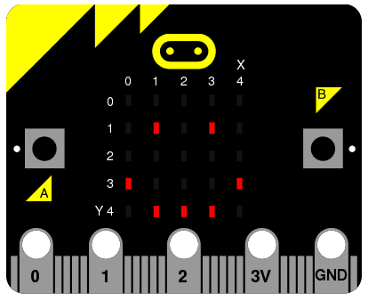

<!-- To get a box around the text about the playlist and to make it distinct from the rest of the exercise-->
# {.tip}

Denne oppgaven er en del av oppgavesamlingen _Programmering i micro-python_ og bygger videre på [Python: Hello, World!](../python_hello_world/python_hello_world_nb.html){target=_blank}.

Vi anbefaler at du laster ned og skriver koden din i [mu editor](https://codewith.mu/){target=_blank} når du jobber med disse oppgavene. Instruksjoner for hvordan man laster ned Mu finner du på nettsiden via linken.

Når Mu er installert kan du koble micro:biten din til datamaskinen via en USB-kabel. Skriv koden din i editor-vinduet og trykk på “Flash”-knappen for å laste koden over på micro:biten. Hvis det ikke fungerer, sørg for at micro:biten har dukket opp som en USB-enhet på datamaskinen din.

# Introduksjon {.intro}

MicroPython er omtrent så god som deg til å lage kunst dersom det eneste du har
er et 5x5 rutenett med røde LED lys ("light emitting diodes" -- de tingene som
lyser opp på fremmsiden av enheten). I denne oppgaven skal vi se at MicroPython
gir deg stor kontroll over displayet slik at du kan lage en rekke forskjellige
interessante effekter.

MicroPython har en rekke bilder bilder bygd inn som er klar til å vises på
displayet. For eksempel for å få enheten til å se lykkelig ut kan du skrive

```python
from microbit import *

display.show(Image.HAPPY)
```

Jeg antar du husker hva den første linjen med kode gjør. Den andre linjen bruker
`display` objektet til å vise (`show`) ett bilde som er bygd inn. Smilefjeset vi
ønsker å vise er en del av `Image` objektet og heter naturlig nok `HAPPY`. Vi
kan fortelle `show` å bruke bildet ved å legge det mellom parenthesene `(` og
`)`.



## Liste av tilgjengelige bilder {.tip}

- `Image.HEART`

- `Image.HEART_SMALL`

- `Image.HAPPY`

- `Image.SMILE`

- `Image.SAD`

- `Image.CONFUSED`

- `Image.ANGRY`

- `Image.ASLEEP`

- `Image.SURPRISED`

- `Image.SILLY`

- `Image.FABULOUS`

- `Image.MEH`

- `Image.YES`

- `Image.NO`

- `Image.CLOCK12`, `Image.CLOCK11`, `Image.CLOCK10`, `Image.CLOCK9`,
  `Image.CLOCK8`, `Image.CLOCK7`, `Image.CLOCK6`, `Image.CLOCK5`,
  `Image.CLOCK4`, `Image.CLOCK3`, `Image.CLOCK2`, `Image.CLOCK1`

- `Image.ARROW_N`, `Image.ARROW_NE`, `Image.ARROW_E`, `Image.ARROW_SE`,
  `Image.ARROW_S`, `Image.ARROW_SW`, `Image.ARROW_W`, `Image.ARROW_NW`

- `Image.TRIANGLE`

- `Image.TRIANGLE_LEFT`

- `Image.CHESSBOARD`

- `Image.DIAMOND`

- `Image.DIAMOND_SMALL`

- `Image.SQUARE`

- `Image.SQUARE_SMALL`

- `Image.RABBIT`

- `Image.COW`

- `Image.MUSIC_CROTCHET`

- `Image.MUSIC_QUAVER`

- `Image.MUSIC_QUAVERS`

- `Image.PITCHFORK`

- `Image.XMAS`

- `Image.PACMAN`

- `Image.TARGET`

- `Image.TSHIRT`

- `Image.ROLLERSKATE`

- `Image.DUCK`

- `Image.HOUSE`

- `Image.TORTOISE`

- `Image.BUTTERFLY`

- `Image.STICKFIGURE`

- `Image.GHOST`

- `Image.SWORD`

- `Image.GIRAFFE`

- `Image.SKULL`

- `Image.UMBRELLA`

- `Image.SNAKE`

## Ting å prøve ut {.check}

Det er ganske mange bilder! Modifiser koden som får micro:bit'en til å se
lykkelig ut til å vise ulike bilder. Klarer du å løse noen av oppgavene under?

- [ ] Får du til å få enheten til å vise en strekmann?

- [ ] Hvor mange ulike dyr klarer du å vise?

- [ ] Få enheten til å vise hvilken time det er akkuratt nå!


# Lag dine egne bilder {.activity}

Selvsagt ønsker du og å vise dine egne bilder på micro:bit'en, ikke sant?

Det er enkelt.

Hver LED pixel på det fysiske displayet kan settes til en av ti verdier. Dersom
en pixel er satt til `0` (null) så er den av. Det er bokstavlig talt en lysstyke
på null. Imidlertid dersom verdien er satt til `9` så er den satt til maks.

Bevepnet med denne informasjonen er det mulig a lage nye bilder som dette:

```python
from microbit import *

panda = Image("05050:"
             "05050:"
             "05050:"
             "99999:"
             "09990")

display.show(panda)
```

Hva viser denne koden når du flasher den til enheten din? Hint: det er ikke en
panda!

Har du funnet ut hvordan du kan tegne et bilde? Har du lagt merke til at hver
linje av det fysiske displayet er representert med en linje av tall som slutter
med `:` med ett par sitat-tegn `"` rundt? Hvert tall representerer en spesifikk
lysstyrke. Det er fem linjer med fem tall, så det er mulig å spesifisere
lysstyrken for hver av de fem pixlene på hver av de fem linjene på det fysiske
displayet. Det er hvordan vi lager et bilde.

Enkelt!

Faktisk så trenger vi ikke skrive dette over flere linjer en gang. Dersom du
klarer å holde styr på hver enkelt linje, kan du skrive det slik:

```python
boat = Image("05050:05050:05050:99999:09990")
```

## Ting å prøve ut {.check}

- [ ] Lag et smilefjes der det ene øyet lyser svakere

- [ ] Lag et hjertet som lyser så svakt som mulig. Hint: du kan bruke
  `IMAGES.HEART` for å se ett eksempel på ett hjerte.


# Animasjon {.activity}

Statiske bilder (bilder som står i ro) er artige, men det er enda gøyere å få
dem til å bevege seg. Dette er fantastisk enkelt å gjøre med MicroPython ~ det
er bare å bruke en rekke bilder!

Men, før vi kan lære om animasjoner må vi først lære litt om lister. Her er en
handleliste

```python
Egg
Bacon
Tomater
```

Her er hvordan du representerer den samme listen i Python:

```python
shopping = ["Egg", "Bacon", "Tomater"]
```

Her har jeg bare laget en liste kalt `shopping` som inneholder tre element.
Python vet at dette er en liste siden det er firkant parenteser (`[` og `]`)
rundt. Elementer i listen er adskilt av komma (`,`) og i dette tilfellet så er
elementene tre tekststrenger: `Egg`, `Bacon` og `Tomater`. Vi vet at de er
tekststrenger fordi de er omsluttet av sitat-tegn `"`.

En liste kan inneholde nesten alt i Python. Her er en liste med tall:

```python
primes = [2, 3, 5, 7, 11, 13, 17, 19]
```

## Merk {.tip}

Tall trenger ikke å være sitert siden de representerer en verdi (heller enn en
tekststreng). Det er en forskjell mellom `2` (Tallverdien 2) og `"2"`
(tekststrengen som representerer tallet 2). Hvis dette er vanskelig å forstå så
slapp av. Du kommer snart til å bli vant til det.

##

Det er og mulig å oppbevare ulike ting i den samme listen:

```python
mixed_up_list = ["hello!", 1.234, Image.HAPPY]
```

Vi kan fortelle MicroPython å animere en liste med bilder. For eksempel har vi
allerede et par lister med bilder allerede innebygget. Disse er kalt henholdsvis
`Image.ALL_CLOCKS ` og `Image.ALL_ARROWS`.

```python
from microbit import *

display.show(Image.ALL_CLOCKS, loop=True, delay=100)
```

Som med et enkelt bilde så bruker vi `display.show` til å vise bildene
displayet. Merk at vi fortalte MicroPython å bruke `Image.ALL_CLOCKS` og den
forstod at vi ønsket å se hvert bildet etter hverandre. Vi kan og fortelle
MicroPython å fortsette å loope over listen av bilder (slik at animasjonen
fortsetter for alltid) ved å skrive `loop=True`. Videre kan vi si at vi ønsker
at pausen mellom hvert bilde bare skal være 100 millisekund (En tiendedel av et
sekund) med argumentet `delay=100`.

## Ting å prøve ut {.check}

- [ ] Animer over alle bildene av piler fra `Image.ALL_ARROWS` listen.

- [ ] Gjør slik at animasjonen bare kjører en gang (hint: det motsatte av `True`
  er `False`).

- [ ] Forandre hastigheten på animasjonen slik at den går dobbelt så raskt


# Skipshavari {.activity}

Endelig så er hvordan du kan lage din egen animasjon. I mitt eksempel så skal
jeg få båten jeg laget tidligere til å synke til bunnen av displayet.

```python
from microbit import *

boat1 = Image("05050:"
              "05050:"
              "05050:"
              "99999:"
              "09990")

boat2 = Image("00000:"
              "05050:"
              "05050:"
              "05050:"
              "99999")

boat3 = Image("00000:"
              "00000:"
              "05050:"
              "05050:"
              "05050")

boat4 = Image("00000:"
              "00000:"
              "00000:"
              "05050:"
              "05050")

boat5 = Image("00000:"
              "00000:"
              "00000:"
              "00000:"
              "05050")

boat6 = Image("00000:"
              "00000:"
              "00000:"
              "00000:"
              "00000")

all_boats = [boat1, boat2, boat3, boat4, boat5, boat6]
display.show(all_boats, delay=200)
```

Her er hvordan koden virker

- Jeg lager seks `boat` bilder akkurat som jeg forklarte ovenfor.

- Så putter jeg alle seks bildene i listen `all_boats`

- Endelig så sier jeg til `display.show` å animere listen med en pause på 200
  millisekund mellom hvert bilde.

- Siden jeg ikke har satt `loop = True` vil båten bare synke en gang (slik at
  animasjonen min av båden som synker er vitenskapelig korrekt). ;)

## Ting å prøve ut {.check}

- [ ] Bruk smilefjeset du laget tidligere og animer det til å blunke med ett øye

- [ ] Animer hjertet du laget tidligere til å banke (hint: Du kan la lysstyrken
  gå fra `0` opp til `9` også tilbake igjen).

- [ ] Velg ditt eget bilde og animer det. Trenger du inspirasjon kan du se på
  listen over innebygde bilder ovenfor.

<!--To get the link to the next exercise in a box. -->
# {.tip}
Neste oppgave i samlingen er [Python: Knapper](../python_buttons/python_buttons_nb.html){target=_blank}.
Klikk videre for å fortsette gjennom samlingen.
