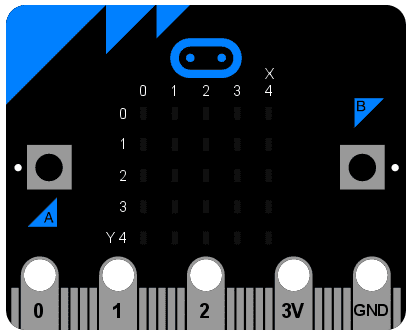
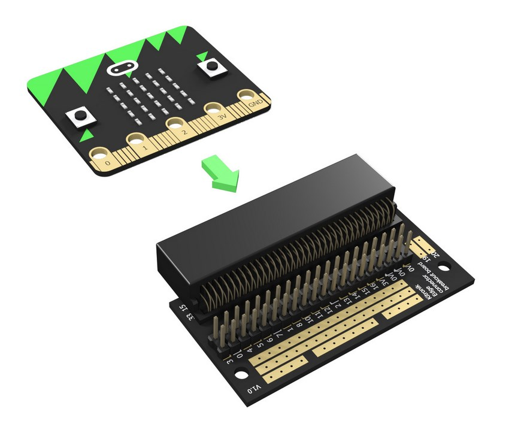
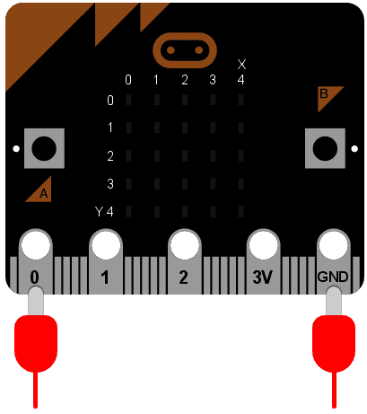

<!-- To get a box around the text about the playlist and to make it distinct from the rest of the exercise-->
# {.tip}

Denne oppgaven er en del av oppgavesamlingen _Programmering i micro-python_ og bygger videre på [Python: Retninger](../python_direction/python_direction_nb.html){target=_blank}.

Vi anbefaler at du laster ned og skriver koden din i [mu editor](https://codewith.mu/){target=_blank} når du jobber med disse oppgavene. Instruksjoner for hvordan man laster ned Mu finner du på nettsiden via linken.

Når Mu er installert kan du koble micro:biten din til datamaskinen via en USB-kabel. Skriv koden din i editor-vinduet og trykk på “Flash”-knappen for å laste koden over på micro:biten. Hvis det ikke fungerer, sørg for at micro:biten har dukket opp som en USB-enhet på datamaskinen din.

# Introduksjon {.intro}

Det eksisterer metal langs kanten på bunnen av din micro:bit som gjør at det ser
ut som enheten din har tenner. Dette er input/outputkomponentene (eller I/O
klemmene).



Noen av disse komponentene er større enn andre slik at slik at det er mulig å
feste krokodilleklemmer til dem. Disse er merket som 0, 1, 2, 3V og GND (siden
datamaskiner alltid begynner å telle fra null). Dersom du fester et
kobblingsbrett til enheten er det mulig å feste mange ledninger til mindre
enheter



Hver pin på micro:bit'en er et *objekt* med navn `pinN` hvor `N` er nummeret til
pin'en. Så, for eksempel, for å gjøre noe med pin'en merket med 0 (null) så
bruker vi objektet med navn `pin0`.

Enkelt!

Disse objektene har ulike *metoder* knyttet til dem avhengig av hva de ulike
pin'ene er i stand til.


# Kilen Python

Det enkleste eksempelet på input via pin'ene er å sjekke om de blir rørt. Så, du
kan kile enheten din for å få den til å le slik:

```python
from microbit import *

while True:
    if pin0.is_touched():
        display.show(Image.HAPPY)
    else:
        display.show(Image.SAD)
```

Med en hånd, hold enheten din på GND pin'en (her står GND for "ground" eller
jord på norsk). Så, med den andre hånden berør (eller kil) 0 (null) pin'en. Du
skal nå se at displayet endres fra sur til glad!

Dette er en form for veldig enkel måling av input. Morroa begynner når du setter
sammen elektriske komponenter og andre enheter via pin'ene.


# Beep Boop

En av de enkleste tingene vi kan kobble til enheten er en Piezo buzzer. Vi skal
bruke den som output.


Disse små enhetene spiller av en høyfrekvent pipelyd når du kobbler dem til en
lukket krets. For å kobble til en til din micro:bit må du kobble krokodille
klemmer til pin 0 og GND, som vist på bilde under



Ledningen fra pin 0 skal være kobblet til det positive kobblingspunktet (dette
pleier å være det lengste beinet), mens ledningen fra GND skal til det negative
kobblingspunktet.

Det følgende programmet vil gjøre at buzzeren lager en lyd:

```python
from microbit import *

pin0.write_digital(1)
```

Dette er gøy i akkurat 5 sekunder, og så ønsker du at den forferdelige lyden
skal stoppe. La oss forbedre eksempelet vårt og i stedet få enheten til å pipe:

```python
from microbit import *

while True:
    pin0.write_digital(1)
    sleep(20)
    pin0.write_digital(0)
    sleep(480)
```

Kan du finne ut hvordan dette programmet virker? Husk at `1` er "på" og `0` er
av i den digitale verdenen.

Enheten er satt til å kjøre en `while`-løkke for alltid (siden `True` alltid er
sant) og med en gang skru pin 0 på. Dette gjør at buzzeren piper. Mens buzzeren
piper, så venter programmet for tyve millisekunder også skrur den pin 0 av.
Dette gir effekten av ett kort pip. Endelig, så venter enheten i 480
millisekunder før den går tilbake til start og begynner på nytt igjen.

## Prøv det ut selv {.check}

- [ ] Hvor mange ganger piper enheten i sekundet?

- [ ] Skriv om koden slik at den piper en gang i sekundet

Gratulerer du har laget et veldig enkelt metronom!

<!--To get the link to the next exercise in a box. -->
# {.tip}

Neste oppgave i samlingen er [Python: Bevegelse](../python_movement/python_movement_nb.html){target=_blank}.
Klikk videre for å fortsette gjennom samlingen.
