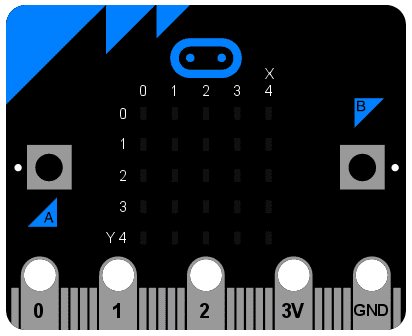
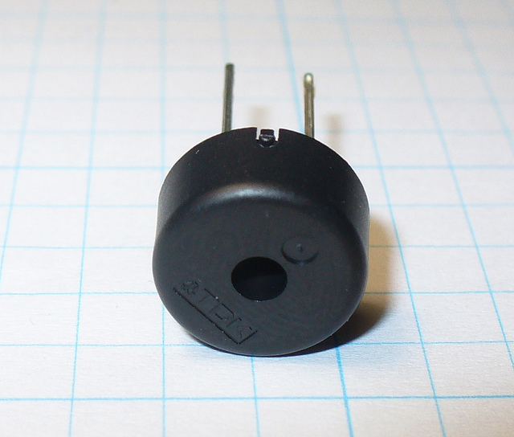

<!-- To get a box around the text about the playlist and to make it distinct from the rest of the exercise-->
# {.tip}

Denne oppgåva er ein del av oppgåvesamlinga "Programmering i micro-python" og byggjer vidare på [Python: Retningar](../python_direction/python_direction_nn.html){target=_blank}.

Me tilrår at du lastar ned og skriv koden din i [mu editor](https://codewith.mu/){target=_blank} når du jobbar med desse oppgåvene. Instruksjonar for korleis ein lastar ned Mu finn du på nettsida via linken.

Når Mu er installert kan du kople micro:biten din til datamaskinen via ein USB-kabel. Skriv koden din i editor-vindauget og trykk på “Flash”-knappen for å laste koden over på micro:biten. Dersom det ikkje fungerer, sørg for at micro:biten har dukka opp som ei USB-eining på datamaskinen din.

# Introduksjon {.intro}

Det er metall langs kanten på botnen av micro:bit-en din som gjer at det ser ut
som om den har tenner. Dette er input-/outputkomponentane (eller I/O-klemmene).



Nokre av desse komponentane er større enn andre slik at det er mogleg å feste
krokodilleklemmer til dei. Desse er merka `0`, `1`, `2`, `3V` og `GND` (sidan
datamaskiner alltid startar å telje frå null). Viss du festar eit koplingsbrett
til eininga er det mogleg å feste mange ledningar til mindre einingar.


Kvar pin på micro:bit-en er eit *objekt* med namn `pinN` der `N` er nummeret til
pin-en. Til dømes kan me bruke pin-en merka med `0` ved å bruke objektet `pin0`.

Enkelt!

Desse objekta har ulike *metodar* knytt til dei avhengig av kva dei ulike
pin-ane er i stand til.


# Kilen Python

Det enklaste dømet på input via pin-ane er å sjekke om dei blir rørt ved. Så du
kan kile eininga di for å få den til å le ved å bruke følgjande kode:

```python
from microbit import *

while True:
    if pin0.is_touched():
        display.show(Image.HAPPY)
    else:
        display.show(Image.SAD)
```

Med ei hand, hald eininga du på `GND` (GND står for "ground" eller "jord" på
norsk). Med den andre handa kan du ta på (eller kile) `0`-pin-en. No skal
displayet endre seg frå sur til glad!

Dette er ei form for veldig enkel måling av input. Moroa startar når du set
saman elektriske komponentar og andre einingar via pin-ane.


# Beep boop

Ein av dei enklaste tinga me kan kople til eininga er ein Piezo-buzzar. Me skal
bruke den som output.



Desse små einingane speler av ein høgfrekvent pipelyd når du koplar dei til ein
lukka krins. For å kople den til micro:bit-en din må du kople krokodilleklemmer
til `0` og `GND` som vist på biletet under.


Ledningen frå `pin0` skal vere kopla til det positive koplingspunktet (dette er
vanlegvis det lengste beinet), medan ledningen frå `GND` skal til det negative
koplingspunktet.

Det følgjande programmet vil gjere at buzzaren lagar ein lyd:

```python
from microbit import *

pin0.write_digital(1)
```

Dette er moro i akkurat 5 sekund, og så vil du at den forferdelege lyden skal
stoppe. La oss forbetre dømet vårt og i staden få eininga til å pipe:

```python
from microbit import *

while True:
    pin0.write_digital(1)
    sleep(20)
    pin0.write_digital(0)
    sleep(480)
```

Kan du finne ut korleis dette programmet virkar? Hugs at `1` er "på" og `0` er
"av" i den digitale verda.

Eininga er sett til å køyre ei `while`-løkke for alltid (sidan `True` alltid er
sant) og skru på `pin0` med ein gong. Dette gjer at buzzaren pip. Medan buzzaren
pip ventar programmet i 20 millisekund, og så skrur den `pin0` av. Det gir
effekten av eit kort pip. Til slutt ventar eininga i 480 millisekund før den går
tilbake til start og byrjar på att.

## Prøv sjølv {.check}

- [ ] Kor mange gonger pip eininga i sekundet?

- [ ] Skriv om koden slik at den pip ein gong i sekundet.

Gratulerer! Du har laga eit veldig enkelt *metronom*!

<!--To get the link to the next exercise in a box. -->
# {.tip}

Neste oppgåve i samlinga er [Python: Rørsle](../python_movement/python_movement_nn.html){target=_blank}.
Klikk vidare for å halde fram gjennom samlinga.
