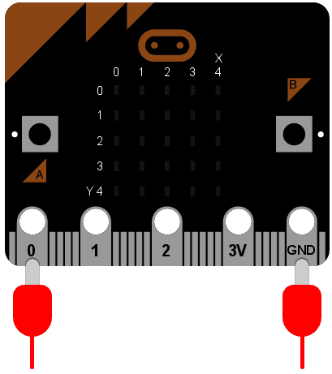

<!-- To get a box around the text about the playlist and to make it distinct from the rest of the exercise-->
# {.tip}

Denne oppgåva er ein del av oppgåvesamlinga "Programmering i micro-python" og byggjer vidare på [Python: Input og output](../python_input_output/python_input_output_nn.html){target=_blank}.

Me tilrår at du lastar ned og skriv koden din i [mu editor](https://codewith.mu/){target=_blank} når du jobbar med desse oppgåvene. Instruksjonar for korleis ein lastar ned Mu finn du på nettsida via linken.

Når Mu er installert kan du kople micro:biten din til datamaskinen via ein USB-kabel. Skriv koden din i editor-vindauget og trykk på “Flash”-knappen for å laste koden over på micro:biten. Dersom det ikkje fungerer, sørg for at micro:biten har dukka opp som ei USB-eining på datamaskinen din.


# Introduksjon {.intro}

Micro:bit-en din er utstyrt med eit akselerometer som måler rørsle langs tre
aksar:

* X - tilte frå venstre til høgre.

* Y - tilte framover og bakover.

* Z - rørsle opp og ned.

Det er ein funksjon for kvar akse som returnerer eit positivt eller negativt tal
som indikerer antal milli-g-krefter. Den viser 0 når du står i vater langs den
aktuelle aksen.

Til dømes, her er eit enkelt program som viser deg kor mykje i vater eininga di
er langs X-aksen:

```python
from microbit import *

while True:
    reading = accelerometer.get_x()
    if reading > 20:
        display.show("H")
    elif reading < -20:
        display.show("V")
    else:
        display.show("-")
```

Viss du heldt eininga flatt skal den vise `-`. Viss du tippar den mot venstre å
høgre bør den vise høvesvis `V` eller `H`.

Sidan me vil at eininga vår skal reagere på forandring heile tida brukar me ei
`while`-løkke. Den fyrste tingen som skjer *inne i while-løkka* er at den måler
langs `X`-aksen og lagrar resultatet i variabelen `reading` (avlesing på norsk).
Fordi akselerometeret er veldig sensitivt har me lagt inn eit slingringsmonn på
+/- 20. Det er difor `if` og `elif`-setningane sjekkar for respektivt `> 20` og
`< -20`. Til slutt seier `else`-setninga at viss verdien til `reading` er mellom
-20 og 20 så er eininga i vater. For kvar setning brukar me displayet til å vise
ein passande tekst.

Det er ein `get_y`-metode for Y-aksen og ein `get_z`-metode for Z-aksen.

Viss du lurar på korleis ein mobiltelefon veit om du heldt mobilen horisontalt
eller vertikalt, så er det fordi den brukar eit akselerometer på akkurat same
måte som programmet over. Spelkontrollarar inneheldt òg akselerometer som kan
hjelpe deg å navigere.


# Musikalsk galskap

Ei av dei beste eigenskapane til MicroPython er kor saumlaust du kan setje saman
ulike funksjonar til micro:bit-en. Til dømes kan me gjere om eininga til eit
"musikalsk" instrument. Kvifor me brukar hermeteikn kring musikalsk finn du
raskt ut!

Set inn ein høgtalar slik du gjorde i oppgåva ["Lage musikk med
micro:bit"](../python_musikk/python_musikk_nn.html). Bruk krokodilleklemmer til
å feste pin 0 og GND (jord) til den positive og negative inngangen på høgtalaren
-- det speler inga rolle kva veg dei er kopla.



Kva skjer viss me les av akselerometeret og spelar det av som toner? La oss
finne det ut!

```python
from microbit import *
import music

while True:
    music.pitch(accelerometer.get_y(), 10)
```

Den viktigaste linja er utan tvil på slutten, og den er relativt enkel. Me
*nøstar* lesinga frå Y-aksen som frekvensen, og matar den inn i
`music.pitch`-metoden. Me let denne frekvensen spele i berre 10 millisekund
fordi me vil at tona skal endre seg raskt når me tippar eininga til sides. Sidan
me brukar ei `while`-løkke som går for alltid bli alltid endringane langs
Y-aksen lest av.

Det er alt!

Tipp eininga framover og bakover. Viss lesinga langs Y-aksen er positive, så vil
den endre tonehøgda micro:bit-en spelar av.

Klarar du å spele ein melodi på dette enkle instrumentet? I siste del skal me
sjå på nokre enkle forbetringar du kan gjere.

## Prøv sjølv {.check}

- [ ] Endre instrumentet ditt slik at du kan tippe det både framover og bakover
  for å endre tonehøgda.

Dette kan du til dømes gjere ved å leggje inn ei `if`-setning, eller ved å bruke
`abs`-funksjonen.

<toggle>
  <strong>Hint</strong>
  <hide>

```python
from microbit import *
import music

while True:
    music.pitch(abs(accelerometer.get_y()), 10)
```

Alternativt

```python
from microbit import *
import music

while True:
    if accelerometer.get_y() < 0:
        Y = -accelerometer.get_y()
    else:
        Y = accelerometer.get_y()
    music.pitch(Y, 10)
```

Kva alternativ trur du ein programmerar ville likt best?

</hide>
</toggle>

- [ ] Endre koden slik at du kan styre kor lenge tonene varierer ved å variere
  høgda i Z-retninga.

<toggle>
  <strong>Hint</strong>
  <hide>

```python
from microbit import *
import music

while True:
    Y = abs(accelerometer.get_y())
    Z = abs(accelerometer.get_z())
    music.pitch(Y, Z)
```

Merk korleis koden er litt meir lesbar sidan me definerte variablane `Y` og `Z`.

</hide>
</toggle>

Me menneske har problem med å høyre frekvensar over 18 000 Hz og under 40 Hz, og
frekvensane som er behagelege å høyre ligg gjerne mellom 80 og 400 Hz. For å
fikse micro:bit-en slik at den berre speler toner i dette intervallet kan me
gjere noko som liknar på dette:

```python
from microbit import *
import music

while True:
    Y = A * abs(accelerometer.get_y())
    if Y < 80:
        Y = 80
    elif Y > 400:
        Y = 400
    Z = abs(accelerometer.get_z())
    music.pitch(Y, Z)
```

<toggle>
  <strong>Alternativ</strong>
  <hide>

```python
from microbit import *
import music

while True:
    Y = min(max(A * abs(accelerometer.get_y()), 80), 400)
    Z = abs(accelerometer.get_z())
    music.pitch(Y, Z)
```

Her har me skrive koden litt kortare ved å bruke dei innebygde `max`- og
`min`-funksjonane. Er denne koden enklare å forstå enn den fyrste? Som koden
viser er det ikkje alltid ein god idé å skrive kortare kode dersom det gjer den
mindre lesbar.

</hide>
</toggle>

- [ ] Finn gode talverdiar for `A` i koden over. Forstår du korleis koden
  fungerer?

<!--To get the link to the next exercise in a box. -->
# {.tip}

Neste oppgåve i samlinga er [Python: Nettverk](../python_network/python_network_nn.html){target=_blank}.
Klikk vidare for å halde fram gjennom samlinga.
