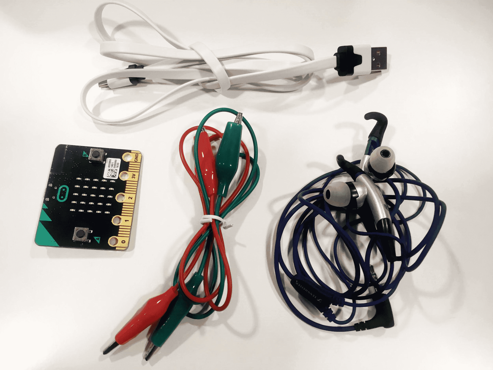
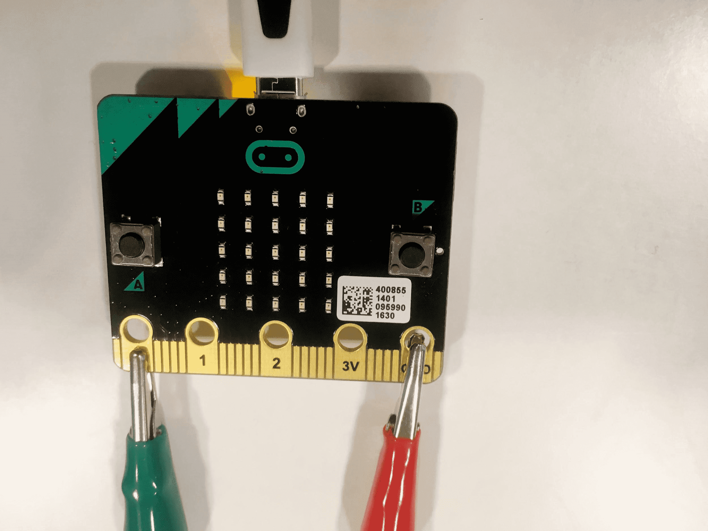

# Introduksjon {.intro}

Vi skal lage et lite program hvor vi får micro:biten til å spille musikk dersom
vi kobler til hodetelefoner eller en høytaler. I denne veiledningen viser vi
hvordan du kan spille melodien "Twinkle twinkle little star", og med dette som
utgangspunkt kan du spille av hvilken som helst sang du vil.


# Steg 1: Sjekk at du har riktig utstyr {.activity}

*Det er viktig at du har alt utstyr og tilbehør for å kunne gjøre denne
oppgaven.*

## Sjekkliste {.check}

- [ ] En micro:bit med en micro-usb-kabel.

- [ ] To ledninger med krokodilleklemmer.

- [ ] Hodetelefoner eller en høytaler.

- [ ] En datamaskin med Internett eller en [installert micro-python
  editor](https://codewith.mu/){target=_blank}.

*Her ser du et bilde av utstyr du kan bruke:*

{ width=75% }


# Steg 2: Klargjøre utstyret {.activity}

*Først kobler vi sammen utstyret før vi begynner å programmere.*

## Sjekkliste {.check}

- [ ] Koble usb-kabelen til micro:biten og en usb-port på datamaskinen.

- [ ] Koble den ene krokodilleklemmen til porten hvor det står GND på
  micro:biten. Den andre enden kobler du til innerst på stikket til
  hodetelefonene/høytaleren.

- [ ] Koble den andre krokodilleklemmen til porten hvor det står 0 på
  micro:biten. Den andre enden kobler du til ytterst på stikket til
  hodetelefonene/høytaleren.

*Her ser du to bilder av hvordan utstyret bør kobles:*

{ width=45% } { width=45% }


# Steg 3: Start å kode {.activity}

*Først starter vi med å skrive kode for å spille toner.*

## Sjekkliste {.check}

- [ ] Gå til [python.microbit.org](http://python.microbit.org){target="_blank"}
  eller din micro-python-editor for å åpne en editor som vi kan skrive kode i.

- [ ] Fjern all kode som står der i fra tidligere.

- [ ] Vi starter med å importere et musikk-bibliotek. Dette gjør at vi kan bruke
  kode som er laget av noen andre for å spille av musikk. Skriv inn følgende
  kode i editoren:

  ```python
  from music import *
  ```

- [ ] For å teste at alt funker som det skal så prøver vi å spille av en
  innebygget meldodi, som har navn *NYAN*. Denne melodien kan vi spille av ved å
  bruke en funkson som heter _play()_. Legg til kodesnutten:

  ```python
  play(NYAN)
  ```

- [ ] Til slutt må vi overføre programmet vårt over til micro:biten. Trykk på
  **Download** i menyen, da lastes programmet ned til datamaskinen din. Så
  overfører du filen *microbit.hex* til micro:biten du koblet til. Dersom du
  bruker en lokal editor så kan du trykke på **Flash** for å overføre filen til
  micro:biten.

## Test prosjektet {.flag}

- [ ] Spilles melodien på micro:biten når du har overført programmet ditt?

- [ ] Test ut noen [andre innebygde
  melodier](https://microbit-micropython.readthedocs.io/en/latest/music.html#built-in-melodies){target=_blank}
  også.


# Steg 4: Lag en tone selv {.activity}

*Det er kulere å lage sin egen tone, enn å bare spille av en innebygget. Det
skal vi gjøre nå.*

## Sjekkliste {.check}

- [ ] Først så fjerner vi linjen hvor vi spiller av musikk, men beholder linjen
  hvor vi importerte musikk-biblioteket.

- [ ] Så lager vi en ny variabel som heter *tone* og setter den lik en tom
  liste. Skriv inn følgende kodelinje:

  ```python
  tone = []
  ```

- [ ] Når vi oppretter toner så har de en viss form. Tonene er en tekststreng,
  og består av tre ulike deler. Først har vi en note, så en oktav og så lengden
  til tonen. Noter beskrives med bokstaver, for eksempel en **C** eller en
  **D**, eller **R** for pause. Oktaver er et tall mellom **0** og **8** (som er
  det høyeste et menneske kan høre), mens lengden er antall *ticks* tonen skal
  spilles. Uten å gå for mye inn i detaljer, så er 4 ticks det samme som 125
  millisekunder.

- [ ] Endre kodesnutten din til å inkludere en tone, for eksempel slik:

  ```python
  tone = ["C4:4"]
  ```

- [ ] For å spille av tonen vår så må vi igjen bruke _play_. Legg til denne
  kodelinjen nederst:

  ```python
  play(tone)
  ```

## Test prosjektet {.flag}

- [ ] Spilles tonen på micro:biten når du har overført programmet ditt?

- [ ] Trykk *restart*-knappen på micro:biten for å spille den av på nytt.


# Steg 5: Programmere melodien {.activity}

*Nå skal vi erstatte tonen vår med melodien til "Twinkle twinkle little star".*

- [ ] Erstatt variabelen *tone* med *melodi*, og spill av. Da ser koden din slik
  ut:

  ```python
  from music import *

  melodi = ["C4:4", "C", "G", "G", "A", "A", "G:8", "F:4", "F", "E", "E", "D", "D", "C:8",
  "G:4", "G", "F", "F", "E", "E", "D:8", "G:4", "G", "F", "F", "E", "E", "D:8", "C4:4",
  "C", "G", "G", "A", "A", "G:8", "F:4", "F", "E", "E", "D", "D","C:8"]

  play(melodi)
  ```

## Test prosjektet {.flag}

- [ ] Spiller micro:biten "Twinkle twinkle little star"?


# Steg 5: Legg til knapp for å styre musikken {.activity}

*Nå spilles bare melodinen akkurat når vi overførere den eller trykker restart.
Vi legger til en knapp for å styre musikken.*

## Sjekkliste {.check}

- [ ] Først må vi importere enda et bibliotek. Legg til følgende linje helt
  øverst:

  ```python
  from microbit import *
  ```

- [ ] Så legger vi til en løkke som kjøres for alltid, også sjekker vi om knapp
  **A** er trykket. Da ser programmet ditt slik ut:

  ```python
  from microbit import *
  from music import*

  melodi = ["C4:4", "C", "G", "G", "A", "A", "G:8", "F:4", "F", "E", "E", "D", "D", "C:8",
  "G:4", "G", "F", "F", "E", "E", "D:8", "G:4", "G", "F", "F", "E", "E", "D:8", "C4:4",
  "C", "G", "G", "A", "A", "G:8", "F:4", "F", "E", "E", "D", "D","C:8"]

  while True:
    if button_a.is_pressed():
      play(melodi)
  ```

## Test prosjektet {.flag}

- [ ] Sjekk om melodinen kun spilles når man trykker på knapp **A**.

## Utfordring : Legge til egne melodier {.challenge}

- [ ] Klarer du å komponere din egen melodi?

- [ ] Klarer du å finne en melodi på Internett og lage en liste med toner som du
  kan spille av?

## Forklaring av koden {.protip}

Vi pleier alltid importere biblioteket som heter *microbit* når vi programmer en
micro:bit, for at vi skal kunne bruke de forskjellige sensorene som er
innebygget i micro:biten. I dette tilfellet bruker vi bibliteket til å sjekke om
vi har trykket på knapp **A**.

Vi må importere biblioteket som heter *musikk* for at vi skal kunne bruke
funksjonen som heter *play()*, som spiller av musikken vi lager.

Når vi oppretter en tone så har den flere forskjellige deler. Det første man kan
se er at vi har to klammeparanteser `[` og `]`. De bruker vi til å opprette en
liste som vi kan ha tonene våre i. Hver tone består av tre deler, først hvilken
note vi skal spille og hvilken oktav noten skal være i, og så hvor lenge tonen
skal spilles. `"C4:4"` betyr at vi skal spille en **C** i oktav **fire** i
**fire** ticks, som i dette tilfellet er 125 millisekunder.

Sjekk ut
[dokumentasjonen](https://microbit-micropython.readthedocs.io/en/latest/music.html){target="_blank"}
for å se hvilke muligheter som finnes med musikk-programmering på micro:biten.
